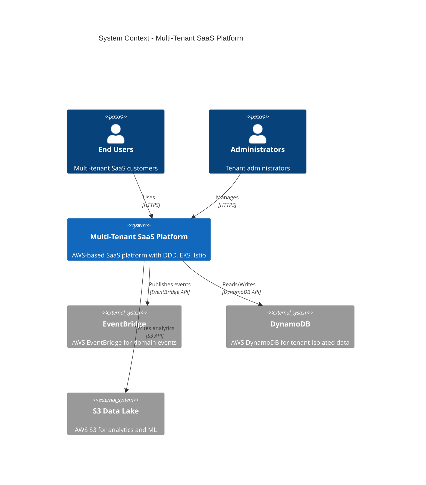

# 🏗️ Multi-Tenant SaaS Reference Architecture
## 📚 Interview-Grade Documentation

> **🎯 Elevator Pitch**: A comprehensive reference architecture for building enterprise-grade multi-tenant SaaS applications on AWS. This architecture demonstrates Domain-Driven Design (DDD) principles with bounded contexts mapped to Kubernetes namespaces, event-driven communication via EventBridge and SQS, and a Zero Trust security model. Built on AWS EKS with Istio service mesh, it showcases composable business capabilities, data isolation patterns, and full observability with OpenTelemetry. Perfect for architects and engineers preparing for senior/staff-level interviews or implementing production-ready multi-tenant systems.

---

## 🗺️ Quick Navigation

```
aws-multitenant-saas-reference/
├── 📄 README.md                          # 🗺️ You are here
│
└── 📂 docs/
    ├── 📋 00-overview.md                 # 🎯 Project overview & system context
    ├── 🏛️ 01-enterprise-architecture.md  # ⭐ EA: TOGAF, Gartner, Composable Capabilities
    ├── ⚙️ 02-backend-ddd-microservices.md # 🧩 DDD, Bounded Contexts, EDA
    ├── 🎨 03-frontend-bff.md             # 🎭 BFF Pattern & Frontend Architecture
    ├── ☁️ 04-cloud-foundation-sre.md     # 🌐 AWS Infrastructure & SRE
    ├── 💾 05-data-platform-analytics-ml.md # 📈 Data Lake, Data Mesh, ML
    ├── 📊 06-observability.md            # 🔍 OpenTelemetry & Observability
    ├── 🔄 07-devsecops.md                # 🚀 CI/CD & Shift-Left Security
    └── 🔒 08-security-zero-trust.md      # 🛡️ Zero Trust & Defense in Depth
```

---

## 🏛️ Architecture in One Picture



---

## 📚 Documentation Index

| Document | Description | Key Topics |
|----------|-------------|------------|
| 📋 **[00-overview.md](docs/00-overview.md)** | Project overview, system context, technology stack | System boundaries, tech stack, interview guide |
| 🏛️ **[01-enterprise-architecture.md](docs/01-enterprise-architecture.md)** | EA frameworks, composable capabilities, value chain | TOGAF ADM, Gartner TIME/PAID, pace layers, composable architecture |
| ⚙️ **[02-backend-ddd-microservices.md](docs/02-backend-ddd-microservices.md)** | DDD bounded contexts, microservices, event-driven patterns | Bounded contexts, EventBridge, outbox pattern, K8s namespaces |
| 🎨 **[03-frontend-bff.md](docs/03-frontend-bff.md)** | Frontend architecture and BFF pattern | React, BFF, tenant context, API aggregation |
| ☁️ **[04-cloud-foundation-sre.md](docs/04-cloud-foundation-sre.md)** | AWS infrastructure, EKS, Istio, networking | EKS, Istio mesh, Route53, CloudFront, WAF, API Gateway, SRE |
| 💾 **[05-data-platform-analytics-ml.md](docs/05-data-platform-analytics-ml.md)** | Data patterns, lake, Data Mesh, ML pipelines | DynamoDB, S3, Glue, Athena, Medallion, Data Vault, Data Mesh |
| 📊 **[06-observability.md](docs/06-observability.md)** | OpenTelemetry, metrics, logs, traces, SLOs | OpenTelemetry, distributed tracing, dashboards, SLOs |
| 🔄 **[07-devsecops.md](docs/07-devsecops.md)** | CI/CD pipelines, shift-left security | GitHub Actions, SAST, SCA, IaC scanning, container scanning |
| 🔒 **[08-security-zero-trust.md](docs/08-security-zero-trust.md)** | Zero Trust model, defense in depth | Zero Trust, IAM/IRSA, secrets management, mTLS, NetworkPolicies |

---

## 🛠️ Technology Stack


### Core Technologies

| Layer | Technology | Purpose |
|-------|------------|---------|
| **Frontend** | React + TypeScript | User interface |
| **BFF** | Node.js + Express | API aggregation, security boundary |
| **Backend** | Node.js + TypeScript | Domain services (microservices) |
| **Platform** | EKS + Istio | Container orchestration, service mesh |
| **Data** | DynamoDB | Tenant-isolated operational data |
| **Events** | EventBridge + SQS | Event-driven communication |
| **Analytics** | S3 + Glue + Athena | Data lake and analytics |
| **IaC** | Terraform | Infrastructure as code |
| **Observability** | OpenTelemetry | Metrics, logs, traces |

---

## 💬 Interview Talking Points

### 🏛️ Architecture Decisions

1. **Domain-Driven Design (DDD)**: Bounded contexts mapped to Kubernetes namespaces, enabling clear domain boundaries and independent deployment
2. **Composable Capabilities**: Lower-level domains compose into higher-level business capabilities, demonstrating EA maturity
3. **Event-Driven Architecture**: EventBridge + SQS for loose coupling, avoiding Kafka complexity while maintaining scalability
4. **Multi-Tenancy**: Tenant isolation at data layer (DynamoDB partition keys) and application layer (JWT claims, geo-validation)
5. **Zero Trust Security**: Defense in depth with WAF → API Gateway → Istio mTLS → NetworkPolicies → Pod Security
6. **Service Mesh**: Istio for east-west traffic with automatic mTLS, traffic management, and observability
7. **Data Isolation**: Single DynamoDB table per domain with strict tenant_id partitioning + country residency partitions
8. **BFF Pattern**: Backend for Frontend aggregates APIs, enforces security, and propagates tenant context
9. **Observability**: OpenTelemetry for distributed tracing across services and event publishing
10. **Shift-Left Security**: SAST, SCA, IaC scanning, and container scanning in CI/CD pipeline
11. **Data Platform**: Medallion architecture (Bronze/Silver/Gold) with Data Mesh principles for domain-oriented data products
12. **SRE Practices**: SLIs, SLOs, error budgets, and runbooks for operational excellence
13. **EA Frameworks**: TOGAF ADM alignment, Gartner TIME/PAID portfolio management, pace layers
14. **Infrastructure**: AWS-native services with Terraform for reproducibility and version control
15. **Residency Compliance**: Country partition enforcement (US/BR) with geo-validation at gateway level

### 🎯 Key Strengths

- ✅ **Interview-Ready**: Comprehensive documentation covering all architectural disciplines
- ✅ **Production Patterns**: Real-world patterns (outbox, inbox, CQRS, multi-tenancy)
- ✅ **EA Maturity**: Composable capabilities, value chain, portfolio management
- ✅ **Security First**: Zero Trust model with defense in depth
- ✅ **Observable**: Full OpenTelemetry instrumentation with distributed tracing
- ✅ **Scalable**: Event-driven architecture with EventBridge fanout to SQS
- ✅ **Isolated**: Multi-tenant data isolation with DynamoDB partitioning

---

## 🚀 Quick Start

> **Note**: This is documentation-only. For implementation, see [00-overview.md](docs/00-overview.md) for next steps.

1. 📖 **Read the Overview**: Start with [00-overview.md](docs/00-overview.md) for system context
2. 🏛️ **Understand EA**: Review [01-enterprise-architecture.md](docs/01-enterprise-architecture.md) for composable capabilities
3. ⚙️ **Study DDD**: Explore [02-backend-ddd-microservices.md](docs/02-backend-ddd-microservices.md) for bounded contexts
4. 🎨 **Review Frontend**: Check [03-frontend-bff.md](docs/03-frontend-bff.md) for BFF pattern
5. ☁️ **Infrastructure**: See [04-cloud-foundation-sre.md](docs/04-cloud-foundation-sre.md) for AWS setup
6. 💾 **Data Platform**: Review [05-data-platform-analytics-ml.md](docs/05-data-platform-analytics-ml.md) for data patterns
7. 📊 **Observability**: Check [06-observability.md](docs/06-observability.md) for OpenTelemetry
8. 🔄 **DevSecOps**: See [07-devsecops.md](docs/07-devsecops.md) for CI/CD pipelines
9. 🔒 **Security**: Review [08-security-zero-trust.md](docs/08-security-zero-trust.md) for Zero Trust model

---

## 📊 Documentation Statistics

- **Total Documents**: 9 (README + 8 discipline docs)
- **Total Mermaid Diagrams**: ~36 diagrams across all documents
- **C4 Model Levels**: Up to Level 3 (Context, Container, Component)
- **Example Domains**: Identity, User, Billing, Notifications, Analytics, Compliance

---

## 🎯 Target Audience

- 🏛️ **Enterprise Architects**: EA frameworks, composable capabilities, portfolio management
- ⚙️ **Backend Engineers**: DDD, microservices, event-driven patterns
- ☁️ **Platform Engineers**: EKS, Istio, AWS infrastructure, SRE
- 💾 **Data Engineers**: Data lake, Data Mesh, analytics pipelines
- 🔒 **Security Engineers**: Zero Trust, defense in depth, IAM
- 📊 **Observability Engineers**: OpenTelemetry, distributed tracing, SLOs
- 🚀 **DevOps Engineers**: CI/CD, shift-left security, infrastructure as code
- 💼 **Interview Candidates**: Comprehensive reference for senior/staff-level interviews

---

## 📝 License & Usage

This is a **reference architecture** for educational and interview preparation purposes. Use it to:
- ✅ Understand multi-tenant SaaS patterns
- ✅ Study enterprise architecture frameworks
- ✅ Prepare for architecture interviews
- ✅ Reference production-ready patterns
- ✅ Learn AWS-native service integration

---

> **💡 Tip**: Each document is self-contained but cross-referenced. Start with the overview, then dive into specific disciplines based on your interests or interview focus.

---

**Last Updated**: 2024 | **Version**: 1.0 | **Status**: 📚 Documentation Complete

