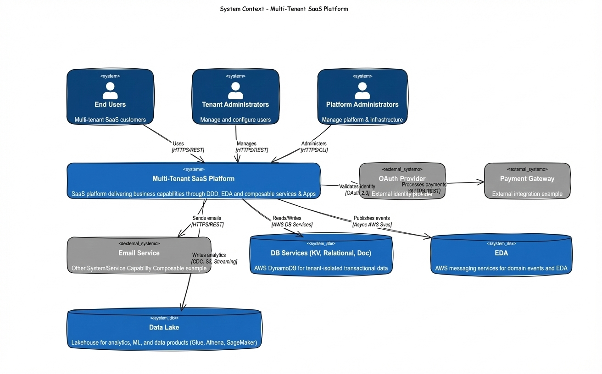

# 🏗️ Multi-Tenant SaaS Reference Architecture
## 📚 Enterprise Reference Architecture Documentation

> **🎯 Elevator Pitch**: Enterprise-grade multi-tenant SaaS reference architecture on AWS. Demonstrates DDD with bounded contexts, event-driven architecture (EventBridge/SQS), Zero Trust security, and composable capabilities. Built on EKS with Istio service mesh, featuring data isolation, OpenTelemetry observability, and production-ready patterns for scalable, secure multi-tenant systems.

---

## 🗺️ Quick Navigation

```
aws-multitenant-saas-reference/
├── 📄 README.md                          → 🗺️ You are here
│
└── 📂 docs/
    ├── 🏛️ 01-enterprise-architecture.md  → ⭐ EA: TOGAF, Gartner, Composable Capabilities
    ├── 🏛️ 02-overall-solution-architecture.md → 🎯 Overall Solution Architecture
    ├── ☁️ 03-cloud-foundation-sre.md     → 🌐 AWS Infrastructure & SRE
    ├── ⚙️ 04-backend-ddd-microservices.md → 🧩 DDD, Bounded Contexts, EDA
    ├── 🎨 05-frontend-bff.md             → 🎭 BFF Pattern & Frontend Architecture
    ├── 💾 06-data-platform-analytics-ml.md → 📈 Data Lake, Data Mesh, ML
    ├── 🔒 07-security-zero-trust.md      → 🛡️ Zero Trust, Least Privilege & Defense in Depth
    ├── 📊 08-observability.md            → 🔍 OpenTelemetry & Observability
    └── 🔄 09-devsecops.md                → 🚀 CI/CD, Shift-Left Security & DAST
```

---

## 🏛️ Architecture in One Picture



---

## 📚 Documentation Index

| Document | Description | Key Topics |
|----------|-------------|------------|
| 🏛️ **[01-enterprise-architecture.md](docs/01-enterprise-architecture.md)** | EA frameworks, composable capabilities | TOGAF ADM, Gartner TIME/PAID, pace layers, composable architecture |
| 🏛️ **[02-overall-solution-architecture.md](docs/02-overall-solution-architecture.md)** | Solution architecture, system context | System boundaries, tech stack, architecture decisions |
| ☁️ **[03-cloud-foundation-sre.md](docs/03-cloud-foundation-sre.md)** | AWS infrastructure, EKS, Istio | EKS, Istio mesh, Route53, CloudFront, WAF, API Gateway, SRE |
| ⚙️ **[04-backend-ddd-microservices.md](docs/04-backend-ddd-microservices.md)** | DDD bounded contexts, microservices | Bounded contexts, EventBridge, outbox pattern, K8s namespaces |
| 🎨 **[05-frontend-bff.md](docs/05-frontend-bff.md)** | Frontend architecture, BFF pattern | React, BFF, tenant context, API aggregation |
| 💾 **[06-data-platform-analytics-ml.md](docs/06-data-platform-analytics-ml.md)** | Data platform, analytics, ML | DynamoDB, S3, Glue, Athena, Medallion, Data Vault, Data Mesh |
| 🔒 **[07-security-zero-trust.md](docs/07-security-zero-trust.md)** | Zero Trust security model | Zero Trust, IAM/IRSA, secrets management, mTLS, NetworkPolicies |
| 📊 **[08-observability.md](docs/08-observability.md)** | Observability, monitoring | OpenTelemetry, distributed tracing, dashboards, SLOs |
| 🔄 **[09-devsecops.md](docs/09-devsecops.md)** | CI/CD pipelines, shift-left security | GitHub Actions, SAST, SCA, IaC scanning, container scanning, DAST |

---

## 🛠️ Technology Stack


### Core Technologies

| Layer | Technology | Purpose |
|-------|------------|---------|
| **Frontend** | React + TypeScript | User interface |
| **BFF** | Node.js + Express | API aggregation, security boundary |
| **Backend** | Node.js + TypeScript | Domain services (microservices) |
| **Platform** | EKS + Istio | Container orchestration, service mesh |
| **Data** | DynamoDB + Aurora + DocumentDB | Tenant-isolated operational data |
| **Events** | EventBridge + SQS | Event-driven communication |
| **Analytics** | S3 + Glue + Athena | Data lake and analytics |
| **IaC** | Terraform + Helm + ArgoCD | Infrastructure as code + GitOps |
| **Observability** | OpenTelemetry + CloudWatch + X-Ray | Metrics, logs, traces |

---

## 🏛️ Architecture Principles & Decisions

### 🎯 Core Architecture Principles

**Design & Architecture**
1. **Domain-Driven Design (DDD)**: Bounded contexts mapped to Kubernetes namespaces for clear domain boundaries and independent deployment
2. **Composable Capabilities**: Lower-level domains compose into higher-level business capabilities, demonstrating EA maturity
3. **Event-Driven Architecture**: EventBridge + SQS for loose coupling and scalability
4. **Microfrontend + Atomic Design**: Component composition enabling independent development and tenant customization

**Multi-Tenancy & Isolation**
5. **Multi-Tenancy**: Tenant isolation at data layer (DynamoDB partition keys) and application layer (JWT claims, geo-validation)
6. **Data Isolation**: Single DynamoDB table per domain with strict tenant_id partitioning + country residency partitions
7. **Residency Compliance**: Country partition enforcement (US/BR) with geo-validation at gateway level

**Security**
8. **Zero Trust Security**: Defense in depth with WAF → API Gateway → Istio mTLS → NetworkPolicies → Pod Security
9. **Shift-Left Security**: SAST, SCA, IaC scanning, container scanning, and DAST in CI/CD pipeline
10. **BFF Pattern**: Backend for Frontend aggregates APIs, enforces security, and propagates tenant context

**Infrastructure & Operations**
11. **Service Mesh**: Istio for east-west traffic with automatic mTLS, traffic management, and observability
12. **Infrastructure**: AWS-native services with Terraform for reproducibility and version control
13. **SRE Practices**: SLIs, SLOs, error budgets, and runbooks for operational excellence

**Data & Observability**
14. **Data Platform**: Medallion architecture (Bronze/Silver/Gold) with Data Mesh principles for domain-oriented data products
15. **Observability**: OpenTelemetry for distributed tracing across services and event publishing

**Governance**
16. **EA Frameworks**: TOGAF ADM alignment, Gartner TIME/PAID portfolio management, pace layers

### 🎯 Key Architecture Strengths

- ✅ **Comprehensive Coverage**: Documentation covering all architectural disciplines
- ✅ **Production Patterns**: Real-world patterns (outbox, inbox, CQRS, multi-tenancy)
- ✅ **EA Maturity**: Composable capabilities, value chain, portfolio management
- ✅ **Security First**: Zero Trust model with defense in depth
- ✅ **Observable**: Full OpenTelemetry instrumentation with distributed tracing
- ✅ **Scalable**: Event-driven architecture with EventBridge fanout to SQS
- ✅ **Isolated**: Multi-tenant data isolation with DynamoDB partitioning

---

## 🚀 Quick Start

> **Note**: This is documentation-only (EY Draft).

1. 🏛️ **[Enterprise Architecture](docs/01-enterprise-architecture.md)** - EA frameworks and composable capabilities
2. 🏛️ **[Solution Architecture](docs/02-overall-solution-architecture.md)** - Overall system context
3. ☁️ **[Cloud Foundation](docs/03-cloud-foundation-sre.md)** - AWS infrastructure and SRE
4. ⚙️ **[Backend & DDD](docs/04-backend-ddd-microservices.md)** - Bounded contexts and microservices
5. 🎨 **[Frontend & BFF](docs/05-frontend-bff.md)** - BFF pattern and frontend architecture
6. 💾 **[Data Platform](docs/06-data-platform-analytics-ml.md)** - Data lake, Data Mesh, and ML
7. 🔒 **[Security](docs/07-security-zero-trust.md)** - Zero Trust security model
8. 📊 **[Observability](docs/08-observability.md)** - OpenTelemetry and monitoring
9. 🔄 **[DevSecOps](docs/09-devsecops.md)** - CI/CD pipelines and security scanning

---

## 🎯 Target Audience

- 🏛️ **Enterprise Architects**: EA frameworks, composable capabilities, portfolio management
- 🎨 **Frontend Engineers**: Microfrontends, Atomic Design, BFF pattern, React architecture
- ⚙️ **Backend Engineers**: DDD, microservices, event-driven patterns
- ☁️ **Platform Engineers**: EKS, Istio, AWS infrastructure, SRE
- 💾 **Data Engineers**: Data lake, Data Mesh, analytics pipelines
- 🔒 **Security Engineers**: Zero Trust, defense in depth, IAM
- 📊 **Observability Engineers**: OpenTelemetry, distributed tracing, SLOs
- 🚀 **DevOps Engineers**: CI/CD, shift-left security (SAST, SCA, IaC, container, DAST), infrastructure as code

---

> **💡 Tip**: Each document is self-contained but cross-referenced. Start with Enterprise Architecture, then explore the Overall Solution Architecture, followed by specific disciplines based on your needs.

---

**Last Updated**: Sun, Jan 4th, 2026 | **Version**: 1.0 | **Status**: 📚 For Architecture Interview (principles discussion only) 

---

**Author**: Lucas Freitas.