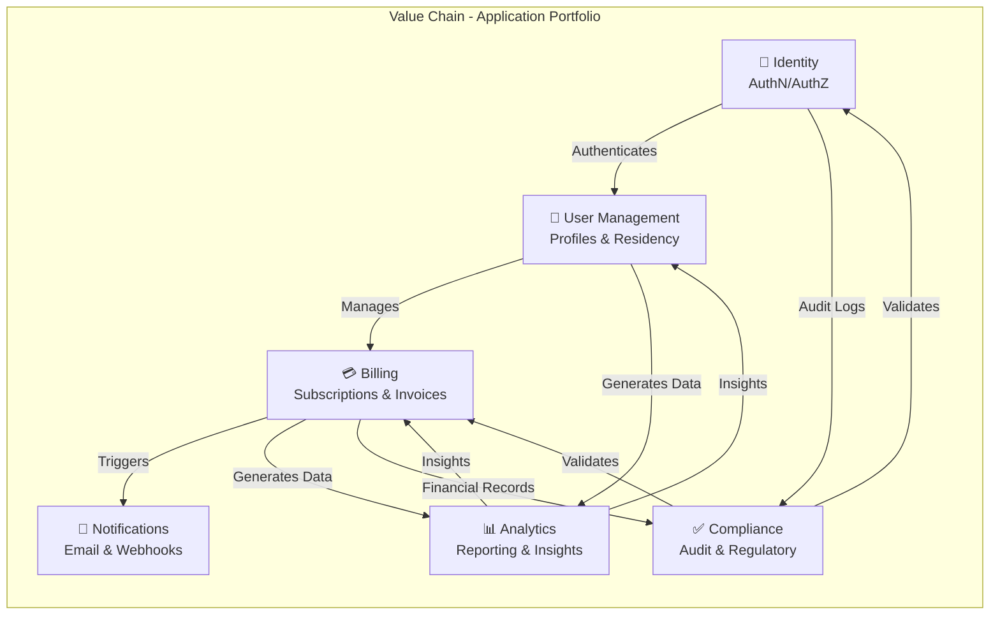
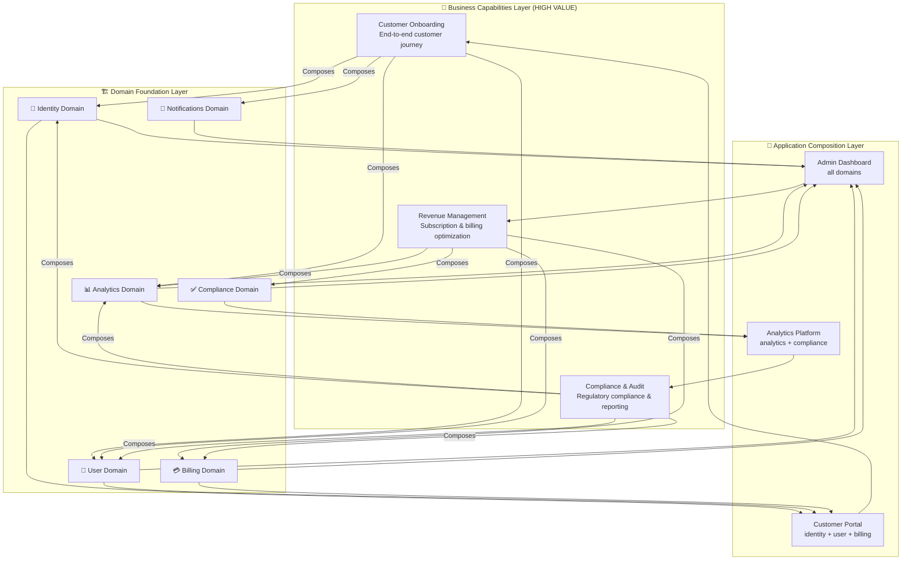
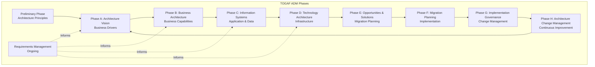
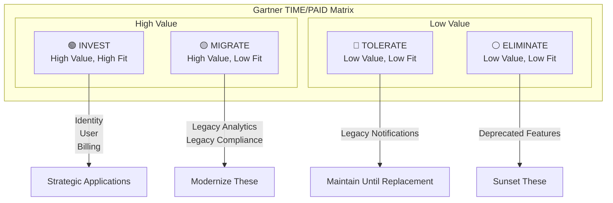
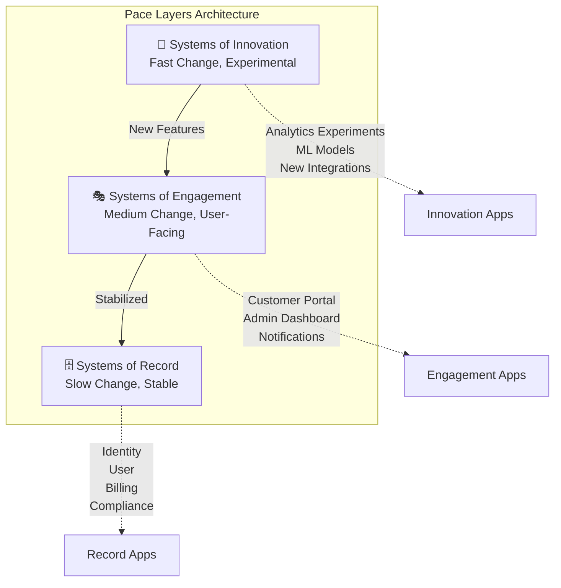

# 🏛️ Enterprise Architecture
## ⭐ TOGAF, Gartner, Composable Capabilities & Value Chain

> **💡 This is the most important document - heavy emphasis on EA frameworks and composable capabilities**

---

## 🎯 Scope

- 🏛️ **Enterprise Architecture Principles**: TOGAF ADM methodology, architecture governance
- 🔗 **Value Chain Analysis**: How applications contribute to business value delivery
- 🧩 **Composable Capabilities**: Layered view showing domains → applications → business capabilities ⭐
- 📊 **Gartner TIME/PAID Framework**: Portfolio rationalization and investment decisions
- ⚡ **Pace Layers**: Systems of Record, Engagement, and Innovation
- 📦 **Portfolio Management**: Application portfolio strategy and lifecycle

---

## 🔗 Value Chain

### 📊 Value Chain Description

| Application | Value Contribution | Key Capabilities |
|-------------|-------------------|------------------|
| **🔐 Identity** | Secure access, tenant context | Authentication, authorization, JWT tokens |
| **👤 User Management** | User profiles, tenant-scoped data | User CRUD, profile management, residency |
| **💳 Billing** | Revenue generation, subscriptions | Subscription management, invoicing, payments |
| **📧 Notifications** | User engagement, alerts | Email delivery, webhooks, event notifications |
| **📊 Analytics** | Business intelligence, insights | Reporting, dashboards, data products |
| **✅ Compliance** | Regulatory compliance, audit | Audit logs, regulatory reporting, validation |

**Value Flow**: Identity enables access → User Management manages customers → Billing generates revenue → Notifications engage users → Analytics provide insights → Compliance ensures governance

---

## 🧩 Composable Capabilities (Layered View) - ⭐ CRITICAL

### 🎯 Business Capabilities Examples

#### 1. Customer Onboarding
**Composition**: 🔐 Identity + 👤 User + 📧 Notifications + 📊 Analytics

**Capability**: End-to-end customer journey from signup to first value realization

**Value**: 
- Automated onboarding workflow
- Welcome emails and setup guidance
- Analytics tracking of onboarding funnel
- Identity verification and profile creation

#### 2. Revenue Management
**Composition**: 💳 Billing + 👤 User + 📊 Analytics + ✅ Compliance

**Capability**: Optimize subscription revenue and billing operations

**Value**:
- Subscription lifecycle management
- Revenue analytics and forecasting
- Compliance with financial regulations
- User segmentation for pricing optimization

#### 3. Compliance & Audit
**Composition**: 🔐 Identity + 💳 Billing + 👤 User + 📊 Analytics

**Capability**: Regulatory compliance and audit trail management

**Value**:
- Audit logs from all domains
- Financial record compliance
- User data privacy compliance
- Analytics-driven compliance reporting

### 🏗️ Domain Foundation Layer

| Domain | Purpose | Key Entities |
|--------|---------|--------------|
| **🔐 Identity** | Authentication, authorization, tenant context | Users, Roles, Permissions, JWT Tokens |
| **👤 User** | User profiles, tenant-scoped data | User Profiles, Preferences, Residency |
| **💳 Billing** | Subscriptions, invoices, payments | Subscriptions, Invoices, Payment Methods |
| **📧 Notifications** | Email, webhooks, alerts | Notification Templates, Delivery Status |
| **📊 Analytics** | Reporting, dashboards, insights | Reports, Dashboards, Data Products |
| **✅ Compliance** | Audit logs, regulatory reporting | Audit Logs, Compliance Reports |

### 🧩 Application Composition Layer

| Application | Composed Domains | Purpose |
|-------------|-----------------|---------|
| **Customer Portal** | Identity + User + Billing | Self-service customer experience |
| **Admin Dashboard** | All domains | Platform administration and management |
| **Analytics Platform** | Analytics + Compliance | Business intelligence and compliance reporting |

---

## 📐 TOGAF ADM (Architecture Development Method)

### 📋 TOGAF Alignment

| Phase | Our Architecture Alignment | Artifacts |
|-------|---------------------------|-----------|
| **Preliminary** | Architecture principles, governance | EA principles, composable architecture |
| **Phase A** | Business drivers, stakeholders | Value chain, business capabilities |
| **Phase B** | Business architecture, capabilities | Composable capabilities, value chain |
| **Phase C** | Application and data architecture | DDD bounded contexts, data patterns |
| **Phase D** | Technology architecture | AWS infrastructure, EKS, Istio |
| **Phase E** | Migration opportunities | Implementation roadmap |
| **Phase F** | Migration planning | Terraform modules, deployment strategy |
| **Phase G** | Implementation governance | CI/CD, DevSecOps practices |
| **Phase H** | Change management | Observability, SLOs, continuous improvement |

---

## 📊 Gartner TIME/PAID Framework

### 📊 Application Positioning

| Application | Quadrant | Rationale | Action |
|------------|----------|-----------|--------|
| **🔐 Identity** | 🟢 INVEST | Core capability, high business value | Enhance, modernize |
| **👤 User** | 🟢 INVEST | Core capability, high business value | Enhance, modernize |
| **💳 Billing** | 🟢 INVEST | Revenue-critical, high business value | Enhance, modernize |
| **📧 Notifications** | 🟡 MIGRATE | High value, needs modernization | Migrate to event-driven |
| **📊 Analytics** | 🟡 MIGRATE | High value, legacy system | Migrate to Data Mesh |
| **✅ Compliance** | 🔴 TOLERATE | Low value, maintain for regulatory | Tolerate until replacement |

### 🎯 Portfolio Rationalization Strategy

1. **🟢 INVEST**: Identity, User, Billing - Core strategic applications
2. **🟡 MIGRATE**: Notifications, Analytics - Modernize to event-driven and Data Mesh
3. **🔴 TOLERATE**: Legacy Compliance - Maintain until replacement
4. **⚪ ELIMINATE**: Deprecated features - Sunset and remove

---

## ⚡ Pace Layers

### 📊 Pace Layer Positioning

| Layer | Change Rate | Example Applications | Characteristics |
|-------|-------------|----------------------|-----------------|
| **🚀 Systems of Innovation** | Fast (weeks) | Analytics experiments, ML models, new integrations | Experimental, rapid iteration |
| **🎭 Systems of Engagement** | Medium (months) | Customer Portal, Admin Dashboard, Notifications | User-facing, frequent updates |
| **🗄️ Systems of Record** | Slow (years) | Identity, User, Billing, Compliance | Stable, critical, well-tested |

### 🎯 Pace Layer Strategy

- **🚀 Innovation**: Rapid experimentation, fail fast, learn quickly
- **🎭 Engagement**: User experience focus, frequent feature releases
- **🗄️ Record**: Stability and reliability, careful change management

---

## 💡 Key Decisions

1. **✅ Composable Architecture**: Lower-level domains compose into higher-level business capabilities, enabling agility and reuse
2. **✅ Domain-Driven Design**: Bounded contexts as foundation for composable capabilities
3. **✅ Event-Driven Communication**: Loose coupling via events enables independent domain evolution
4. **✅ Portfolio Management**: Gartner TIME/PAID framework guides investment decisions
5. **✅ Pace Layers**: Different change rates for different system types (Innovation, Engagement, Record)
6. **✅ TOGAF Alignment**: Architecture development follows TOGAF ADM methodology
7. **✅ Value Chain Focus**: Applications positioned in value chain showing business contribution
8. **✅ EA Governance**: Architecture principles and governance framework established

---

## 🔗 Related Documentation

- 📄 [README.md](../README.md) - Central index
- 📋 [00-overview.md](00-overview.md) - System context and overview
- ⚙️ [02-backend-ddd-microservices.md](02-backend-ddd-microservices.md) - DDD bounded contexts implementation
- ☁️ [04-cloud-foundation-sre.md](04-cloud-foundation-sre.md) - Infrastructure architecture
- 💾 [05-data-platform-analytics-ml.md](05-data-platform-analytics-ml.md) - Data platform and analytics

---

> **💡 Tip**: This document demonstrates EA maturity through composable capabilities, value chain analysis, and portfolio management frameworks. Use it to show how technical architecture aligns with business strategy.

