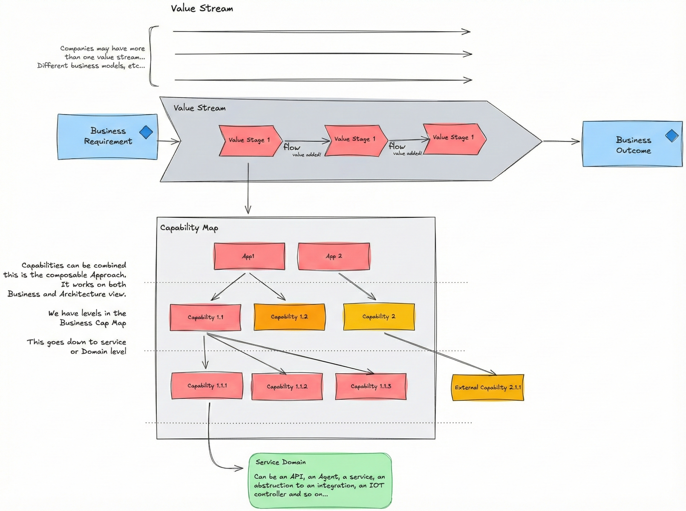
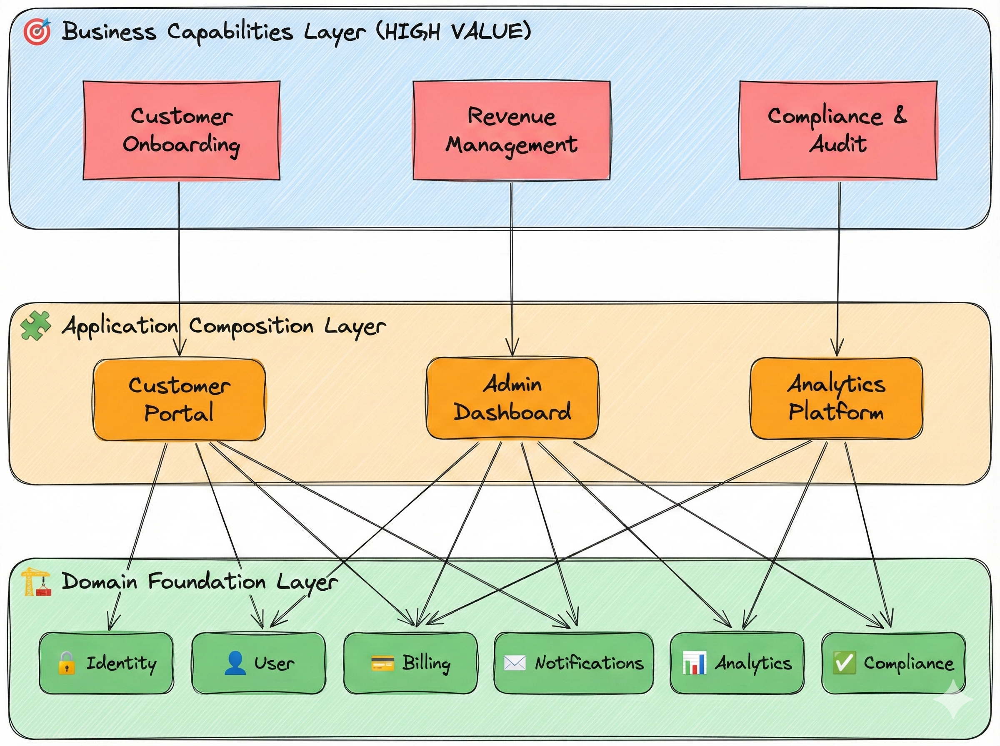
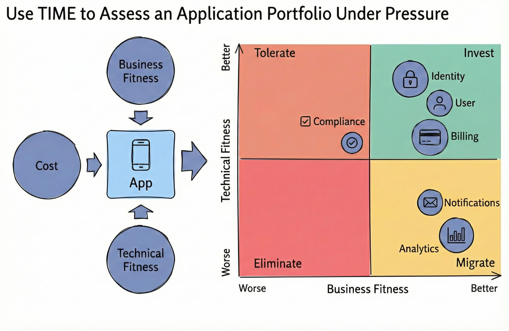
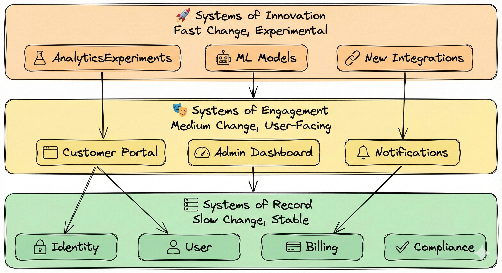
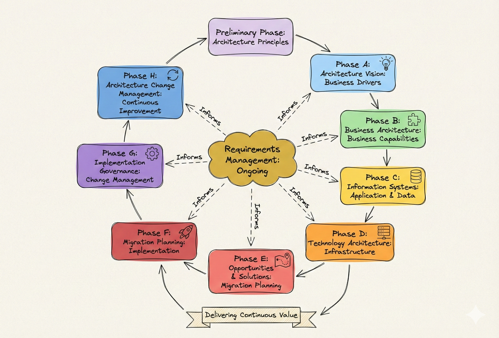

# 🏛️ Enterprise Architecture
## Business Value, Composable Architecture, and EA Governance

> **💡 This is the most important document - heavy emphasis on EA frameworks and composable capabilities**

> **💡 IMPORTANT:** Always have the eyes on the business! Business drivers (OKRs) measured by KPIs among systems and services implementation build value. Technology serving and adding to business
---

## 🎯 Scope

- 🏛️ **Enterprise Architecture Principles**: TOGAF ADM methodology, architecture governance
- 🔗 **Value Chain Analysis**: How applications contribute to business value delivery
- 🧩 **Composable Capabilities**: Layered view showing domains → applications → business capabilities ⭐
- 📊 **Gartner TIME/PAID Framework**: Portfolio rationalization and investment decisions
- ⚡ **Pace Layers**: Systems of Record, Engagement, and Innovation
- 📦 **Portfolio Management**: Application portfolio strategy and lifecycle

**Document Flow**: This document follows a logical progression: we start with **Value Chain** (why we exist - business value), then **Composable Capabilities** (how we build - architectural approach), followed by **Portfolio Management** (what to invest in and how fast), then **TOGAF ADM** (how we govern - process), and finally **Key Decisions** (synthesis of all frameworks).

---

## 🔗 Value Chain: Business Value Delivery

### 📖 Understanding Value Streams

**Value** is fundamental to everything an organization does - the primary reason it exists is to provide value to stakeholders. [Value Streams, Open Group, 2017]

**Value Stream** represents the sequence of activities that deliver value to stakeholders, always defined from the stakeholder's perspective. [ArchiMate 3.1, Open Group, 2019]

Value streams flow through multiple stages, typically including:
- **Request**: Stakeholder need or demand that initiates the value stream
- **Design**: Conceptualization and planning of the solution
- **Development**: Building and implementing the solution
- **Operations**: Delivering and maintaining the solution
- **Outcome**: The value delivered to stakeholders

Each stage is supported by management functions ensuring effective value delivery.

### 🏗️ Application Portfolio in the Value Stream

In our multi-tenant SaaS platform, applications contribute to the value stream by providing specific capabilities that support different stages of value delivery. Each application plays a role in enabling the overall value proposition (*non exhaustive example*):

| Application | Value Contribution | Key Capabilities |
|-------------|-------------------|------------------|
| **🔐 Identity** | Secure access, tenant context | Authentication, authorization, JWT tokens |
| **👤 User Management** | User profiles, tenant-scoped data | User CRUD, profile management, residency |
| **💳 Billing** | Revenue generation, subscriptions | Subscription management, invoicing, payments |
| **📧 Notifications** | User engagement, alerts | Email delivery, webhooks, event notifications |
| **📊 Analytics** | Business intelligence, insights | Reporting, dashboards, data products |
| **✅ Compliance** | Regulatory compliance, audit | Audit logs, regulatory reporting, validation |

**Value Flow**: Identity enables access → User Management manages customers → Billing generates revenue → Notifications engage users → Analytics provide insights → Compliance ensures governance

To deliver this value efficiently, we need a composable architecture that enables rapid capability composition and reuse.

---

## 🧩 Composable Capabilities (Layered View) - ⭐ CRITICAL

### 📐 Composable Architecture Principles

Composable architecture builds higher-level business capabilities by combining lower-level domain services and applications through three layers:

- **Domain Foundation Layer**: Core domain services (Identity, User, Billing, etc.) provide fundamental capabilities
- **Application Composition Layer**: Applications combine multiple domains for integrated user experiences
- **Business Capabilities Layer**: High-value capabilities emerge from composition

This enables **reuse** across applications, rapid **composition** of new capabilities, independent **evolution** of domains, and scalable value delivery.

### 🎯 Composable Capabilities Examples

Examples of how domains compose into higher-level business capabilities:

#### 1. Customer Onboarding
**Composition**: 🔐 Identity + 👤 User + 📧 Notifications + 📊 Analytics

**Capability**: End-to-end customer journey from signup to first value realization

**Value Delivered**: Automated onboarding, welcome emails, analytics tracking, identity verification

**Value Stream Contribution**: Supports **Design** and **Development** stages enabling rapid customer acquisition.

#### 2. Revenue Management
**Composition**: 💳 Billing + 👤 User + 📊 Analytics + ✅ Compliance

**Capability**: Optimize subscription revenue and billing operations

**Value Delivered**: Subscription lifecycle management, revenue analytics, financial compliance, pricing optimization

**Value Stream Contribution**: Supports **Operations** stage ensuring sustainable revenue and compliance.

#### 3. Compliance & Audit
**Composition**: 🔐 Identity + 💳 Billing + 👤 User + 📊 Analytics

**Capability**: Regulatory compliance and audit trail management

**Value Delivered**: Audit logs, financial compliance, data privacy compliance, analytics-driven reporting

**Value Stream Contribution**: Supports all stages ensuring governance, risk management, and regulatory compliance.

### 🏗️ Domain Foundation Layer

| Domain | Purpose | Key Entities |
|--------|---------|--------------|
| **🔐 Identity** | Authentication, authorization, tenant context | Users, Roles, Permissions, JWT Tokens |
| **👤 User** | User profiles, tenant-scoped data | User Profiles, Preferences, Residency |
| **💳 Billing** | Subscriptions, invoices, payments | Subscriptions, Invoices, Payment Methods |
| **📧 Notifications** | Email, webhooks, alerts | Notification Templates, Delivery Status |
| **📊 Analytics** | Reporting, dashboards, insights | Reports, Dashboards, Data Products |
| **✅ Compliance** | Audit logs, regulatory reporting | Audit Logs, Compliance Reports |

### 🧩 Application Composition Layer

| Application | Composed Domains | Purpose |
|-------------|-----------------|---------|
| **Customer Portal** | Identity + User + Billing | Self-service customer experience |
| **Admin Dashboard** | All domains | Platform administration and management |
| **Analytics Platform** | Analytics + Compliance | Business intelligence and compliance reporting |

To optimize investments in this composable architecture, we use portfolio management frameworks (TIME and Pace Layers) to guide what to invest in and how fast to evolve.

---

## 📊 Portfolio Management: Investment Strategy and Change Velocity

### 🎯 Why TIME and Pace Layers Matter

In a composable architecture, effective portfolio management aligns technology investments with **business STRATEGY**. Gartner's TIME framework and Pace Layers provide complementary lenses:

- **TIME Framework** answers **"What should we invest in?"** by evaluating applications based on business value and strategic fit
- **Pace Layers** answers **"How fast should we change?"** by recognizing that different systems require different change velocities

Together, these frameworks optimize both **investment allocation** (TIME) and **change velocity** (Pace Layers) to maximize business value delivery.

### 🔗 Integration with Composable Capabilities

**TIME Framework + Composable Capabilities:**
- **INVEST** decisions focus on core domain services (Identity, User, Billing) that form the foundation layer
- **MIGRATE** decisions target applications needing modernization to better support composition and reuse
- Investment prioritization builds strong, reusable domain foundations enabling rapid composition

**Pace Layers + Composable Capabilities:**
- **Systems of Record** (Identity, User, Billing) provide stable, well-tested domain services as foundation
- **Systems of Engagement** (Customer Portal, Admin Dashboard) compose stable domains for user-facing experiences
- **Systems of Innovation** enable rapid experimentation that can later be composed into stable domains
- This allows us to **stabilize** core domains while **innovating** at the edges, **composing** new capabilities, and **evolving** independently

### 🔗 Connection to Value Chain

- TIME framework ensures we invest in applications contributing most to value delivery stages
- Pace Layers optimize change velocity: fast innovation for new opportunities, stable operations for reliable delivery
- Applications in the value chain are evaluated through TIME to determine investment priority

---

## 📊 Gartner TIME Framework

The **Gartner TIME Framework** provides a strategic portfolio management approach that evaluates applications based on their **business value** and **technical fit**. By positioning applications across four quadrants (INVEST, MIGRATE, TOLERATE, ELIMINATE), we optimize **investment allocation** and prioritize modernization efforts. This framework complements our **Pace Layers** strategy by determining **what** to invest in, while Pace Layers determine **how fast** applications should evolve. Together, they enable data-driven portfolio decisions that align technical investments with business value delivery.

### 📊 Application Positioning

| Application | Quadrant | Rationale | Action |
|------------|----------|-----------|--------|
| **🔐 Identity** | 🟢 INVEST | Core capability, high business value | Enhance, modernize |
| **👤 User** | 🟢 INVEST | Core capability, high business value | Enhance, modernize |
| **💳 Billing** | 🟢 INVEST | Revenue-critical, high business value | Enhance, modernize |
| **📧 Notifications** | 🟡 MIGRATE | High value, needs modernization | Migrate to event-driven |
| **📊 Analytics** | 🟡 MIGRATE | High value, legacy system | Migrate to Data Mesh |
| **✅ Compliance** | 🔴 TOLERATE | Low value, maintain for regulatory | Tolerate until replacement |

### 🎯 Portfolio Rationalization Strategy

1. **🟢 INVEST**: Identity, User, Billing - Core strategic applications
2. **🟡 MIGRATE**: Notifications, Analytics - Modernize to event-driven and Data Mesh
3. **🔴 TOLERATE**: Legacy Compliance - Maintain until replacement
4. **⚪ ELIMINATE**: Deprecated features - Sunset and remove

---

## ⚡ Pace Layers

**Pace Layers Architecture** organizes applications into three layers based on their **rate of change**: Systems of Innovation (fast), Systems of Engagement (medium), and Systems of Record (slow). This approach optimizes **change velocity** by allowing rapid experimentation in innovation layers while maintaining stability in record systems. Pace Layers complement the **TIME Framework** by determining **change cadence** for applications, ensuring that high-value investments (from TIME) evolve at appropriate speeds. Together, they create a balanced architecture that enables both **agile innovation** and **reliable operations** within our composable enterprise architecture.

### 📊 Pace Layer Positioning

| Layer | Change Rate | Example Applications | Characteristics |
|-------|-------------|----------------------|-----------------|
| **🚀 Systems of Innovation** | Fast (weeks) | Analytics experiments, ML models, new integrations | Experimental, rapid iteration |
| **🎭 Systems of Engagement** | Medium (months) | Customer Portal, Admin Dashboard, Notifications | User-facing, frequent updates |
| **🗄️ Systems of Record** | Slow (years) | Identity, User, Billing, Compliance | Stable, critical, well-tested |

### 🎯 Pace Layer Strategy

- **🚀 Innovation**: Rapid experimentation, fail fast, learn quickly
- **🎭 Engagement**: User experience focus, frequent feature releases
- **🗄️ Record**: Stability and reliability, careful change management

To govern this architecture systematically, we follow TOGAF ADM as our architecture governance process.

---

## 📐 TOGAF ADM: Architecture Governance Process

TOGAF ADM provides a cyclical process for developing and managing enterprise architecture. Our composable capabilities approach integrates seamlessly: business capabilities (Phase B) are realized through applications (Phase C) built on domain services (Phase D), with governance and continuous improvement (Phases G and H).

### 📋 TOGAF Alignment

| Phase | Our Architecture Alignment | Artifacts |
|-------|---------------------------|-----------|
| **Preliminary** | Architecture principles, governance | EA principles, composable architecture |
| **Phase A** | Business drivers, stakeholders | Value chain, business capabilities |
| **Phase B** | Business architecture, capabilities | Composable capabilities, value chain |
| **Phase C** | Application and data architecture | DDD bounded contexts, data patterns |
| **Phase D** | Technology architecture | AWS infrastructure, EKS, Istio |
| **Phase E** | Migration opportunities | Implementation roadmap |
| **Phase F** | Migration planning | Terraform modules, deployment strategy |
| **Phase G** | Implementation governance | CI/CD, DevSecOps practices |
| **Phase H** | Change management | Observability, SLOs, continuous improvement |

---

## 💡 Key Decisions

These decisions synthesize our approach across all frameworks:

1. **✅ Composable Architecture** (see Composable Capabilities): Lower-level domains compose into higher-level business capabilities, enabling agility and reuse
2. **✅ Domain-Driven Design**: Bounded contexts provide the foundation for composable capabilities
3. **✅ Event-Driven Communication**: Loose coupling via events enables independent domain evolution
4. **✅ Portfolio Management** (see Portfolio Management): TIME framework guides investment decisions; Pace Layers optimize change velocity
5. **✅ Value Chain Focus** (see Value Chain): Applications positioned to maximize business value contribution
6. **✅ TOGAF Alignment** (see TOGAF ADM): Architecture development follows TOGAF ADM methodology for systematic governance
7. **✅ EA Governance**: Architecture principles and governance framework ensure continuous alignment with business strategy

Together, these decisions create a cohesive architecture that balances business value delivery (Value Chain), architectural flexibility (Composable), investment optimization (Portfolio Management), and systematic governance (TOGAF).

---

## 🔗 Related Documentation

- 📄 [README.md](../README.md) - Central index
- 🏛️ [02-overall-solution-architecture.md](02-overall-solution-architecture.md) - Overall solution architecture
- ☁️ [03-cloud-foundation-sre.md](03-cloud-foundation-sre.md) - Infrastructure architecture
- ⚙️ [04-backend-ddd-microservices.md](04-backend-ddd-microservices.md) - DDD bounded contexts implementation
- 💾 [06-data-platform-analytics-ml.md](06-data-platform-analytics-ml.md) - Data platform and analytics

---

> **💡 Tip**: This document demonstrates EA maturity through composable capabilities, value chain analysis, and portfolio management frameworks. Use it to show how technical architecture aligns with business strategy.

