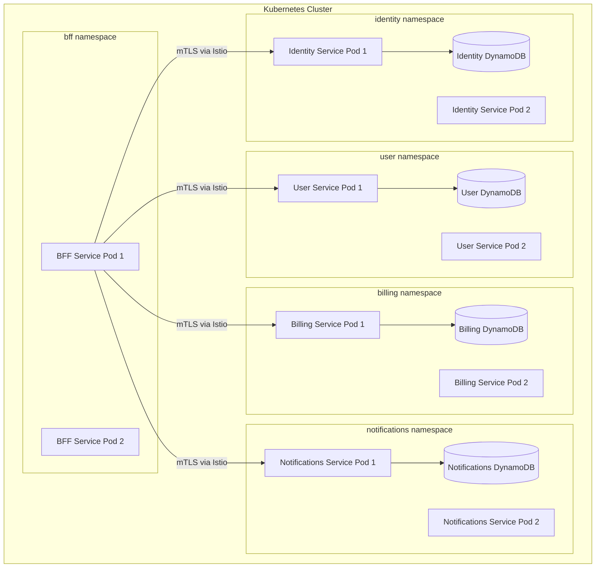
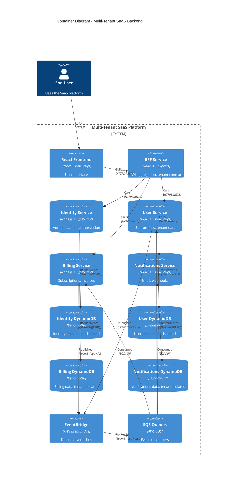
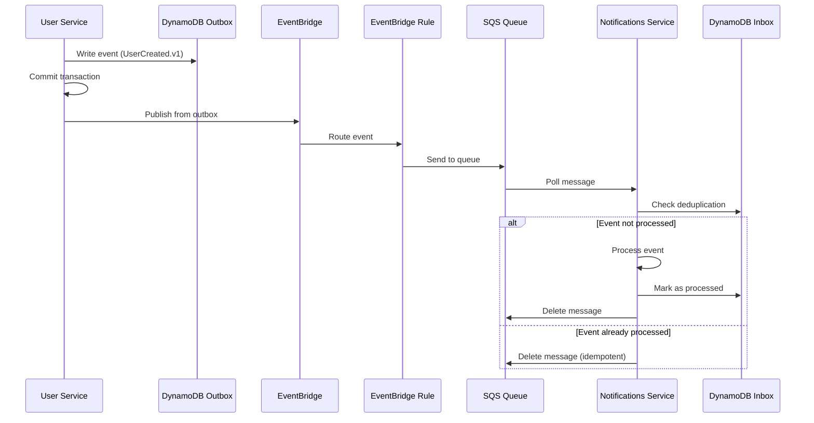
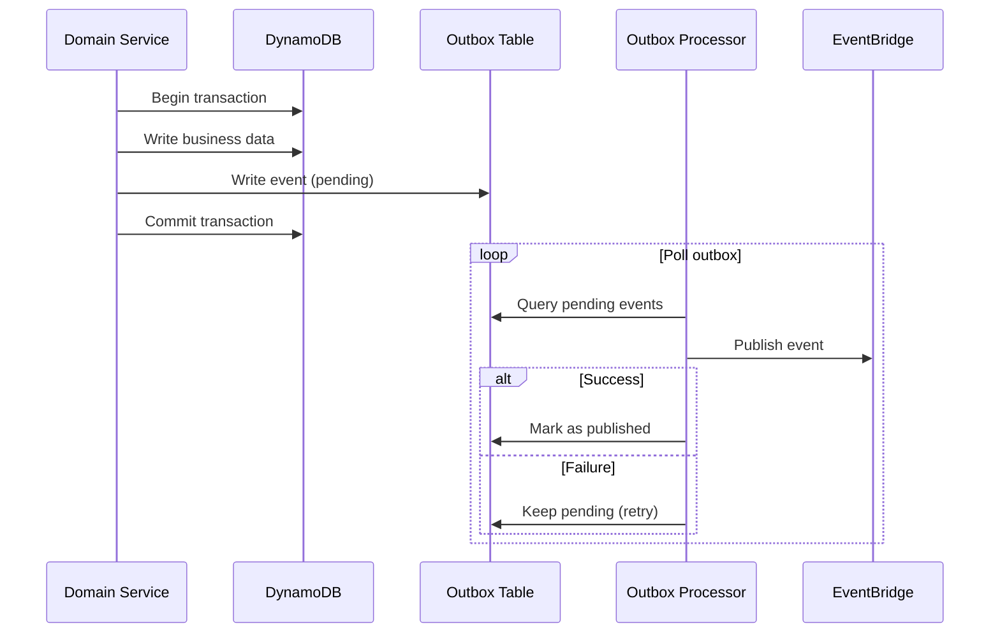
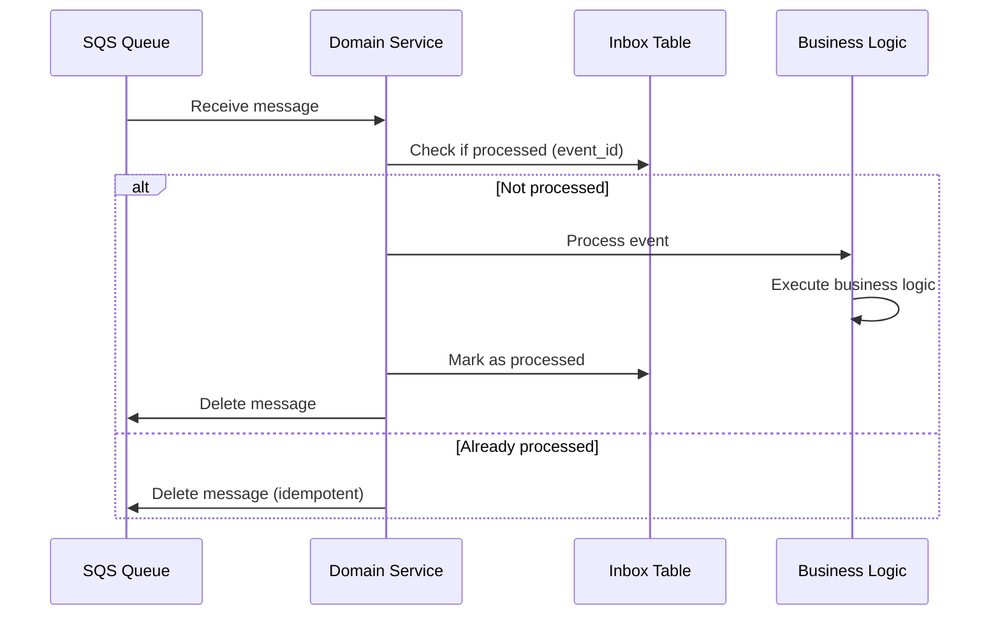
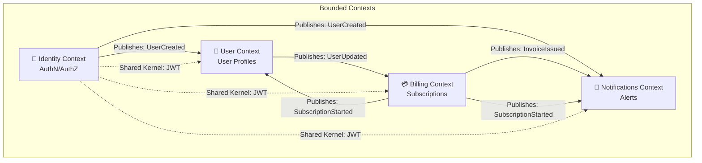
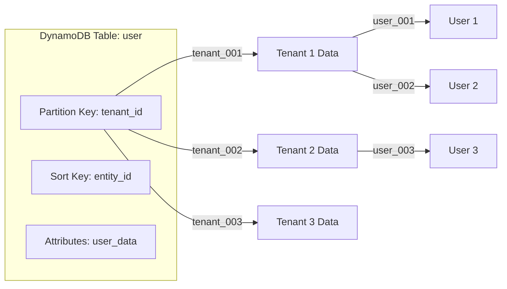
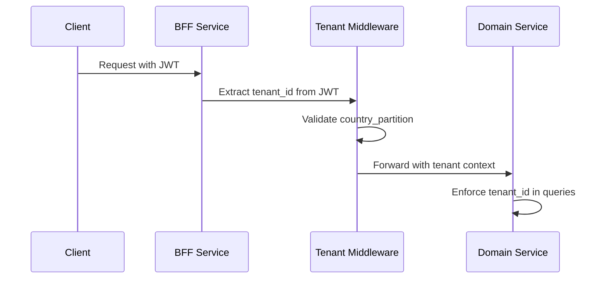

# ⚙️ Backend: DDD & Microservices
## 🧩 Bounded Contexts, Event-Driven Architecture & K8s Mapping

> **📖 Purpose**: This document describes the Domain-Driven Design (DDD) approach, bounded contexts mapped to Kubernetes namespaces, microservices patterns, and event-driven communication via EventBridge and SQS.

---

## 🎯 Scope

- 🧩 **Domain-Driven Design (DDD)**: Bounded contexts, domain models, ubiquitous language
- 🏗️ **Bounded Contexts as K8s Namespaces**: Each bounded context = Kubernetes namespace
- ⚙️ **Microservices Patterns**: Command/query separation, CQRS, service design
- 📡 **Event-Driven Architecture**: EventBridge + SQS for domain events
- 🔐 **Multi-Tenancy Data Patterns**: DynamoDB tenant isolation
- 📦 **Outbox/Inbox Patterns**: Reliable event publishing and consumption

---

## 🏗️ Bounded Contexts in Kubernetes



### 📊 Bounded Context Mapping

| Bounded Context | K8s Namespace | Services | Purpose |
|----------------|---------------|-----------|---------|
| **🔐 Identity** | `identity` | Identity Service | Authentication, authorization, JWT tokens |
| **👤 User** | `user` | User Service | User profiles, tenant-scoped data |
| **💳 Billing** | `billing` | Billing Service | Subscriptions, invoices, payments |
| **📧 Notifications** | `notifications` | Notifications Service | Email, webhooks, alerts |
| **🎭 BFF** | `bff` | BFF Service | API aggregation, tenant context |

### 🏗️ Namespace Configuration

Each namespace includes:
- **Labels**: `domain: {context-name}`, `tenant-isolation: strict`
- **Istio PeerAuthentication**: `STRICT` mTLS mode
- **NetworkPolicy**: Default deny, explicit allows
- **AuthorizationPolicy**: Service-to-service allowlist

---

## 🏛️ C4 Container Diagram



---

## 📡 Event-Driven Architecture



### 📡 Event Flow Pattern

1. **Producer**: Domain service writes event to DynamoDB outbox table
2. **Outbox Processor**: Polls outbox, publishes to EventBridge
3. **EventBridge**: Routes event to SQS queues via rules
4. **Consumer**: Polls SQS, checks inbox for deduplication
5. **Processing**: Processes event, marks as processed in inbox

### 🎯 Domain Events

| Event | Publisher | Consumers | Purpose |
|-------|-----------|-----------|---------|
| **UserCreated.v1** | Identity Service | User Service, Notifications Service | New user signup |
| **SubscriptionStarted.v1** | Billing Service | User Service, Notifications Service | Subscription activated |
| **InvoiceIssued.v1** | Billing Service | Notifications Service | Invoice generated |
| **NotificationRequested.v1** | Any Service | Notifications Service | Notification trigger |

---

## 📦 Outbox Pattern



### ✅ Outbox Pattern Benefits

- **✅ Transactional Guarantees**: Event written atomically with business data
- **✅ Reliability**: Events not lost if EventBridge is unavailable
- **✅ Idempotency**: Outbox processor can retry safely
- **✅ Ordering**: Events processed in order (optional)

### 📊 Outbox Table Schema

```json
{
  "event_id": "uuid",
  "domain": "user",
  "event_type": "UserCreated.v1",
  "payload": "{...}",
  "status": "pending|published|failed",
  "created_at": "timestamp",
  "published_at": "timestamp"
}
```

---

## 📥 Inbox Pattern (Deduplication)



### ✅ Inbox Pattern Benefits

- **✅ Deduplication**: Prevents duplicate event processing
- **✅ Idempotency**: Safe to process same event multiple times
- **✅ Audit Trail**: Track all processed events
- **✅ Recovery**: Can replay events if needed

### 📊 Inbox Table Schema

```json
{
  "event_id": "uuid",
  "domain": "notifications",
  "event_type": "UserCreated.v1",
  "processed_at": "timestamp",
  "status": "processed|failed"
}
```

---

## 🗺️ DDD Context Map



### 🔗 Context Relationships

| Relationship | From | To | Type | Mechanism |
|--------------|------|-----|------|-----------|
| **UserCreated** | Identity | User, Notifications | Published Language | EventBridge |
| **SubscriptionStarted** | Billing | User, Notifications | Published Language | EventBridge |
| **InvoiceIssued** | Billing | Notifications | Published Language | EventBridge |
| **JWT Token** | Identity | All | Shared Kernel | JWT claims |

---

## 🔐 Multi-Tenancy Data Patterns

### 📊 DynamoDB Partition Model



### ✅ Data Isolation Strategy

- **Partition Key**: `tenant_id` - Ensures tenant isolation
- **Sort Key**: `entity_id` - Unique entity within tenant
- **Access Control**: Application enforces tenant_id from JWT
- **Country Partition**: Additional `country_partition` (US/BR) for residency

### 📊 Table Schema Example

```json
{
  "tenant_id": "tenant_001",
  "entity_id": "user_123",
  "country_partition": "US",
  "user_data": {
    "name": "John Doe",
    "email": "john@example.com"
  },
  "created_at": "2024-01-01T00:00:00Z"
}
```

---

## ⚙️ Service Design Patterns

### 🎯 Command/Query Separation

| Pattern | Endpoint | Purpose |
|---------|----------|---------|
| **Command** | `POST /commands/create-user` | Mutate state, publish events |
| **Query** | `GET /read/users/:id` | Read state, no side effects |

### 📡 CQRS (Command Query Responsibility Segregation)

- **Commands**: Write to DynamoDB, publish events
- **Queries**: Read from DynamoDB (or read model if needed)
- **Events**: Drive eventual consistency across contexts

### 🔐 Tenant Context Middleware



---

## 💡 Key Decisions

1. **✅ Bounded Contexts = K8s Namespaces**: Clear domain boundaries, independent deployment
2. **✅ Event-Driven Communication**: EventBridge + SQS for loose coupling, no direct service calls
3. **✅ Outbox Pattern**: Reliable event publishing with transactional guarantees
4. **✅ Inbox Pattern**: Deduplication and idempotent event processing
5. **✅ DynamoDB Tenant Partitioning**: Single table per domain with tenant_id partition key
6. **✅ Command/Query Separation**: Clear separation of write and read operations
7. **✅ Tenant Context Middleware**: Automatic tenant extraction and validation
8. **✅ Istio mTLS**: All service-to-service communication encrypted and authenticated

---

## 🔗 Related Documentation

- 📄 [README.md](../README.md) - Central index
- 🏛️ [01-enterprise-architecture.md](01-enterprise-architecture.md) - EA and composable capabilities
- 🎨 [03-frontend-bff.md](03-frontend-bff.md) - BFF pattern and frontend
- ☁️ [04-cloud-foundation-sre.md](04-cloud-foundation-sre.md) - K8s and Istio infrastructure
- 💾 [05-data-platform-analytics-ml.md](05-data-platform-analytics-ml.md) - Data patterns
- 🔒 [08-security-zero-trust.md](08-security-zero-trust.md) - Security and multi-tenancy

---

> **💡 Tip**: Bounded contexts mapped to K8s namespaces enable clear domain boundaries and independent deployment. Event-driven communication via EventBridge + SQS provides loose coupling without Kafka complexity.

