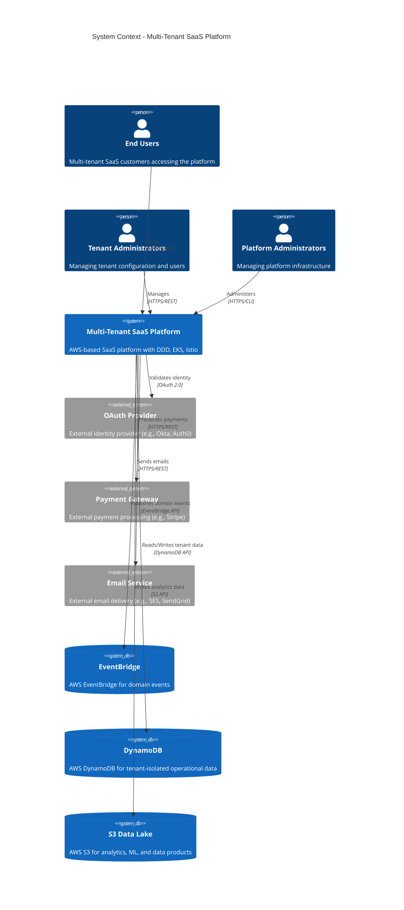
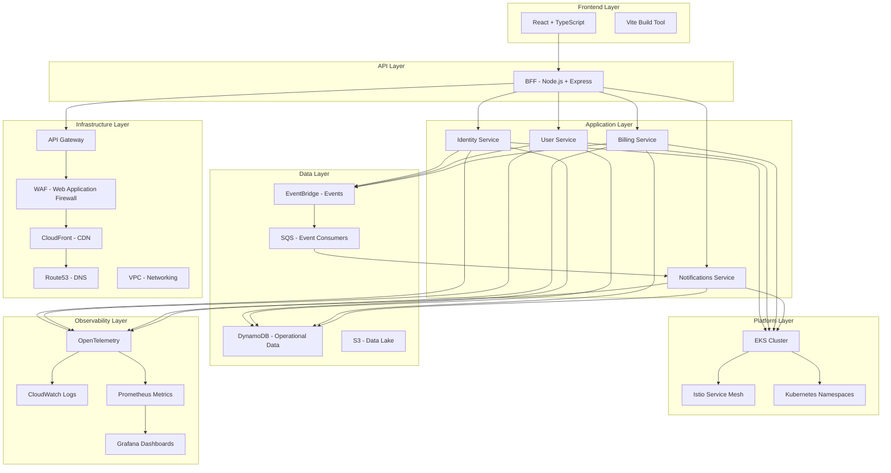

# 🏛️ Overall Solution Architecture
## 🎯 System Context & Technology Stack

> **📖 Purpose**: This document provides the overall solution architecture for the multi-tenant SaaS platform, including system context, technology stack, and architectural decisions.

---

## 🎯 Scope

- ✅ **Project Purpose**: Reference architecture for enterprise-grade multi-tenant SaaS on AWS
- ✅ **Target Audience**: Enterprise architects, senior engineers, platform teams
- ✅ **Technology Stack**: AWS-native services, EKS, Istio, EventBridge, DynamoDB
- ✅ **Architecture Style**: Domain-Driven Design (DDD) with bounded contexts, event-driven communication
- ✅ **Non-Goals**: This is documentation-only; no code implementation included

---

## 🏛️ System Context (C4 Level 1)

### 🎯 Key Actors

| Actor | Role | Interactions |
|-------|------|--------------|
| **End Users** | Multi-tenant SaaS customers | Use the platform via web/mobile |
| **Tenant Administrators** | Manage tenant configuration | Admin dashboard, user management |
| **Platform Administrators** | Manage infrastructure | AWS Console, Terraform, kubectl |
| **OAuth Provider** | External identity | OAuth 2.0 authentication flows |
| **Payment Gateway** | Payment processing | Payment transactions |
| **Email Service** | Email delivery | Notification emails |

---

## 📊 Technology Stack

### 🛠️ Technology Choices

| Layer | Technology | Rationale |
|-------|------------|-----------|
| **Frontend** | React + TypeScript | Modern, type-safe, component-based UI |
| **BFF** | Node.js + Express | API aggregation, tenant context propagation |
| **Backend** | Node.js + TypeScript | Consistent stack, type safety, microservices |
| **Platform** | EKS + Istio | Managed Kubernetes, service mesh for mTLS |
| **Data** | DynamoDB | Serverless, scalable, tenant partitioning |
| **Events** | EventBridge + SQS | AWS-native, no Kafka complexity, fanout pattern |
| **Analytics** | S3 + Glue + Athena | Data lake pattern, serverless analytics |
| **IaC** | Terraform | Infrastructure as code, version control |
| **Observability** | OpenTelemetry | Vendor-neutral, distributed tracing |

---

## 💡 Key Decisions

1. **✅ Domain-Driven Design (DDD)**: Bounded contexts mapped to K8s namespaces for clear domain boundaries
2. **✅ Event-Driven Architecture**: EventBridge + SQS instead of Kafka for AWS-native simplicity
3. **✅ Multi-Tenancy**: Data isolation via DynamoDB partition keys + application-level tenant context
4. **✅ Service Mesh**: Istio for automatic mTLS, traffic management, and observability
5. **✅ BFF Pattern**: Single backend entry point for frontend, aggregates APIs, enforces security
6. **✅ Zero Trust Security**: Defense in depth with multiple security layers
7. **✅ OpenTelemetry**: Vendor-neutral observability with distributed tracing
8. **✅ AWS-Native**: Leverage managed services (EKS, EventBridge, DynamoDB) for operational simplicity
9. **✅ Terraform IaC**: Infrastructure as code for reproducibility and version control
10. **✅ Composable Architecture**: Lower-level domains compose into higher-level business capabilities

---

## 🎯 Project Goals

### Primary Goals

- ✅ **Reference Architecture**: Comprehensive documentation for multi-tenant SaaS patterns
- ✅ **Architecture Documentation**: Complete documentation covering all architectural disciplines
- ✅ **EA Maturity**: Demonstrate composable capabilities, value chain, portfolio management
- ✅ **Production Patterns**: Real-world patterns (outbox, inbox, CQRS, multi-tenancy)
- ✅ **Security First**: Zero Trust model with defense in depth

### Success Criteria

- 📊 **Documentation Coverage**: All discipline documents completed
- 🎨 **Visual Diagrams**: Comprehensive Mermaid diagrams across all documents
- 🔗 **Cross-References**: All documents linked and cross-referenced
- 📚 **Architecture Reference**: Clear architecture principles and decisions documented

---

## 🚫 Non-Goals

- ❌ **Code Implementation**: This is documentation-only; no actual code
- ❌ **Full Production System**: Reference architecture, not production deployment
- ❌ **All AWS Services**: Focus on core services; not exhaustive AWS coverage
- ❌ **Specific Business Domain**: Generic patterns applicable to any multi-tenant SaaS

---

---

## 🚀 Next Steps for Implementation

### 📋 Implementation Roadmap

1. **🏗️ Infrastructure Setup**
   - ✅ Terraform modules for VPC, EKS, networking
   - ✅ EKS cluster with node groups and IRSA
   - ✅ Istio installation and configuration

2. **🔐 Security Foundation**
   - ✅ WAF rules and API Gateway policies
   - ✅ IAM roles and IRSA for services
   - ✅ Secrets management (Secrets Manager, SSM)

3. **⚙️ Backend Services**
   - ✅ Domain services (identity, user, billing, notifications)
   - ✅ BFF service with tenant context middleware
   - ✅ Event adapters (EventBridge publisher, SQS consumer)

4. **🎨 Frontend**
   - ✅ React app with tenant selection
   - ✅ BFF client integration
   - ✅ Pages for Users, Billing, Notifications

5. **📊 Observability**
   - ✅ OpenTelemetry instrumentation
   - ✅ CloudWatch logs and Prometheus metrics
   - ✅ Grafana dashboards and SLO definitions

6. **🔄 CI/CD**
   - ✅ GitHub Actions workflows
   - ✅ Docker image builds and ECR pushes
   - ✅ Terraform plan/apply automation

7. **💾 Data Platform**
   - ✅ DynamoDB tables per domain
   - ✅ S3 buckets for data lake
   - ✅ Glue catalog and Athena queries

8. **🧪 Testing**
   - ✅ Unit tests for services
   - ✅ Integration tests for event flows
   - ✅ Contract tests for APIs

9. **📈 Performance**
   - ✅ Load testing and optimization
   - ✅ Caching strategies
   - ✅ Database query optimization

10. **✅ Production Hardening**
    - ✅ Real JWT validation (not simulated)
    - ✅ Real EventBridge integration (not console.log)
    - ✅ Comprehensive error handling
    - ✅ Disaster recovery procedures
    - ✅ Cost optimization

---

## 🔗 Related Documentation

- 📄 [README.md](../README.md) - Central index and navigation
- 🏛️ [01-enterprise-architecture.md](01-enterprise-architecture.md) - EA frameworks and composable capabilities
- ☁️ [03-cloud-foundation-sre.md](03-cloud-foundation-sre.md) - AWS infrastructure and SRE
- ⚙️ [04-backend-ddd-microservices.md](04-backend-ddd-microservices.md) - DDD and microservices patterns
- 🎨 [05-frontend-bff.md](05-frontend-bff.md) - Frontend and BFF architecture
- 💾 [06-data-platform-analytics-ml.md](06-data-platform-analytics-ml.md) - Data platform and analytics
- 🔒 [07-security-zero-trust.md](07-security-zero-trust.md) - Zero Trust security model
- 📊 [08-observability.md](08-observability.md) - Observability and OpenTelemetry
- 🔄 [09-devsecops.md](09-devsecops.md) - CI/CD and DevSecOps

---

> **💡 Tip**: This document provides the overall solution architecture. Start with Enterprise Architecture to understand the business context, then explore specific disciplines based on your needs.

