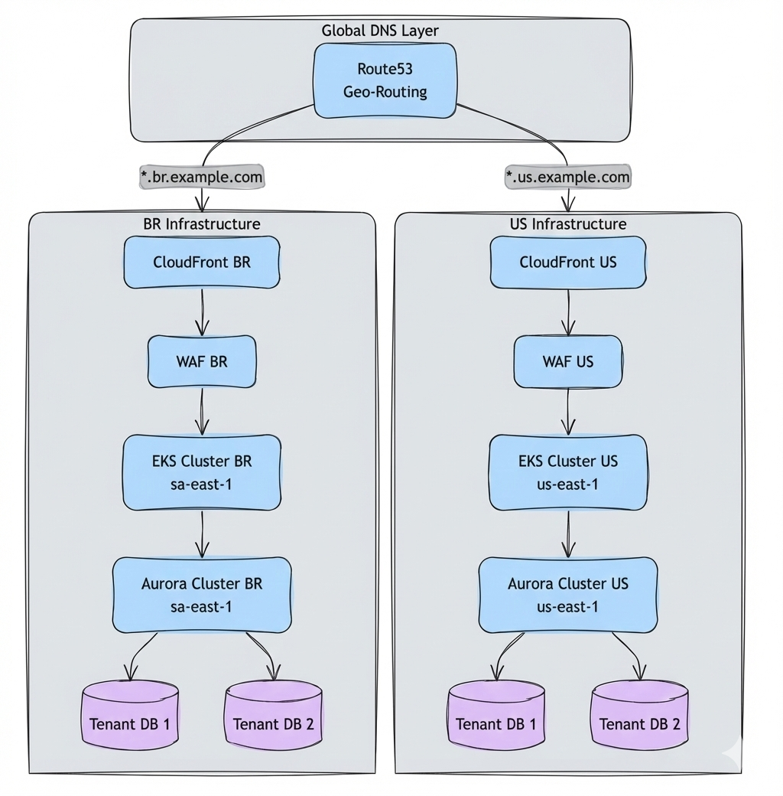
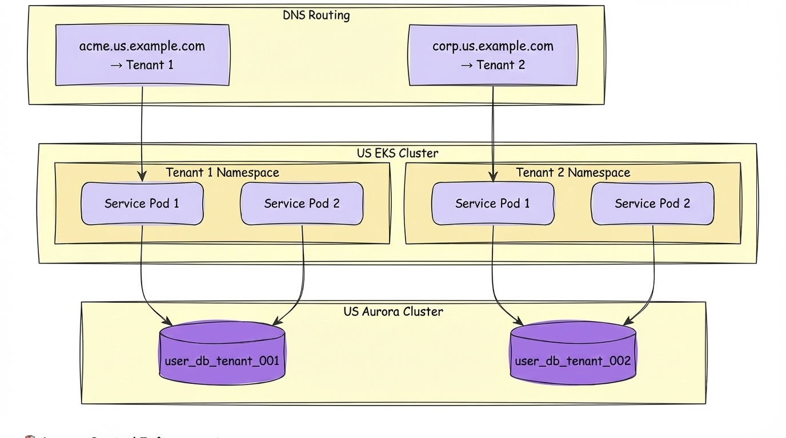
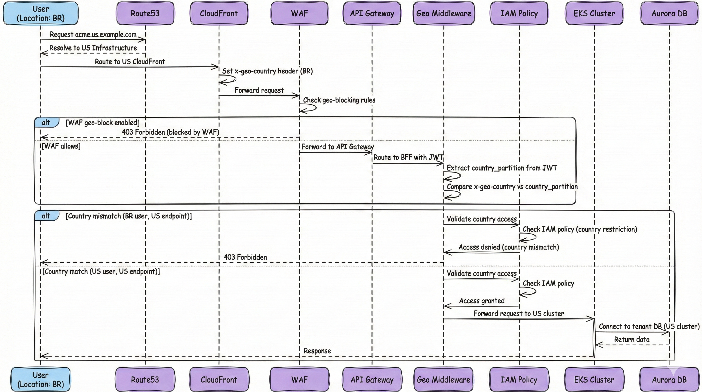
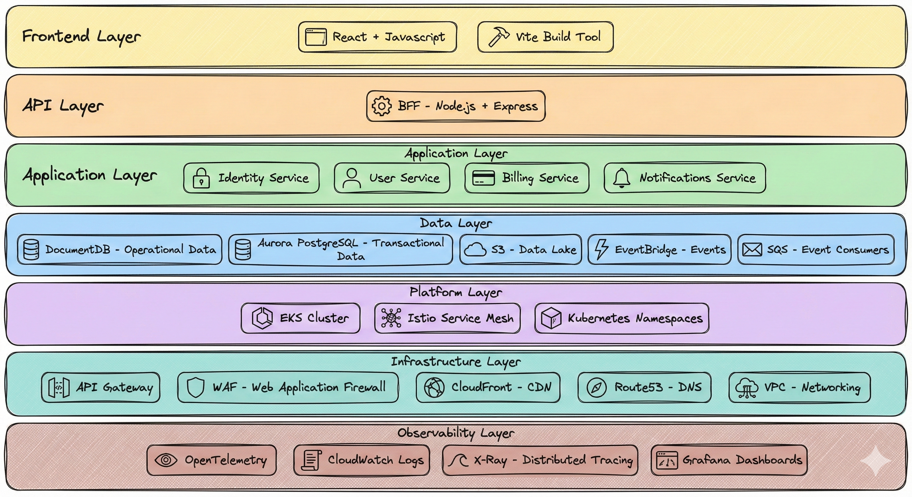

# 🏛️ Overall Solution Architecture
## 🎯 System Context & Technology Stack

> **📖 Purpose**: This document provides the overall solution architecture for the multi-tenant SaaS platform, including system context, technology stack, and architectural decisions.

---

## 🌍 Multi-Country Multi-Tenant Isolation Architecture

This architecture enforces **strict geographic and tenant isolation** to ensure **data residency compliance** with regulations such as GDPR, data localization laws, and country-specific requirements. We implement **complete isolation at multiple layers**—infrastructure level (separate EKS clusters and database clusters per country) and application level (DNS routing, IAM policies, geo-validation middleware)—creating a **defense-in-depth approach** that prevents any cross-country or cross-tenant data access.

The platform uses **country-based subdomain routing** where each tenant is identified by a subdomain pattern: `{tenant_id}.{country_code}.example.com` (e.g., `acme.us.example.com`, `acme.br.example.com`). Route53 performs **geo-routing** to direct requests to the correct country infrastructure, while **geo-validation middleware** and **IAM policies** work together to block access attempts from users outside their authorized country, even if they have valid IAM permissions. This ensures that data never crosses geographic boundaries and tenants can only access their own isolated clusters within their designated country.

Each country maintains **completely isolated infrastructure**: separate EKS clusters for compute, separate database clusters (Aurora PostgreSQL, DocumentDB) per tenant per country, and independent networking. Each tenant has its **own dedicated database cluster per country** (e.g., `tenant_001_cluster_us`, `tenant_002_cluster_us`), with **domains as separate databases** within each tenant cluster (e.g., `identity_db`, `user_db`, `billing_db`). This **one cluster per tenant** model provides **complete physical isolation** while maintaining operational efficiency through shared compute resources within each tenant cluster.

### 🗺️ Country-Level Isolation Architecture

### 🏢 Tenant Isolation Within Country

### 🛡️ Access Control Enforcement

The platform implements **multi-layered access control** to enforce geographic and tenant boundaries through a **defense-in-depth security model**. The **subdomain format** `{tenant_id}.{country_code}.example.com` (e.g., `acme.us.example.com`, `acme.br.example.com`) enables Route53 to perform **geo-routing** and direct requests to the correct country's infrastructure from the start. This DNS-based routing ensures that requests are sent to the appropriate EKS cluster and Aurora database cluster, reducing latency and ensuring data never leaves the designated country.

**IAM policies** are configured to restrict access based on country, ensuring that even users with valid credentials cannot access resources outside their authorized country. The **geo-validation middleware** is a **custom Express.js middleware component** deployed within the BFF service that validates geographic access at the application layer. It extracts the `x-geo-country` header (set by CloudFront based on the user's geographic location) and compares it against the `country_partition` claim in the JWT token. The middleware is configured to run early in the request pipeline, before any business logic execution, ensuring that geographic validation occurs before database connections are established. If a user attempts to access a country's infrastructure from a different geographic location, the middleware blocks the request with a `403 Forbidden` response, even if IAM policies would otherwise allow access.

**AWS services involved** in the geo-validation flow include **CloudFront** (which sets the `x-geo-country` header based on the request origin's geographic location), **Route53** (which performs geo-routing to direct requests to country-specific infrastructure), **WAF** (which can be configured with geo-blocking rules as an additional layer), and **IAM** (which enforces country-based access restrictions). The combination of DNS routing, IAM policies, WAF geo-blocking, and geo-validation middleware creates a comprehensive geographic access control system that operates at both the infrastructure and application layers.

### 🔐 Geographic Access Control Flow

The following sequence diagram illustrates the complete access control flow, showing how requests are validated at multiple layers before reaching the tenant's isolated database:

### 📊 Key Isolation Principles

| Isolation Layer | Mechanism | Purpose |
|----------------|-----------|---------|
| **Country Isolation** | Separate EKS clusters, database clusters per country | Data residency compliance, regulatory requirements |
| **Tenant Isolation** | One cluster per tenant, domains as databases, subdomain routing | Complete physical isolation, data sovereignty |
| **Geographic Access Control** | IAM policies + WAF geo-blocking + geo-validation middleware | Prevent cross-country access, enforce data residency |
| **DNS Routing** | Route53 with country-based subdomains | Route to correct country infrastructure, tenant identification |

---

## 🏢 Tenant Architecture Overview

Building upon the **country-level isolation** foundation, our **tenant architecture** implements **complete physical isolation per tenant** within each country's infrastructure. Each tenant has its **own dedicated database cluster per country** (e.g., `tenant_001_cluster_us`, `tenant_002_cluster_us`), with **domains as separate databases** within each tenant cluster (e.g., `identity_db`, `user_db`, `billing_db`, `notifications_db`). This ensures **strong data sovereignty** and **regulatory compliance** at the tenant level. The architecture follows **Domain-Driven Design (DDD)** principles, mapping each **bounded context** to a Kubernetes namespace, enabling **independent deployment**, **resource isolation**, and **clear domain boundaries**.

Tenants are identified through **subdomain routing** (`{tenant_id}.{country_code}.example.com`), which enables automatic **connection routing** to the correct tenant cluster and domain database based on the `tenant_id` and `domain` extracted from the JWT token and service context. The application implements **tenant-aware and domain-aware connection pooling**, where each tenant-domain combination has its own connection pool that routes to the tenant's isolated cluster and domain database. This **one cluster per tenant** model provides **complete physical isolation** while maintaining **operational efficiency**—compute resources (EKS clusters, pods) are shared across tenants within a country, while data remains completely isolated at the cluster level.

The tenant architecture leverages **event-driven communication** via EventBridge and SQS to enable **loose coupling** between domain services, with **outbox/inbox patterns** ensuring reliable event publishing and idempotent consumption. **CQRS (Command Query Responsibility Segregation)** enables independent scaling of read and write workloads through Aurora read replicas, while **Istio service mesh** provides automatic mTLS encryption for all service-to-service communication, ensuring **zero-trust networking** within the tenant's namespace boundaries.

---

## 🎯 Scope

- ✅ **Project Purpose**: Reference architecture for enterprise-grade multi-tenant SaaS on AWS
- ✅ **Target Audience**: Enterprise architects, senior engineers, platform teams
- ✅ **Technology Stack**: AWS-native services, EKS, Istio, EventBridge, Aurora PostgreSQL
- ✅ **Architecture Style**: Domain-Driven Design (DDD) with bounded contexts, event-driven communication
- ✅ **Non-Goals**: This is documentation-only; no code implementation included

---

## 🏛️ System Context (C4 Level 1)

### 🎯 Key Actors

| Actor | Role | Interactions |
|-------|------|--------------|
| **End Users** | Multi-tenant SaaS customers | Use the platform via web/mobile |
| **Tenant Administrators** | Manage tenant configuration | Admin dashboard, user management |
| **Platform Administrators** | Manage infrastructure | AWS Console, Terraform, kubectl |
| **OAuth Provider** | External identity | OAuth 2.0 authentication flows |
| **Payment Gateway** | Payment processing | Payment transactions |
| **Email Service** | Email delivery | Notification emails |

---

## 📊 Technology Stack - Few Important Services

### 🛠️ Technology Choices

| Layer | Technology | Rationale |
|-------|------------|-----------|
| **Frontend** | React + TypeScript | Modern, type-safe, component-based UI with rich ecosystem |
| **BFF** | Node.js + Express | Lightweight API aggregation, efficient tenant context propagation |
| **Backend** | Node.js + TypeScript | Consistent stack, type safety, developer productivity for microservices |
| **Platform** | EKS + Istio | Managed Kubernetes scalability, service mesh for automatic mTLS |
| **Data** | Aurora PostgreSQL, DocumentDB, DynamoDB | Managed databases with one cluster per tenant, domains as databases, physical isolation |
| **Events** | EventBridge + SQS | AWS-native simplicity, no Kafka ops overhead, reliable fanout |
| **Analytics** | S3 + Glue + Athena | Cost-effective data lake, serverless analytics at scale |
| **IaC** | Terraform | Industry-standard IaC, version control, multi-cloud support |
| **Observability** | OpenTelemetry | Vendor-neutral standard, distributed tracing, future-proof |

---

## 💡 Key Decisions

1. **✅ Domain-Driven Design (DDD)**: Bounded contexts mapped to K8s namespaces for clear domain boundaries
2. **✅ Event-Driven Architecture**: EventBridge + SQS instead of Kafka for AWS-native simplicity
3. **✅ Multi-Tenancy**: One cluster per tenant (Aurora PostgreSQL, DocumentDB), domains as separate databases within tenant cluster, physical isolation
4. **✅ Multi-Country Isolation**: Separate EKS clusters and database clusters per country, one cluster per tenant per country, geo-routing, geographic access control
5. **✅ Service Mesh**: Istio for automatic mTLS, traffic management, and observability
6. **✅ BFF Pattern**: Single backend entry point for frontend, aggregates APIs, enforces security
7. **✅ Zero Trust Security**: Defense in depth with multiple security layers
8. **✅ OpenTelemetry**: Vendor-neutral observability with distributed tracing
9. **✅ AWS-Native**: Leverage managed services (EKS, EventBridge, Aurora PostgreSQL, DocumentDB, DynamoDB) for operational simplicity
10. **✅ Terraform IaC**: Infrastructure as code for reproducibility and version control
11. **✅ Composable Architecture**: Lower-level domains compose into higher-level business capabilities

---

## 🎯 Project Goals

### Primary Goals

- ✅ **Reference Architecture**: Comprehensive documentation for multi-tenant SaaS patterns
- ✅ **Architecture Documentation**: Complete documentation covering all architectural disciplines
- ✅ **EA Maturity**: Demonstrate composable capabilities, value chain, portfolio management
- ✅ **Production Patterns**: Real-world patterns (outbox, inbox, CQRS, multi-tenancy)
- ✅ **Security First**: Zero Trust model with defense in depth

### Success Criteria

- 📊 **Documentation Coverage**: All discipline documents completed
- 🎨 **Visual Diagrams**: Comprehensive Mermaid diagrams across all documents
- 🔗 **Cross-References**: All documents linked and cross-referenced
- 📚 **Architecture Reference**: Clear architecture principles and decisions documented

---

## 🔗 Related Documentation

- 📄 [README.md](../README.md) - Central index and navigation
- 🏛️ [01-enterprise-architecture.md](01-enterprise-architecture.md) - EA frameworks and composable capabilities
- ☁️ [03-cloud-foundation-sre.md](03-cloud-foundation-sre.md) - AWS infrastructure and SRE
- ⚙️ [04-backend-ddd-microservices.md](04-backend-ddd-microservices.md) - DDD and microservices patterns
- 🎨 [05-frontend-bff.md](05-frontend-bff.md) - Frontend and BFF architecture
- 💾 [06-data-platform-analytics-ml.md](06-data-platform-analytics-ml.md) - Data platform and analytics
- 🔒 [07-security-zero-trust.md](07-security-zero-trust.md) - Zero Trust security model
- 📊 [08-observability.md](08-observability.md) - Observability and OpenTelemetry
- 🔄 [09-devsecops.md](09-devsecops.md) - CI/CD and DevSecOps

---

> **💡 Tip**: This document provides the overall solution architecture. Start with Enterprise Architecture to understand the business context, then explore specific disciplines based on your needs.

