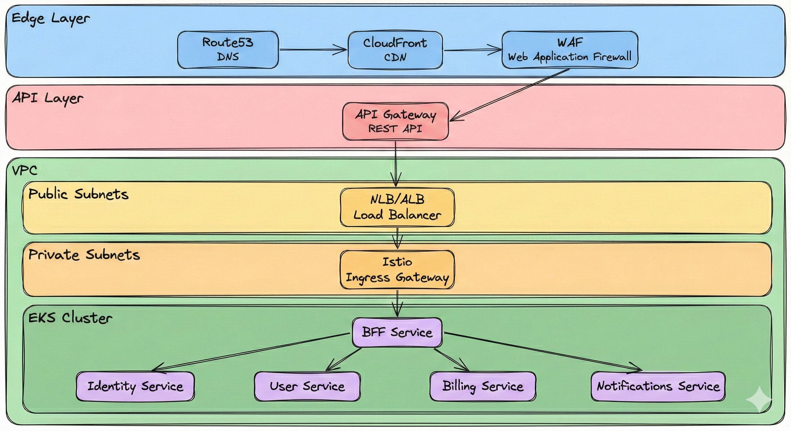
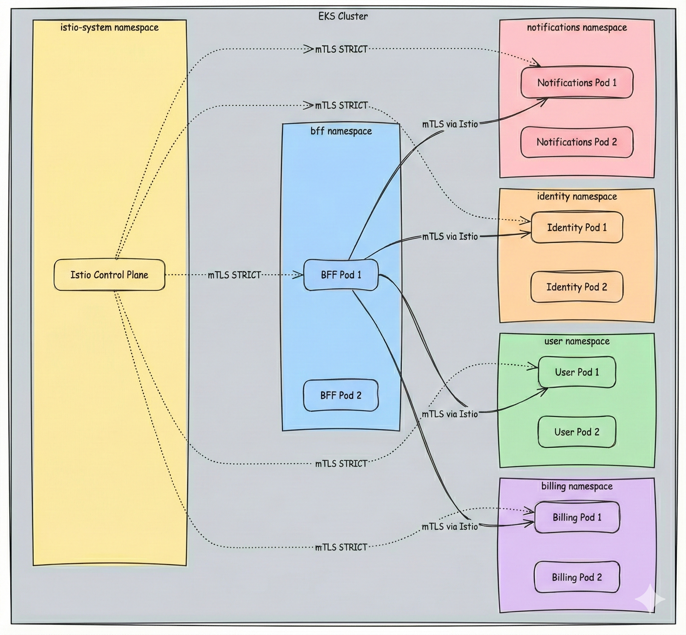
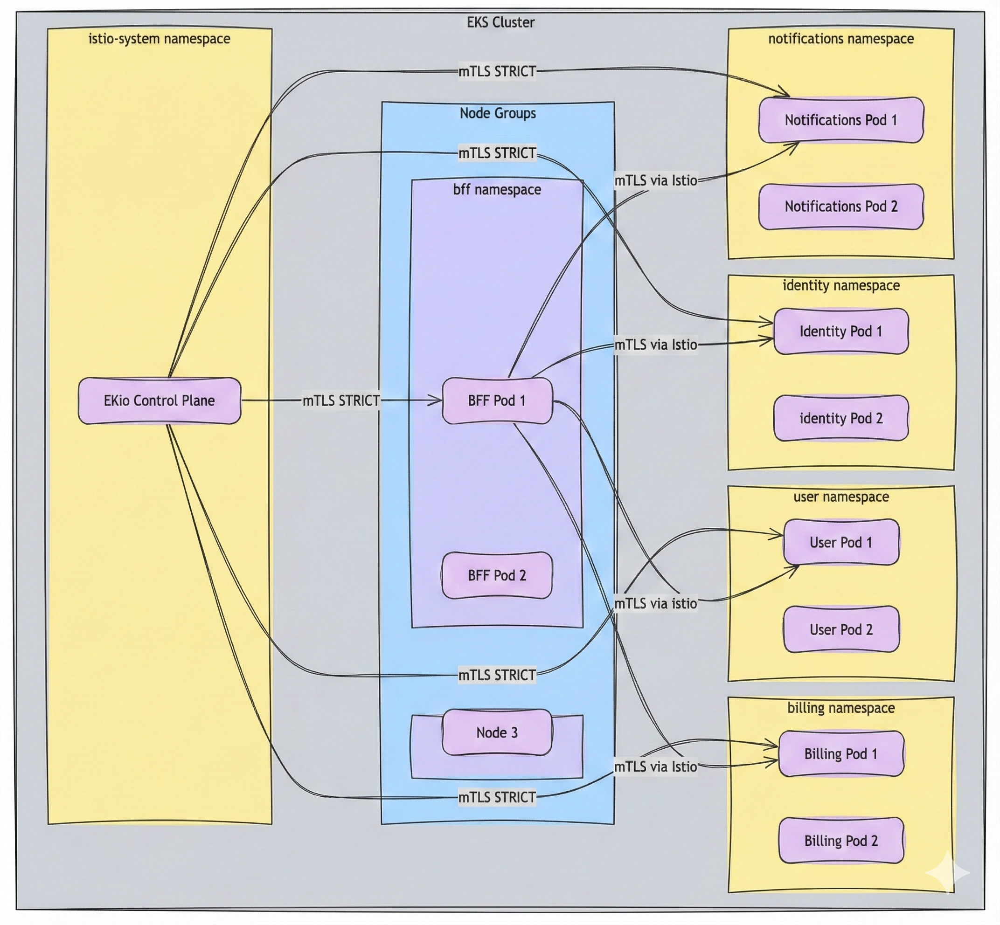
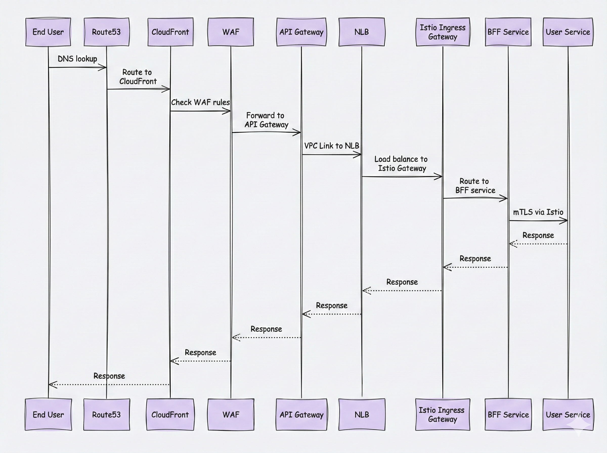
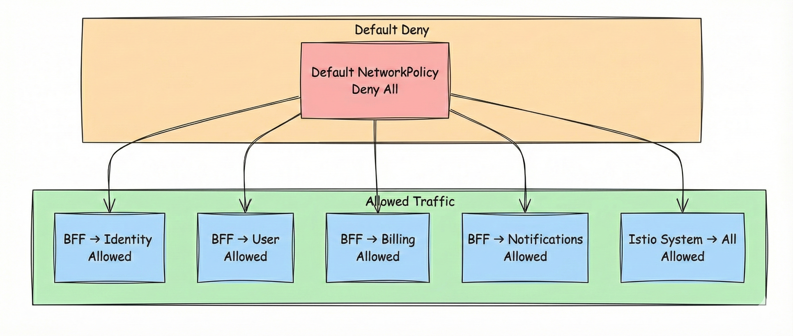
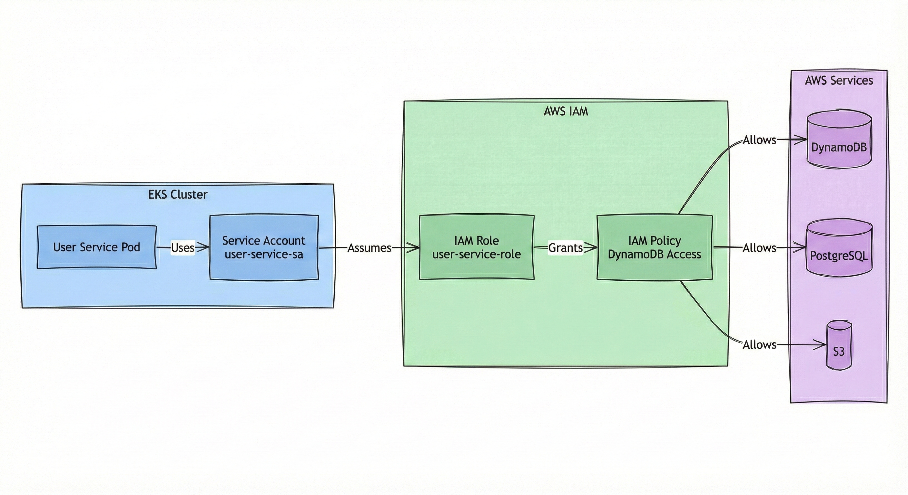

# ☁️ Cloud Foundation & SRE
## 🌐 AWS Infrastructure, EKS, Istio & Site Reliability Engineering

> **📖 Purpose**: This document describes the AWS infrastructure architecture, EKS cluster design, Istio service mesh, networking topology, and SRE practices for operational excellence.

---

## 🎯 Cloud Foundation Principles

This cloud foundation follows **cloud-native architecture principles** and **composable infrastructure patterns** to deliver a resilient, scalable, and secure multi-tenant SaaS platform. Our approach emphasizes **infrastructure as code (IaC)** for reproducibility, **managed services** for operational simplicity, and **defense-in-depth security** at every layer. The architecture is designed as **composable building blocks**—each infrastructure component (networking, compute, storage, security) can be independently scaled, updated, and managed while maintaining clear boundaries and interfaces. We leverage **AWS Well-Architected Framework** principles (operational excellence, security, reliability, performance efficiency, cost optimization) and **SRE methodologies** (SLIs, SLOs, error budgets) to ensure production-grade reliability and observability. The foundation supports **zero-trust networking** with service mesh mTLS, **least-privilege IAM** via IRSA, and **immutable infrastructure** patterns for consistent deployments.

---

## 🎯 Scope

- 🌐 **Frontdoor Services**: Route53 (DNS), CloudFront (CDN), WAF (Web Application Firewall), edge security
- ☁️ **AWS Infrastructure**: VPC, subnets, endpoints, security groups, networking, load balancers
- 🔒 **Infrastructure Security**: Security groups, network ACLs, VPC endpoints, encryption at rest/transit
- 🎯 **EKS Cluster & Core Backend Services**: Cluster design, node groups, IRSA (IAM Roles for Service Accounts), core backend service architecture
- 🔗 **Istio Service Mesh**: Ingress gateway, east-west traffic, mTLS, traffic management
- 📦 **Container & Deployment Services**: ECR (container registry), container image management, deployment pipelines
- ⚡ **Serverless Compute**: AWS Lambda for general-purpose tasks, event processing, scheduled jobs
- 💾 **Data Layer**: DynamoDB (transactional), S3 (object storage), Secrets Manager (secrets), RDS (optional relational), data lake (S3 + Glue + Athena)
- 🔍 **Observability & Monitoring Security**: CloudWatch, GuardDuty, Security Hub, CloudTrail, security monitoring and threat detection
- 🌐 **Networking**: Route53 → CloudFront → WAF → API Gateway → EKS topology
- 📊 **SRE Practices**: SLIs, SLOs, error budgets, runbooks, incident response

---

## 🌐 Network Topology (North-South Traffic)



### 📊 Traffic Flow

| Layer | Component | Purpose |
|-------|-----------|---------|
| **Edge** | Route53 | Global DNS resolution, subdomain routing (tenant.region.example.com), geo-routing, health checks, tenant identification from DNS |
| **Edge** | CloudFront | Global CDN, static asset caching, DDoS mitigation, SSL/TLS termination (for static content) |
| **Edge** | WAF | Web application firewall, OWASP Top 10 protection, rate-based rules, bot control (attached to CloudFront/API Gateway) |
| **API** | API Gateway | REST API management, SSL/TLS termination (primary termination point for API traffic), request throttling, API key authentication, request/response transformation, tenant context extraction |
| **API** | VPC Link | Private, secure integration between API Gateway and VPC resources without internet exposure (HTTP pass-through) |
| **Network** | NLB/ALB | Layer 4/7 load balancing, health checks, path-based routing (HTTP pass-through from API Gateway) |
| **Mesh** | Istio Ingress Gateway | Service mesh entry point, routing rules, mTLS enforcement for east-west traffic, tenant context propagation |
| **Application** | EKS Services | Domain-driven microservices, business logic execution, tenant-aware processing (tenant validation, tenant context injection, data isolation) |

---

## 🔗 Istio Service Mesh (East-West Traffic)



### 🎯 Service Mesh Approach

We leverage **Istio service mesh** to provide automatic **mTLS encryption** for all east-west (service-to-service) traffic within the EKS cluster, eliminating the need for manual certificate management and ensuring zero-trust networking. The service mesh enforces **strict mTLS** between all services, provides **fine-grained authorization policies** for service-to-service communication, and enables **observability** through distributed tracing and metrics collection. For this reference architecture, we use a **single EKS cluster** to host all domain services, which simplifies operations, reduces infrastructure overhead, and maintains clear domain boundaries through Kubernetes namespaces. However, the architecture is designed to **scale horizontally**—clusters can be split by domain, region, or tenant if scaling requirements demand it, with Istio's multi-cluster capabilities enabling secure cross-cluster communication.

Our deployment strategy follows a **one container per POD** pattern for operational simplicity, enhanced auditability, and streamlined deployment management. This approach provides clear **resource isolation**, simplifies **security scanning** and **vulnerability management** per service, enables **independent scaling** and **lifecycle management**, and improves **observability** with clear service-to-container mapping. While sidecar patterns (e.g., service mesh proxies) are injected automatically by Istio, the application container remains the primary workload, ensuring clean separation of concerns and easier troubleshooting.

### 🔒 Istio Security Configuration (non Exhaustive Examples)

**PeerAuthentication (mTLS STRICT):**
```yaml
apiVersion: security.istio.io/v1beta1
kind: PeerAuthentication
metadata:
  name: default
  namespace: identity
spec:
  mtls:
    mode: STRICT
```

**AuthorizationPolicy (Service-to-Service):**
```yaml
apiVersion: security.istio.io/v1beta1
kind: AuthorizationPolicy
metadata:
  name: allow-bff-to-identity
  namespace: identity
spec:
  selector:
    matchLabels:
      app: identity-service
  action: ALLOW
  rules:
  - from:
    - source:
        principals: ["cluster.local/ns/bff/sa/bff-service"]
```

---

## 🎯 EKS Cluster Architecture




### 📊 EKS Configuration (non Exhaustive Example)

| Component | Configuration | Purpose |
|-----------|--------------|---------|
| **Cluster** | EKS 1.28+ | Kubernetes orchestration |
| **Node Groups** | Managed node groups (t3.large) | Worker nodes |
| **IRSA** | IAM Roles for Service Accounts | AWS service access |
| **Networking** | VPC CNI, Calico | Pod networking |
| **Storage** | EBS CSI driver | Persistent volumes |

---

## 🔄 Traffic Flow (North-South & East-West)



### 📊 Traffic Types

| Type | Path | Encryption |
|------|------|------------|
| **North-South** | User → Route53 → CloudFront → WAF → API Gateway → NLB → Istio Gateway → Services | TLS 1.3 |
| **East-West** | Service → Service (via Istio) | mTLS (Istio) |

---

## 🔐 Network Policies  (defense in depth - all layers protected)



### 🛡️ NetworkPolicy Example

```yaml
apiVersion: networking.k8s.io/v1
kind: NetworkPolicy
metadata:
  name: allow-bff-to-user
  namespace: user
spec:
  podSelector:
    matchLabels:
      app: user-service
  policyTypes:
  - Ingress
  ingress:
  - from:
    - namespaceSelector:
        matchLabels:
          name: bff
      podSelector:
        matchLabels:
          app: bff-service
    ports:
    - protocol: TCP
      port: 8080
```

---

## 🔐 IAM Roles for Service Accounts (IRSA)



### 📊 IRSA Configuration

| Service | IAM Role | Permissions |
|---------|----------|------------|
| **User Service** | `user-service-role` | DynamoDB + PostgreSQL read/write (user table) |
| **Billing Service** | `billing-service-role` | PostgreSQL read/write (billing table) |
| **Notifications Service** | `notifications-service-role` | PostgreSQL read/write, SES send email |
| **BFF Service** | `bff-service-role` | No AWS service access (only calls other services) |

---

## 📊 SRE Practices

### 🎯 SLIs (Service Level Indicators) - Examples from the Industry

| SLI | Measurement | Target |
|-----|-------------|--------|
| **Availability** | Uptime percentage | 99.9% (3 nines) |
| **Latency (p50)** | Median response time | < 200ms |
| **Latency (p99)** | 99th percentile | < 1000ms |
| **Error Rate** | 5xx errors / total requests | < 0.1% |
| **Throughput** | Requests per second | > 1000 RPS |

### 📈 SLOs (Service Level Objectives) - Examples from the Industry

| Service | SLO | Error Budget |
|---------|-----|--------------|
| **BFF** | 99.9% availability | 43.2 minutes/month |
| **Identity** | 99.95% availability | 21.6 minutes/month |
| **User** | 99.9% availability | 43.2 minutes/month |
| **Billing** | 99.95% availability | 21.6 minutes/month |
| **Notifications** | 99.5% availability | 216 minutes/month |

### 📖 Runbooks

**Common Runbooks:**
- 🔴 **Service Down**: Check pods, check logs, check dependencies
- 🟡 **High Latency**: Check metrics, check database, check network
- 🟠 **High Error Rate**: Check logs, check dependencies, check configuration
- 🔵 **Capacity Issues**: Scale pods, check node capacity, check quotas

### 🚨 Incident Response

1. **Detection**: Alerts from CloudWatch, Prometheus
2. **Triage**: Identify affected services, scope impact
3. **Mitigation**: Rollback, scale up, fix configuration
4. **Resolution**: Root cause analysis, post-mortem
5. **Prevention**: Update runbooks, improve monitoring

---

## 💡 Key Decisions

1. **✅ AWS-Native Services**: Leverage managed services (EKS, EventBridge, DynamoDB) for operational simplicity
2. **✅ Istio Service Mesh**: Automatic mTLS, traffic management, observability
3. **✅ Defense in Depth**: Multiple security layers (WAF, API Gateway, Istio, NetworkPolicies)
4. **✅ IRSA**: IAM Roles for Service Accounts for least-privilege AWS access
5. **✅ Network Policies**: Default deny, explicit allows for network segmentation
6. **✅ SLO-Based Operations**: SLIs, SLOs, error budgets for reliability
7. **✅ Managed Node Groups**: AWS-managed EKS node groups for operational simplicity
8. **✅ VPC Endpoints**: Private connectivity to AWS services (S3, DynamoDB)

---

## 🔗 Related Documentation

- 📄 [README.md](../README.md) - Central index
- 🏛️ [01-enterprise-architecture.md](01-enterprise-architecture.md) - Enterprise architecture
- 🏛️ [02-overall-solution-architecture.md](02-overall-solution-architecture.md) - Overall solution architecture
- ⚙️ [04-backend-ddd-microservices.md](04-backend-ddd-microservices.md) - Domain services
- 🔒 [07-security-zero-trust.md](07-security-zero-trust.md) - Security model
- 📊 [08-observability.md](08-observability.md) - Observability and monitoring

---

> **💡 Tip**: Istio service mesh provides automatic mTLS for all service-to-service communication, eliminating the need for manual certificate management. NetworkPolicies add an additional layer of network segmentation.

