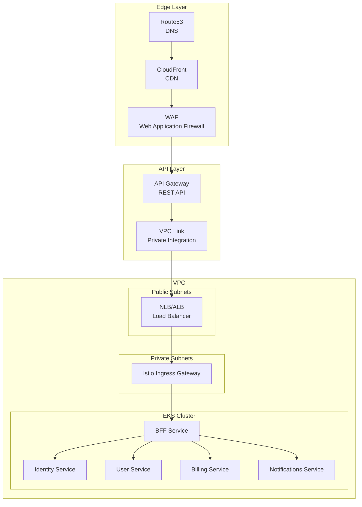
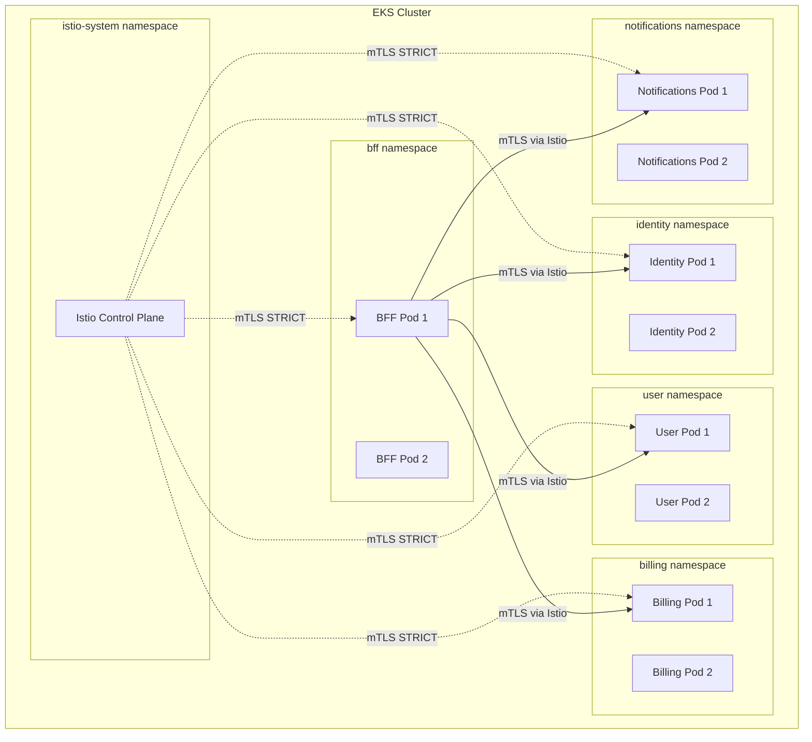
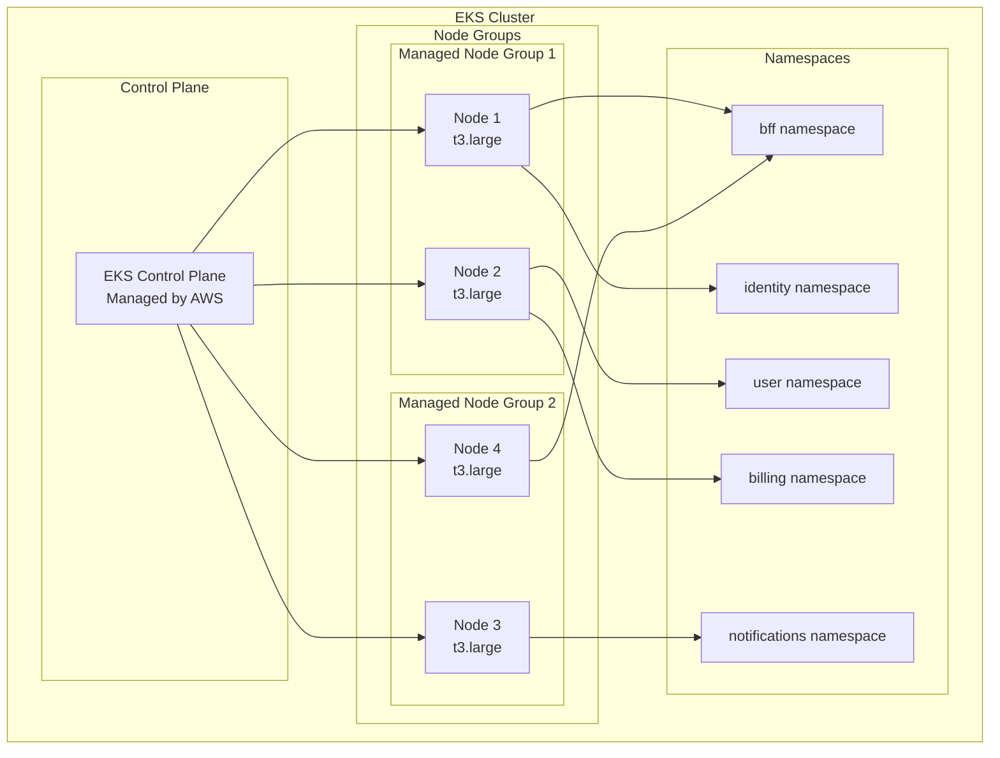
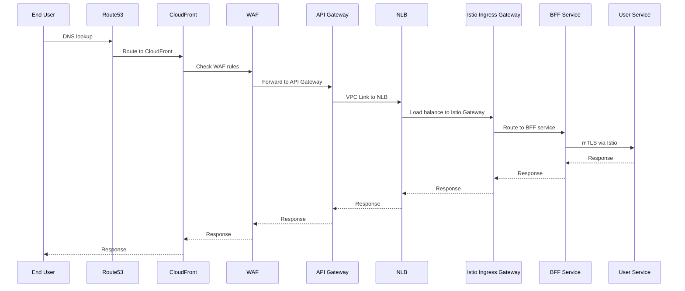
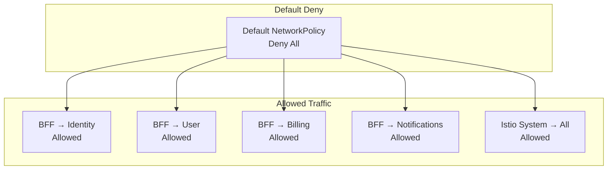
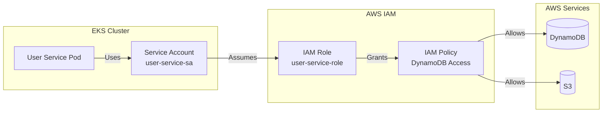

# ☁️ Cloud Foundation & SRE
## 🌐 AWS Infrastructure, EKS, Istio & Site Reliability Engineering

> **📖 Purpose**: This document describes the AWS infrastructure architecture, EKS cluster design, Istio service mesh, networking topology, and SRE practices for operational excellence.

---

## 🎯 Scope

- ☁️ **AWS Infrastructure**: VPC, subnets, endpoints, security groups, networking
- 🎯 **EKS Cluster**: Cluster design, node groups, IRSA (IAM Roles for Service Accounts)
- 🔗 **Istio Service Mesh**: Ingress gateway, east-west traffic, mTLS, traffic management
- 🌐 **Networking**: Route53 → CloudFront → WAF → API Gateway → EKS topology
- 📊 **SRE Practices**: SLIs, SLOs, error budgets, runbooks, incident response

---

## 🌐 Network Topology (North-South Traffic)



### 📊 Traffic Flow

| Layer | Component | Purpose |
|-------|-----------|---------|
| **Edge** | Route53 | DNS resolution |
| **Edge** | CloudFront | CDN, caching, DDoS protection |
| **Edge** | WAF | Web application firewall, OWASP rules |
| **API** | API Gateway | REST API, rate limiting, API keys |
| **API** | VPC Link | Private integration to VPC |
| **Network** | NLB/ALB | Load balancing |
| **Mesh** | Istio Ingress Gateway | Service mesh ingress |
| **Application** | EKS Services | Domain services |

---

## 🔗 Istio Service Mesh (East-West Traffic)



### 🔒 Istio Security Configuration

**PeerAuthentication (mTLS STRICT):**
```yaml
apiVersion: security.istio.io/v1beta1
kind: PeerAuthentication
metadata:
  name: default
  namespace: identity
spec:
  mtls:
    mode: STRICT
```

**AuthorizationPolicy (Service-to-Service):**
```yaml
apiVersion: security.istio.io/v1beta1
kind: AuthorizationPolicy
metadata:
  name: allow-bff-to-identity
  namespace: identity
spec:
  selector:
    matchLabels:
      app: identity-service
  action: ALLOW
  rules:
  - from:
    - source:
        principals: ["cluster.local/ns/bff/sa/bff-service"]
```

---

## 🎯 EKS Cluster Architecture



### 📊 EKS Configuration

| Component | Configuration | Purpose |
|-----------|--------------|---------|
| **Cluster** | EKS 1.28+ | Kubernetes orchestration |
| **Node Groups** | Managed node groups (t3.large) | Worker nodes |
| **IRSA** | IAM Roles for Service Accounts | AWS service access |
| **Networking** | VPC CNI, Calico | Pod networking |
| **Storage** | EBS CSI driver | Persistent volumes |

---

## 🔄 Traffic Flow (North-South & East-West)



### 📊 Traffic Types

| Type | Path | Encryption |
|------|------|------------|
| **North-South** | User → Route53 → CloudFront → WAF → API Gateway → NLB → Istio Gateway → Services | TLS 1.3 |
| **East-West** | Service → Service (via Istio) | mTLS (Istio) |

---

## 🔐 Network Policies



### 🛡️ NetworkPolicy Example

```yaml
apiVersion: networking.k8s.io/v1
kind: NetworkPolicy
metadata:
  name: allow-bff-to-user
  namespace: user
spec:
  podSelector:
    matchLabels:
      app: user-service
  policyTypes:
  - Ingress
  ingress:
  - from:
    - namespaceSelector:
        matchLabels:
          name: bff
      podSelector:
        matchLabels:
          app: bff-service
    ports:
    - protocol: TCP
      port: 8080
```

---

## 🔐 IAM Roles for Service Accounts (IRSA)



### 📊 IRSA Configuration

| Service | IAM Role | Permissions |
|---------|----------|------------|
| **User Service** | `user-service-role` | DynamoDB read/write (user table) |
| **Billing Service** | `billing-service-role` | DynamoDB read/write (billing table) |
| **Notifications Service** | `notifications-service-role` | DynamoDB read/write, SES send email |
| **BFF Service** | `bff-service-role` | No AWS service access (only calls other services) |

---

## 📊 SRE Practices

### 🎯 SLIs (Service Level Indicators)

| SLI | Measurement | Target |
|-----|-------------|--------|
| **Availability** | Uptime percentage | 99.9% (3 nines) |
| **Latency (p50)** | Median response time | < 200ms |
| **Latency (p99)** | 99th percentile | < 1000ms |
| **Error Rate** | 5xx errors / total requests | < 0.1% |
| **Throughput** | Requests per second | > 1000 RPS |

### 📈 SLOs (Service Level Objectives)

| Service | SLO | Error Budget |
|---------|-----|--------------|
| **BFF** | 99.9% availability | 43.2 minutes/month |
| **Identity** | 99.95% availability | 21.6 minutes/month |
| **User** | 99.9% availability | 43.2 minutes/month |
| **Billing** | 99.95% availability | 21.6 minutes/month |
| **Notifications** | 99.5% availability | 216 minutes/month |

### 📖 Runbooks

**Common Runbooks:**
- 🔴 **Service Down**: Check pods, check logs, check dependencies
- 🟡 **High Latency**: Check metrics, check database, check network
- 🟠 **High Error Rate**: Check logs, check dependencies, check configuration
- 🔵 **Capacity Issues**: Scale pods, check node capacity, check quotas

### 🚨 Incident Response

1. **Detection**: Alerts from CloudWatch, Prometheus
2. **Triage**: Identify affected services, scope impact
3. **Mitigation**: Rollback, scale up, fix configuration
4. **Resolution**: Root cause analysis, post-mortem
5. **Prevention**: Update runbooks, improve monitoring

---

## 💡 Key Decisions

1. **✅ AWS-Native Services**: Leverage managed services (EKS, EventBridge, DynamoDB) for operational simplicity
2. **✅ Istio Service Mesh**: Automatic mTLS, traffic management, observability
3. **✅ Defense in Depth**: Multiple security layers (WAF, API Gateway, Istio, NetworkPolicies)
4. **✅ IRSA**: IAM Roles for Service Accounts for least-privilege AWS access
5. **✅ Network Policies**: Default deny, explicit allows for network segmentation
6. **✅ SLO-Based Operations**: SLIs, SLOs, error budgets for reliability
7. **✅ Managed Node Groups**: AWS-managed EKS node groups for operational simplicity
8. **✅ VPC Endpoints**: Private connectivity to AWS services (S3, DynamoDB)

---

## 🔗 Related Documentation

- 📄 [README.md](../README.md) - Central index
- 🏛️ [01-enterprise-architecture.md](01-enterprise-architecture.md) - Enterprise architecture
- 🏛️ [02-overall-solution-architecture.md](02-overall-solution-architecture.md) - Overall solution architecture
- ⚙️ [04-backend-ddd-microservices.md](04-backend-ddd-microservices.md) - Domain services
- 🔒 [07-security-zero-trust.md](07-security-zero-trust.md) - Security model
- 📊 [08-observability.md](08-observability.md) - Observability and monitoring

---

> **💡 Tip**: Istio service mesh provides automatic mTLS for all service-to-service communication, eliminating the need for manual certificate management. NetworkPolicies add an additional layer of network segmentation.

