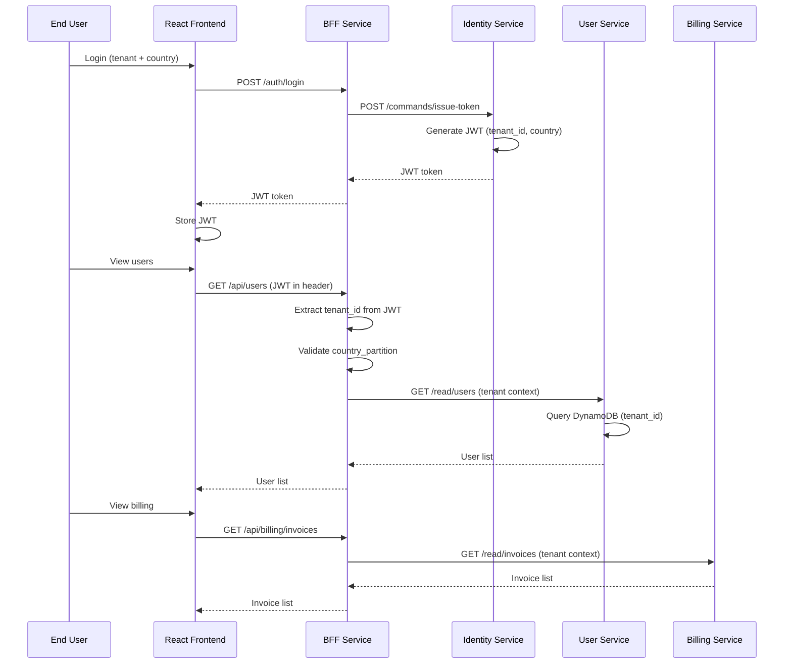
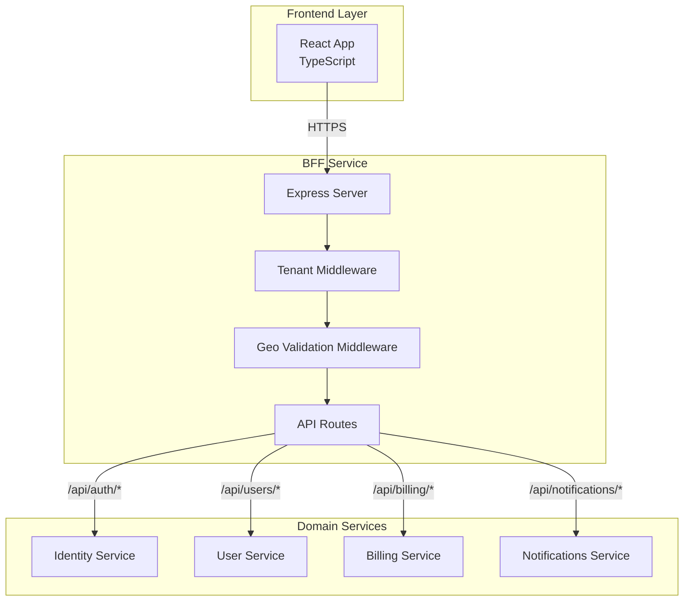
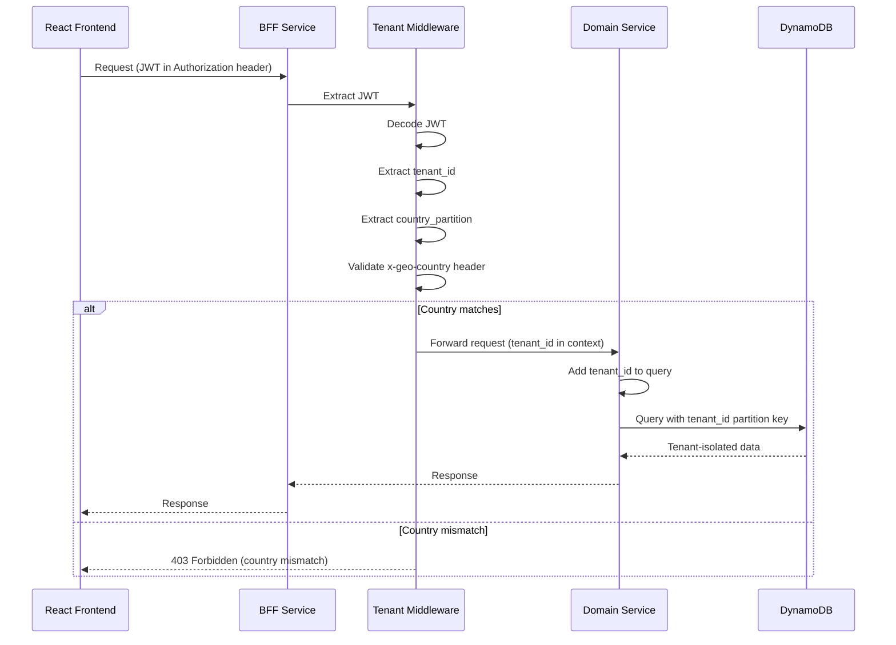
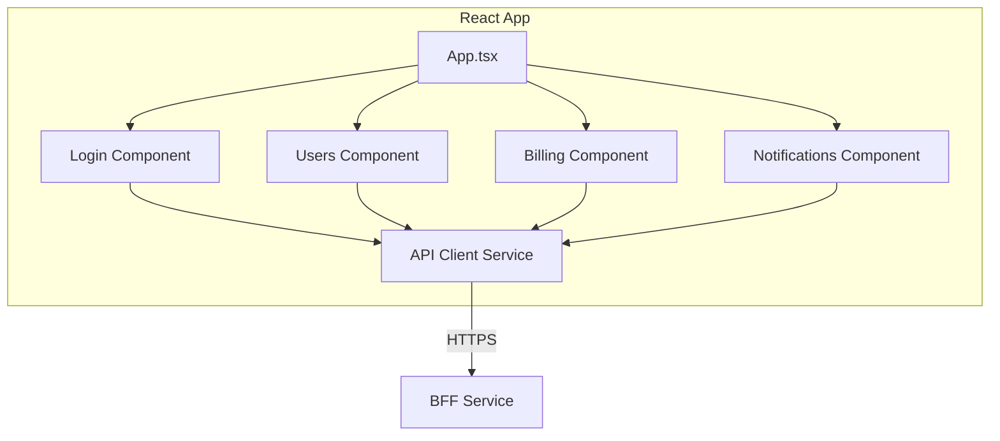

# 🎨 Frontend & BFF Architecture
## 🎭 BFF Pattern, Tenant Context & Frontend Design

> **📖 Purpose**: This document describes the frontend architecture (React), Backend for Frontend (BFF) pattern, tenant context propagation, and API routing strategies.

---

## 🎯 Scope

- ⚛️ **Frontend Architecture**: React + TypeScript, component structure, state management
- 🎭 **BFF Pattern**: Backend for Frontend, API aggregation, security boundary
- 🔐 **Tenant Context Propagation**: JWT extraction, tenant_id validation, geo-validation
- 🛣️ **API Routing**: BFF routes to domain services, request/response transformation
- 📡 **Communication Patterns**: Frontend → BFF → Domain services flow

---

## 🔄 Frontend → BFF → Services Flow



---

## 🎭 BFF Pattern

### ✅ Why BFF?

| Benefit | Description |
|---------|-------------|
| **🔐 Security Boundary** | JWT validation, tenant context extraction, geo-validation |
| **📡 API Aggregation** | Single endpoint for frontend, aggregates multiple domain services |
| **🛡️ Rate Limiting** | Per-tenant rate limiting and throttling |
| **🔄 Request Transformation** | Adapts frontend requests to domain service APIs |
| **📊 Response Transformation** | Combines responses from multiple services |
| **🔐 Tenant Context** | Extracts and propagates tenant_id to all downstream services |

### 🏗️ BFF Architecture



---

## 🛣️ BFF Routing Flow

```mermaid
graph LR
    subgraph "Frontend Requests"
        UsersReq[GET /api/users]
        BillingReq[GET /api/billing/invoices]
        NotificationsReq[GET /api/notifications]
        AuthReq[POST /api/auth/login]
    end
    
    subgraph "BFF Routes"
        UsersRoute[/api/users/*]
        BillingRoute[/api/billing/*]
        NotificationsRoute[/api/notifications/*]
        AuthRoute[/api/auth/*]
    end
    
    subgraph "Domain Services"
        UserService[User Service<br/>/read/users]
        BillingService[Billing Service<br/>/read/invoices]
        NotificationsService[Notifications Service<br/>/read/notifications]
        IdentityService[Identity Service<br/>/commands/issue-token]
    end
    
    UsersReq --> UsersRoute
    BillingReq --> BillingRoute
    NotificationsReq --> NotificationsRoute
    AuthReq --> AuthRoute
    
    UsersRoute -->|"mTLS via Istio"| UserService
    BillingRoute -->|"mTLS via Istio"| BillingService
    NotificationsRoute -->|"mTLS via Istio"| NotificationsService
    AuthRoute -->|"mTLS via Istio"| IdentityService
```

### 📊 Route Mapping

| Frontend Route | BFF Route | Domain Service | Endpoint |
|----------------|-----------|----------------|----------|
| `/api/users` | `/api/users/*` | User Service | `/read/users` |
| `/api/billing/invoices` | `/api/billing/*` | Billing Service | `/read/invoices` |
| `/api/notifications` | `/api/notifications/*` | Notifications Service | `/read/notifications` |
| `/api/auth/login` | `/api/auth/*` | Identity Service | `/commands/issue-token` |

---

## 🔐 Tenant Context Propagation



### 🔐 JWT Token Structure

```json
{
  "sub": "user_123",
  "tenant_id": "tenant_001",
  "country_partition": "US",
  "roles": ["user"],
  "iat": 1234567890,
  "exp": 1234571490
}
```

### ✅ Tenant Context Middleware

**Responsibilities:**
1. Extract JWT from `Authorization` header
2. Decode and validate JWT signature
3. Extract `tenant_id` and `country_partition` from claims
4. Validate `x-geo-country` header matches `country_partition`
5. Inject tenant context into request for downstream services

### 🌍 Geo-Validation

- **Header**: `x-geo-country` (e.g., "US", "BR")
- **Validation**: Must match `country_partition` in JWT claims
- **Enforcement**: Blocks requests if country mismatch
- **Purpose**: Enforce data residency requirements

---

## ⚛️ Frontend Architecture

### 🏗️ React Component Structure



### 📊 Component Responsibilities

| Component | Purpose | API Calls |
|-----------|---------|-----------|
| **Login** | Tenant + country selection, JWT storage | `POST /api/auth/login` |
| **Users** | Display user list, create user | `GET /api/users`, `POST /api/users` |
| **Billing** | Display invoices, subscriptions | `GET /api/billing/invoices` |
| **Notifications** | Display notifications | `GET /api/notifications` |

### 🔐 API Client Service

**Responsibilities:**
- JWT token management (storage, refresh)
- HTTP client with automatic JWT injection
- Error handling and retry logic
- Request/response transformation

---

## 🎯 Frontend Pages

### 📄 Login Page

**Features:**
- Tenant selection (dropdown or input)
- Country selection (US/BR)
- JWT token storage in localStorage
- Redirect to main app after login

### 📄 Users Page

**Features:**
- List users (tenant-scoped)
- Create new user
- Edit user profile
- Delete user (with confirmation)

### 📄 Billing Page

**Features:**
- List invoices (tenant-scoped)
- View invoice details
- Subscription management
- Payment method management

### 📄 Notifications Page

**Features:**
- List notifications (tenant-scoped)
- Mark as read/unread
- Filter by type
- Real-time updates (WebSocket or polling)

---

## 🔄 Request/Response Flow

### 📤 Request Flow

1. **Frontend**: User action triggers API call
2. **API Client**: Adds JWT to `Authorization` header
3. **BFF**: Receives request, extracts JWT
4. **Tenant Middleware**: Validates JWT, extracts tenant context
5. **Geo Middleware**: Validates country partition
6. **Route Handler**: Routes to appropriate domain service
7. **Domain Service**: Processes request with tenant context
8. **Response**: Returns tenant-isolated data

### 📥 Response Flow

1. **Domain Service**: Returns response
2. **BFF**: Transforms response if needed
3. **Frontend**: Receives response, updates UI

---

## 💡 Key Decisions

1. **✅ BFF Pattern**: Single backend entry point for frontend, aggregates APIs, enforces security
2. **✅ JWT-Based Authentication**: Stateless authentication, tenant context in claims
3. **✅ Tenant Context Middleware**: Automatic tenant extraction and propagation
4. **✅ Geo-Validation**: Country partition enforcement for data residency
5. **✅ API Aggregation**: BFF aggregates multiple domain services into single API
6. **✅ React Frontend**: Modern, component-based UI with TypeScript
7. **✅ No Direct Service Calls**: Frontend only calls BFF, never domain services directly
8. **✅ mTLS for Service-to-Service**: BFF to domain services via Istio mTLS

---

## 🔗 Related Documentation

- 📄 [README.md](../README.md) - Central index
- ⚙️ [02-backend-ddd-microservices.md](02-backend-ddd-microservices.md) - Domain services architecture
- ☁️ [04-cloud-foundation-sre.md](04-cloud-foundation-sre.md) - Infrastructure and networking
- 🔒 [08-security-zero-trust.md](08-security-zero-trust.md) - Security and authentication

---

> **💡 Tip**: BFF pattern provides a security boundary and API aggregation layer. Frontend never calls domain services directly, ensuring tenant context is always validated and propagated.

