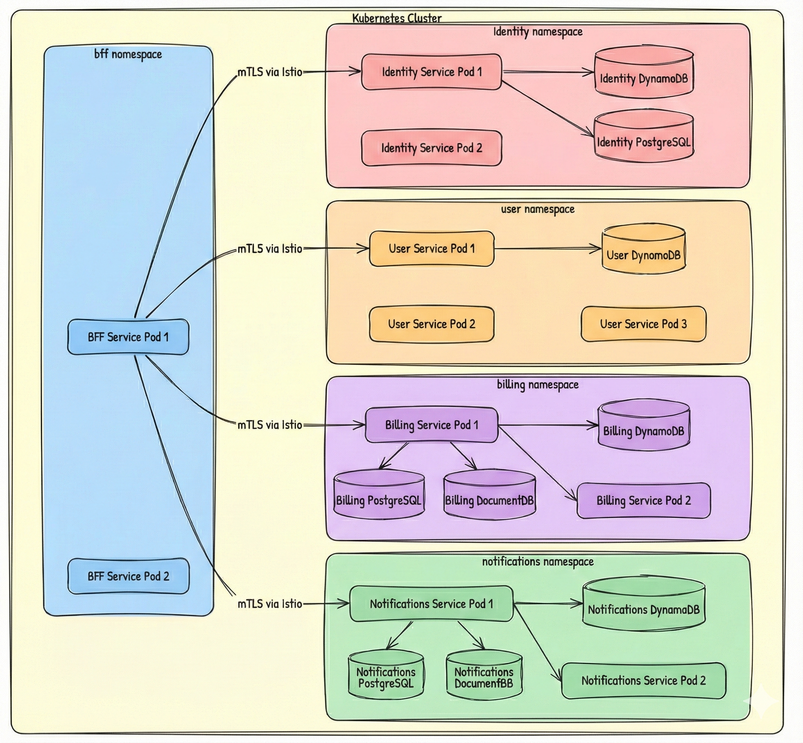
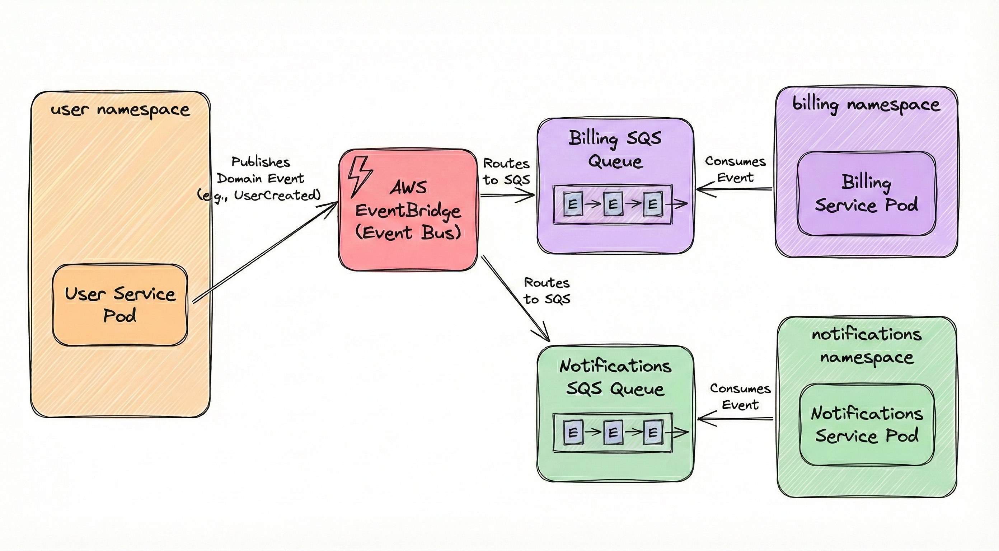
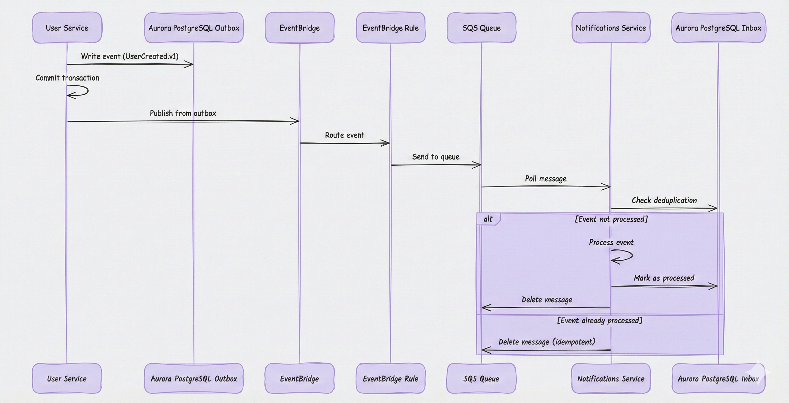
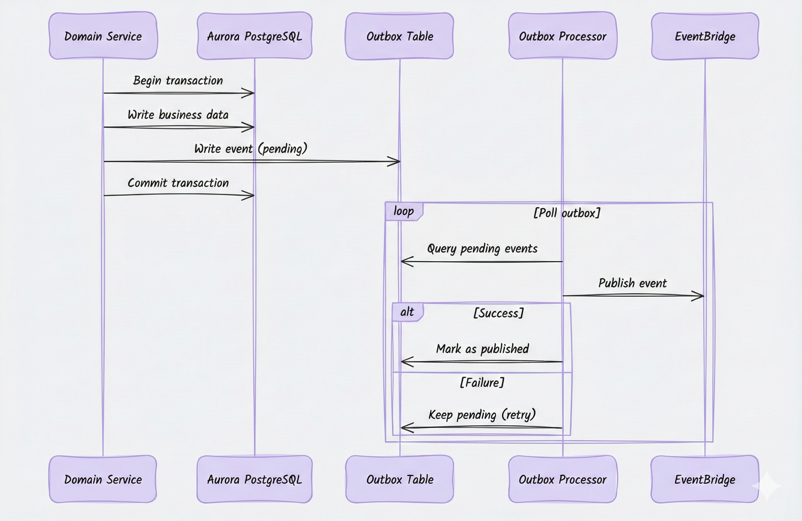
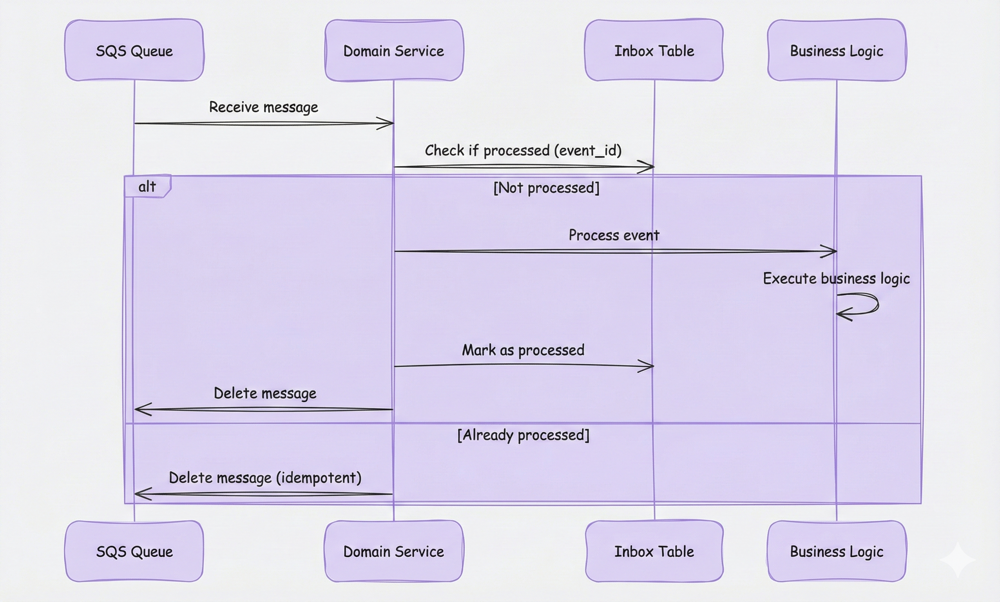
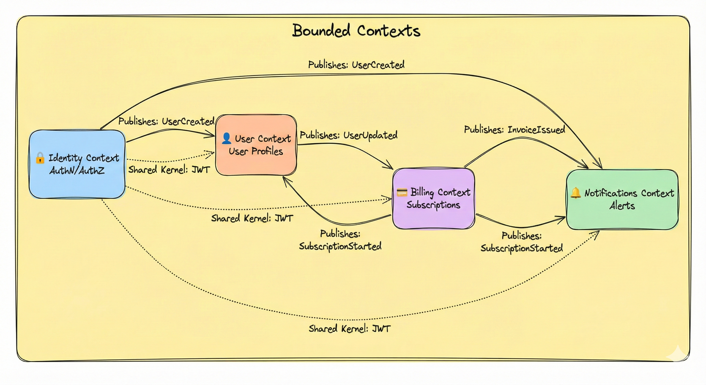
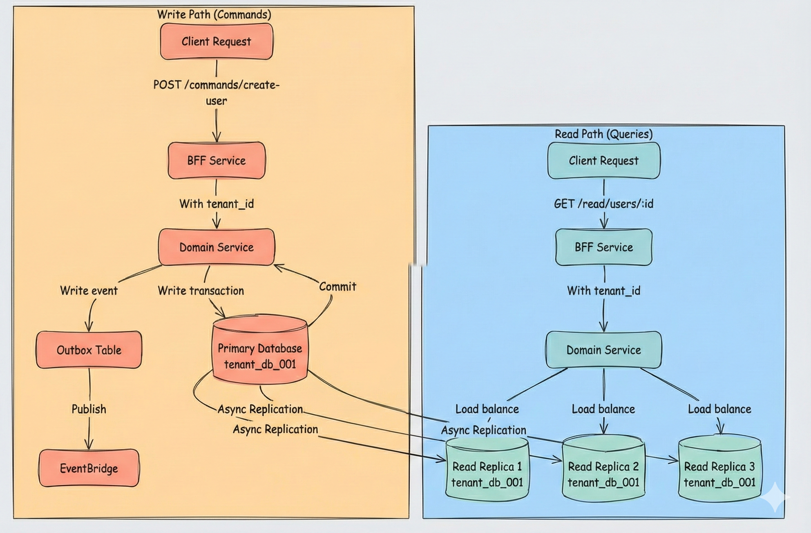
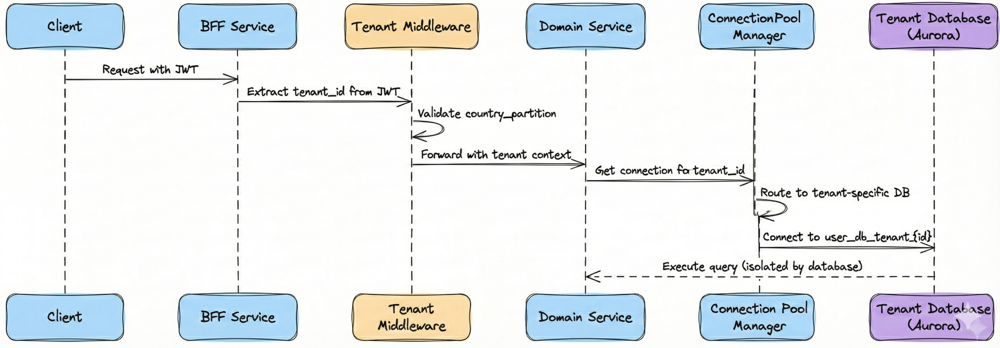

# ⚙️ Backend: DDD & Microservices
## 🧩 Bounded Contexts, Event-Driven Architecture & K8s Mapping

> **📖 Purpose**: This document describes the Domain-Driven Design (DDD) approach, bounded contexts mapped to Kubernetes namespaces, microservices patterns, and event-driven communication via EventBridge and SQS.

---

## 🎯 Backend Architecture Principles

This backend architecture follows **Domain-Driven Design (DDD)** principles to create a **composable, scalable, and maintainable** multi-tenant SaaS platform. We organize business capabilities into **bounded contexts**—each representing a distinct domain with its own **ubiquitous language**, **domain models**, and **business logic**. Each bounded context is mapped to a **Kubernetes namespace**, providing clear **domain boundaries**, **independent deployment**, and **resource isolation**. This approach enables teams to work autonomously within their domains while maintaining clear interfaces through **event-driven communication** and **API contracts**.

We employ **event-driven architecture** with **EventBridge + SQS** to achieve **loose coupling** between bounded contexts, enabling **eventual consistency** and **scalability** without the operational complexity of Kafka. Services communicate through **domain events** using the **outbox/inbox patterns** to ensure **reliable event publishing** and **idempotent consumption**. Our **data isolation strategy** follows a **multi-layered approach**: each bounded context maintains its **own database** (different databases per domain for clear separation), and within each domain, we implement **tenant-level isolation** through database partitioning strategies (tenant_id partition keys) or **separate databases per tenant** for enhanced security and compliance requirements. This **defense-in-depth** data strategy ensures **regulatory compliance**, **data residency** (country-level partitioning), and **strong tenant isolation** while maintaining operational efficiency.

---

## 🎯 Scope

- 🧩 **Domain-Driven Design (DDD)**: Bounded contexts, domain models, ubiquitous language, context mapping
- 🏗️ **Bounded Contexts as K8s Namespaces**: Each bounded context = Kubernetes namespace, independent deployment, resource isolation
- ⚙️ **Microservices Patterns**: Command/query separation, CQRS, service design, API contracts
- 📡 **Event-Driven Architecture**: EventBridge + SQS for domain events, loose coupling, eventual consistency
- 🔐 **Multi-Tenancy Data Patterns**: Different databases per domain, tenant-level isolation (partitioning or separate databases per tenant), data residency, country-level partitioning
- 📦 **Outbox/Inbox Patterns**: Reliable event publishing and consumption, transactional guarantees, idempotency
- 🔒 **Tenant Context Management**: Tenant identification, validation, context propagation, middleware patterns

---

## 🏗️ Bounded Contexts in Kubernetes

Each **bounded context** represents a distinct domain with its own **ubiquitous language**, **domain models**, and **business logic**, ensuring clear **domain boundaries** and **autonomous teams**. We map each bounded context to a **Kubernetes namespace**, providing **resource isolation**, **independent deployment**, and **security boundaries** through Istio mTLS, NetworkPolicies, and AuthorizationPolicies. This one-to-one mapping enables **composable architecture** where each domain can evolve independently while maintaining clear interfaces through events and APIs.



### 📊 Bounded Context Mapping (non Exhaustive Example)

| Bounded Context | K8s Namespace | Services | Purpose |
|----------------|---------------|-----------|---------|
| **🔐 Identity** | `identity` | Identity Service | Authentication, authorization, JWT tokens |
| **👤 User** | `user` | User Service | User profiles, tenant-scoped data |
| **💳 Billing** | `billing` | Billing Service | Subscriptions, invoices, payments |
| **📧 Notifications** | `notifications` | Notifications Service | Email, webhooks, alerts |
| **🎭 BFF** | `bff` | BFF Service | API aggregation, tenant context |

### 🏗️ Namespace Configuration

Each namespace includes:
- **Labels**: `domain: {context-name}`, `tenant-isolation: strict`
- **Istio PeerAuthentication**: `STRICT` mTLS mode
- **NetworkPolicy**: Default deny, explicit allows
- **AuthorizationPolicy**: Service-to-service allowlist

---

## 📡 Event-Driven Architecture

We employ an **event-driven architecture (EDA)** to achieve **loose coupling** between bounded contexts, enabling **asynchronous communication** and **eventual consistency** without direct service dependencies. Domain services publish **domain events** (e.g., `UserCreated.v1`, `SubscriptionStarted.v1`) to **AWS EventBridge**, which routes events to **SQS queues** based on configurable rules. Consumers process events **asynchronously** using the **outbox/inbox patterns** to ensure **reliable event publishing** with transactional guarantees and **idempotent consumption** with deduplication. This approach eliminates tight coupling, enables **independent scaling** of producers and consumers, and provides **resilience** through retry mechanisms and dead-letter queues, all while avoiding the operational complexity of self-managed message brokers like Kafka.



### 📡 Event Flow Sequence



### 📡 Event Flow Pattern

1. **Producer**: Domain service writes event to Aurora PostgreSQL outbox table (within tenant-specific database)
2. **Outbox Processor**: Polls outbox, publishes to EventBridge
3. **EventBridge**: Routes event to SQS queues via rules
4. **Consumer**: Polls SQS, checks inbox for deduplication (within tenant-specific database)
5. **Processing**: Processes event, marks as processed in inbox

### 🎯 Domain Events

| Event | Publisher | Consumers | Purpose |
|-------|-----------|-----------|---------|
| **UserCreated.v1** | Identity Service | User Service, Notifications Service | New user signup |
| **SubscriptionStarted.v1** | Billing Service | User Service, Notifications Service | Subscription activated |
| **InvoiceIssued.v1** | Billing Service | Notifications Service | Invoice generated |
| **NotificationRequested.v1** | Any Service | Notifications Service | Notification trigger |

---

## 📦 Outbox Pattern

The **outbox pattern** ensures **reliable event publishing** by writing domain events to a dedicated outbox table within the same database transaction as the business data. This provides **transactional guarantees**—events are never lost even if EventBridge is temporarily unavailable—and enables **at-least-once delivery** semantics. A separate **outbox processor** (typically a Lambda or containerized service) polls the outbox table, publishes events to EventBridge, and marks them as published, with automatic retry on failures. This pattern eliminates the **dual-write problem** and ensures **eventual consistency** between business data and event publishing.



### ✅ Outbox Pattern Benefits

- **✅ Transactional Guarantees**: Event written atomically with business data using PostgreSQL transactions
- **✅ Reliability**: Events not lost if EventBridge is unavailable
- **✅ Idempotency**: Outbox processor can retry safely
- **✅ Ordering**: Events processed in order (optional)

### 📊 Outbox Table Schema (Aurora PostgreSQL)

```sql
CREATE TABLE outbox (
    event_id UUID PRIMARY KEY DEFAULT gen_random_uuid(),
    domain VARCHAR(50) NOT NULL,
    event_type VARCHAR(100) NOT NULL,
    payload JSONB NOT NULL,
    status VARCHAR(20) NOT NULL DEFAULT 'pending',
    created_at TIMESTAMP DEFAULT CURRENT_TIMESTAMP,
    published_at TIMESTAMP,
    retry_count INTEGER DEFAULT 0
);

CREATE INDEX idx_outbox_status ON outbox(status, created_at) WHERE status = 'pending';
```

---

## 📥 Inbox Pattern (Deduplication)

The **inbox pattern** ensures **idempotent event processing** by maintaining a record of all processed events in a dedicated inbox table. Before processing an event from SQS, the consumer checks the inbox table using the `event_id` to determine if the event has already been processed. This prevents **duplicate processing** caused by SQS message redelivery, network retries, or concurrent processing. The pattern provides **exactly-once processing semantics** at the application level, maintains an **audit trail** of all processed events, and enables **event replay** for recovery scenarios. This complements the outbox pattern to create a **reliable, end-to-end event-driven system**.



### ✅ Inbox Pattern Benefits

- **✅ Deduplication**: Prevents duplicate event processing
- **✅ Idempotency**: Safe to process same event multiple times
- **✅ Audit Trail**: Track all processed events
- **✅ Recovery**: Can replay events if needed

### 📊 Inbox Table Schema (Aurora PostgreSQL)

```sql
CREATE TABLE inbox (
    event_id UUID PRIMARY KEY,
    domain VARCHAR(50) NOT NULL,
    event_type VARCHAR(100) NOT NULL,
    payload JSONB NOT NULL,
    processed_at TIMESTAMP DEFAULT CURRENT_TIMESTAMP,
    status VARCHAR(20) NOT NULL DEFAULT 'processed'
);

CREATE UNIQUE INDEX idx_inbox_event_id ON inbox(event_id);
```

---

## 🗺️ DDD Context Map



### 🔗 Context Relationships

| Relationship | From | To | Type | Mechanism |
|--------------|------|-----|------|-----------|
| **UserCreated** | Identity | User, Notifications | Published Language | EventBridge |
| **SubscriptionStarted** | Billing | User, Notifications | Published Language | EventBridge |
| **InvoiceIssued** | Billing | Notifications | Published Language | EventBridge |
| **JWT Token** | Identity | All | Shared Kernel | JWT claims |

---

## 🔐 Multi-Tenancy Data Patterns

### 🏗️ Database Isolation Strategy

Our data isolation follows a **shared compute, isolated data** architecture ensuring both **domain separation** and **strong tenant isolation**:

1. **One Cluster Per Tenant**: Each tenant has its **own dedicated Aurora PostgreSQL cluster per country** (e.g., `tenant_001_cluster_us`, `tenant_002_cluster_us`). This provides **complete physical isolation** at the cluster level, ensuring **strongest isolation**, **regulatory compliance**, and **data sovereignty**.

2. **Domains as Separate Databases**: Within each tenant cluster, we implement **domain separation** by creating **separate databases per domain** (e.g., `identity_db`, `user_db`, `billing_db`, `notifications_db`). This provides **clear domain boundaries** within the tenant's isolated cluster while maintaining **operational efficiency** through shared compute resources.

3. **Country-Level Isolation**: For **data residency** and **regulatory compliance** (GDPR, data localization laws), we deploy **separate Aurora PostgreSQL clusters per country/region** (e.g., US clusters, BR clusters), ensuring data never crosses geographic boundaries.

### 📊 Aurora PostgreSQL Database Isolation Model


### ✅ Data Isolation Strategy

- **Tenant Isolation**: Each tenant has its own dedicated Aurora PostgreSQL cluster per country (e.g., `tenant_001_cluster_us`, `tenant_002_cluster_us`)
- **Domain Isolation**: Within each tenant cluster, domains are separate databases (e.g., `identity_db`, `user_db`, `billing_db`)
- **Connection Routing**: Application routes database connections based on `tenant_id` + `domain` + `country_partition` from JWT, ensuring tenants can only access their own cluster and domains
- **Access Control**: Database-level access control with tenant-specific credentials and connection pooling per tenant-domain
- **Data Residency**: Separate Aurora clusters per country/region (US clusters, BR clusters) for regulatory compliance
- **Shared Compute**: Aurora cluster provides shared compute resources within tenant cluster while maintaining complete data isolation

### 🔌 Connection Pooling & Tenant-Domain-Based Database Routing

The application implements **tenant-aware and domain-aware connection pooling** to route database connections to the correct tenant cluster and domain database based on the `tenant_id`, `domain`, and `country_partition` extracted from the JWT token and service context. Each service maintains a **connection pool manager** that creates and caches database connections per tenant-domain combination, ensuring efficient resource usage while maintaining complete data isolation.

**Connection Pool Strategy**:
- **Per-Tenant-Domain Connection Pools**: Each tenant-domain combination has its own dedicated connection pool (e.g., `pool_us_tenant_001_user`, `pool_us_tenant_001_billing`)
- **Lazy Initialization**: Connection pools are created on-demand when first accessed by a tenant-domain combination
- **Connection Caching**: Pools are cached in memory to avoid repeated connection establishment
- **Pool Size Configuration**: Configurable pool size per tenant-domain (e.g., min: 2, max: 10 connections per tenant-domain)
- **Connection String Pattern**: `postgresql://user:pass@{tenant_id}_cluster_{country}:5432/{domain}_db`

**Tenant-Domain-Based Routing Flow**:
1. **Extract Context**: Middleware extracts `tenant_id`, `country_partition`, and `domain` from JWT token and service context
2. **Get Connection Pool**: Service requests connection from pool manager using `tenant_id` + `domain` + `country_partition`
3. **Route to Cluster**: Pool manager routes to tenant-specific cluster (e.g., `tenant_001_cluster_us`)
4. **Route to Database**: Within cluster, route to domain-specific database (e.g., `user_db`)
5. **Execute Query**: All read/write operations execute against the tenant's isolated domain database
6. **Return Connection**: Connection returned to pool for reuse

**Implementation Pattern** (Pseudo-code):
```typescript
// Connection Pool Manager
class TenantDomainConnectionPoolManager {
  private pools: Map<string, Pool> = new Map();
  
  getConnection(tenantId: string, domain: string, countryPartition: string): Pool {
    const clusterEndpoint = `${tenantId}_cluster_${countryPartition.toLowerCase()}`;
    const dbName = `${domain}_db`;
    const poolKey = `${countryPartition}_${tenantId}_${domain}`;
    
    if (!this.pools.has(poolKey)) {
      const connectionString = 
        `postgresql://user:pass@${clusterEndpoint}:5432/${dbName}`;
      this.pools.set(poolKey, new Pool({
        connectionString,
        min: 2,
        max: 10,
        idleTimeoutMillis: 30000
      }));
    }
    
    return this.pools.get(poolKey);
  }
}

// Service Usage
async function getUser(tenantId: string, userId: string, countryPartition: string) {
  const pool = connectionPoolManager.getConnection(tenantId, 'user', countryPartition);
  const result = await pool.query(
    'SELECT * FROM users WHERE id = $1', 
    [userId]
  );
  return result.rows[0];
}
```

**Benefits**:
- **✅ Complete Physical Isolation**: Tenants have dedicated clusters, no shared infrastructure
- **✅ Domain Separation**: Clear boundaries between domains within tenant cluster
- **✅ Resource Efficiency**: Shared compute within tenant cluster while maintaining data isolation
- **✅ Performance**: Connection reuse reduces connection establishment overhead
- **✅ Scalability**: Pools scale independently per tenant-domain based on load
- **✅ Security**: No risk of cross-tenant or cross-domain data access at the database level

---

## ⚙️ Service Design Patterns

### 🎯 Command/Query Separation

| Pattern | Endpoint | Purpose |
|---------|----------|---------|
| **Command** | `POST /commands/create-user` | Mutate state, publish events |
| **Query** | `GET /read/users/:id` | Read state, no side effects |

### 📡 CQRS (Command Query Responsibility Segregation)

- **Commands**: Write to Aurora PostgreSQL (tenant-specific database), publish events to outbox
- **Queries**: Read from Aurora PostgreSQL (tenant-specific database) or read model if needed
- **Events**: Drive eventual consistency across contexts via EventBridge + SQS

**CQRS Advantages with Read Replicas**: By separating command (write) and query (read) operations, CQRS enables **independent scaling** of read and write workloads. We leverage **Aurora PostgreSQL read replicas** to scale read operations horizontally—commands write to the **primary database** (ensuring strong consistency and ACID guarantees), while queries can be distributed across **multiple read replicas** (one per tenant database) to handle high read throughput. This pattern provides **significant performance benefits**: read replicas offload query traffic from the primary, enable **geographic distribution** for low-latency reads, and allow **independent scaling** of read capacity without impacting write performance. The separation also enables **optimized read models** (denormalized views, materialized views, or specialized query schemas) that can be maintained asynchronously via events, further improving query performance for complex analytical or reporting workloads.

### 📊 CQRS Write and Read Flows


### 🔐 Tenant Context Middleware & Database Routing



---

## 💡 Key Decisions

1. **✅ Bounded Contexts = K8s Namespaces**: Clear domain boundaries, independent deployment, resource isolation
2. **✅ Event-Driven Communication**: EventBridge + SQS for loose coupling, eventual consistency, no direct service calls
3. **✅ Outbox Pattern**: Reliable event publishing with transactional guarantees, no event loss
4. **✅ Inbox Pattern**: Deduplication and idempotent event processing, audit trail
5. **✅ One Cluster Per Tenant**: Each tenant has its own dedicated Aurora PostgreSQL cluster per country for complete physical isolation
6. **✅ Domains as Databases**: Within each tenant cluster, domains are separate databases (shared compute, isolated data) for domain separation and compliance
7. **✅ Aurora PostgreSQL as Default**: Relational database with ACID guarantees, SQL support, and managed service benefits
8. **✅ Data Residency**: Separate Aurora clusters per country/region for regulatory compliance and data localization
9. **✅ Connection Routing**: Application-level database connection routing based on tenant_id + domain + country_partition for automatic tenant and domain isolation
10. **✅ Command/Query Separation**: Clear separation of write and read operations, CQRS patterns
11. **✅ Tenant Context Middleware**: Automatic tenant and domain extraction, validation, cluster and database routing, and context propagation
12. **✅ Istio mTLS**: All service-to-service communication encrypted and authenticated, zero-trust networking

---

## 🔗 Related Documentation

- 📄 [README.md](../README.md) - Central index
- 🏛️ [01-enterprise-architecture.md](01-enterprise-architecture.md) - EA and composable capabilities
- 🏛️ [02-overall-solution-architecture.md](02-overall-solution-architecture.md) - Overall solution architecture
- 🎨 [05-frontend-bff.md](05-frontend-bff.md) - BFF pattern and frontend
- ☁️ [03-cloud-foundation-sre.md](03-cloud-foundation-sre.md) - K8s and Istio infrastructure
- 💾 [06-data-platform-analytics-ml.md](06-data-platform-analytics-ml.md) - Data patterns
- 🔒 [07-security-zero-trust.md](07-security-zero-trust.md) - Security and multi-tenancy

---

> **💡 Tip**: Bounded contexts mapped to K8s namespaces enable clear domain boundaries and independent deployment. Event-driven communication via EventBridge + SQS provides loose coupling without Kafka complexity.

