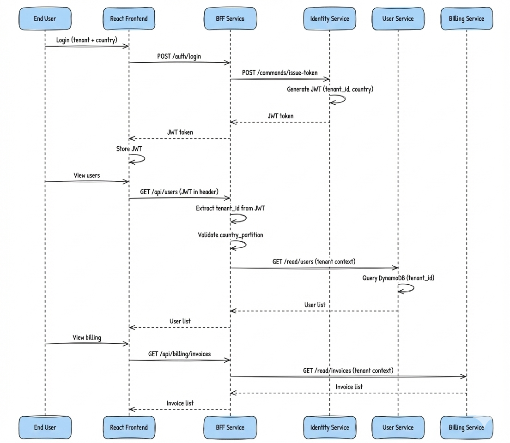
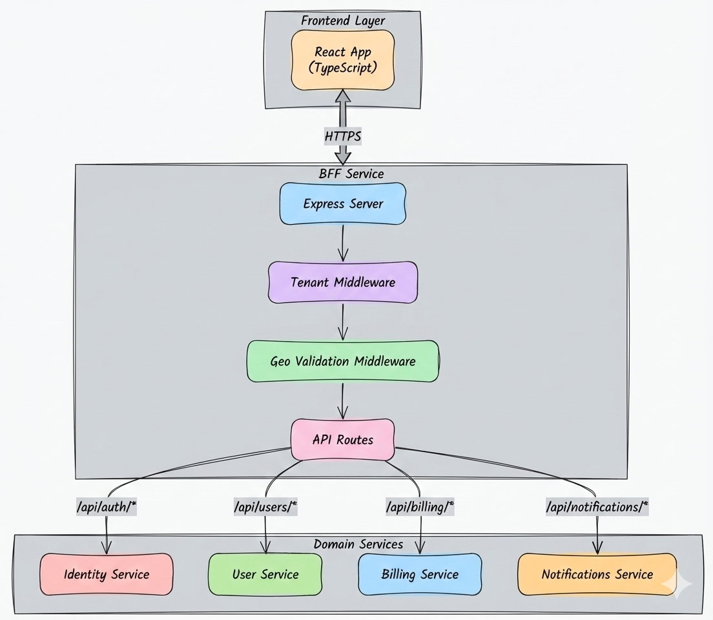
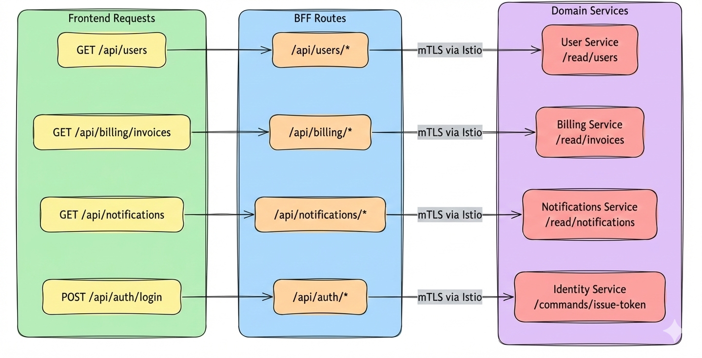
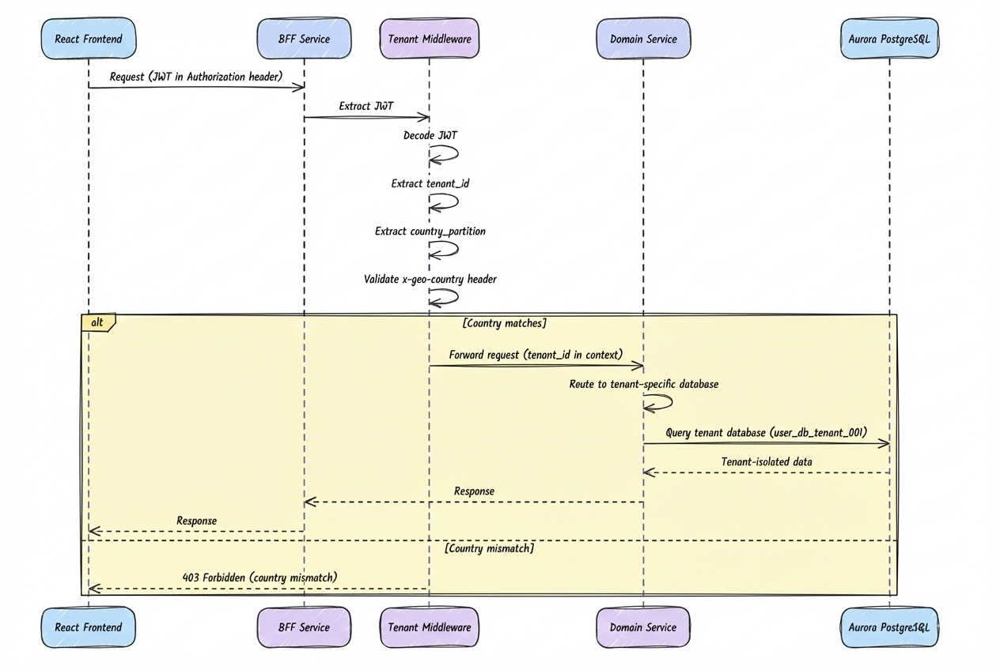
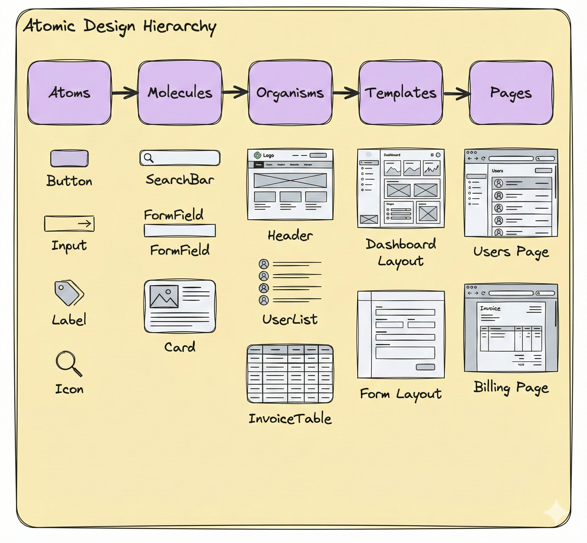
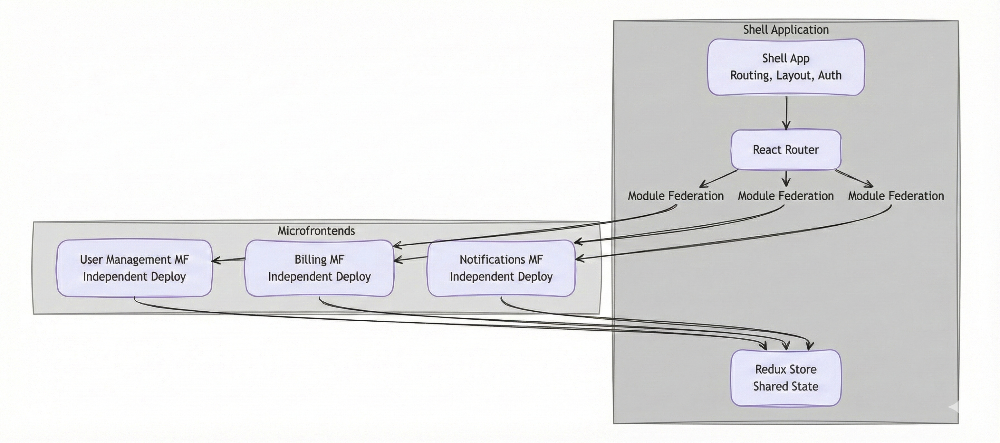
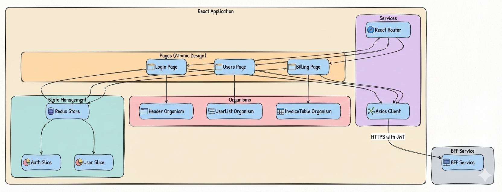
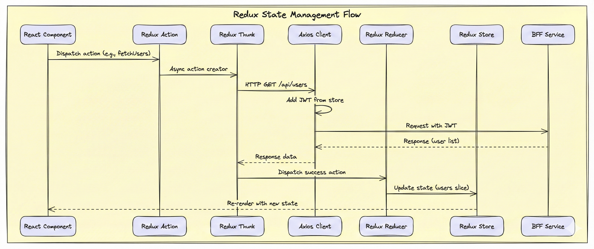

# 🎨 Frontend & BFF Architecture
## 🎭 BFF Pattern, Tenant Context & Frontend Design

> **📖 Purpose**: This document describes the frontend architecture (React), Backend for Frontend (BFF) pattern, tenant context propagation, and API routing strategies.

---

## 🎯 Scope

- ⚛️ **Frontend Architecture**: React + TypeScript, Atomic Design methodology, Microfrontend architecture, component structure, state management
- 🎭 **BFF Pattern**: Backend for Frontend, API aggregation, security boundary
- 🔐 **Tenant Context Propagation**: JWT extraction, tenant_id validation, geo-validation
- 🛣️ **API Routing**: BFF routes to domain services, request/response transformation
- 📡 **Communication Patterns**: Frontend → BFF → Domain services flow
- 🛠️ **React Ecosystem Tools**: Redux, Axios, React Router, React Hook Form, testing frameworks
- 🔧 **Build Tooling**: Webpack/Vite, Babel, TypeScript, ESLint, Prettier, development tooling

---

## 🏗️ Frontend Architecture Overview

Our frontend architecture is designed to support a **multi-tenant, multi-country SaaS platform** where **security, tenant isolation, and data residency** are paramount. The architecture follows a **three-layer pattern**: the **React frontend** provides the user interface with tenant-aware components, the **Backend for Frontend (BFF)** serves as a security boundary and API aggregation layer, and **domain services** handle business logic with complete tenant isolation. This separation ensures that the frontend never directly accesses domain services, maintaining a **defense-in-depth security model** where tenant context is validated and propagated at every layer. The following flow diagram illustrates how user interactions flow through these layers, from initial authentication through data retrieval, with tenant context and geographic validation enforced at each step.

## 🔄 Frontend → BFF → Services Flow



---

## 🎭 BFF Pattern

The **Backend for Frontend (BFF)** pattern is essential in our multi-tenant architecture, serving as the **critical security boundary** between the frontend and domain services. In a system where **tenant isolation** and **data residency** are non-negotiable, the BFF ensures that tenant context is **extracted, validated, and propagated** before any request reaches domain services. It aggregates multiple domain service APIs into a single, frontend-optimized interface, eliminating the need for the frontend to understand the complex microservices landscape. The BFF also enforces **geo-validation** to prevent cross-country data access, implements **per-tenant rate limiting**, and transforms requests/responses to match frontend needs while maintaining security boundaries. This pattern enables the frontend to remain **simple and focused** on user experience, while the BFF handles the complexity of multi-tenant security and API orchestration.

### ✅ Why BFF?

| Benefit | Description |
|---------|-------------|
| **🔐 Security Boundary** | JWT validation, tenant context extraction, geo-validation |
| **📡 API Aggregation** | Single endpoint for frontend, aggregates multiple domain services |
| **🛡️ Rate Limiting** | Per-tenant rate limiting and throttling |
| **🔄 Request Transformation** | Adapts frontend requests to domain service APIs |
| **📊 Response Transformation** | Combines responses from multiple services |
| **🔐 Tenant Context** | Extracts and propagates tenant_id to all downstream services |

### 🏗️ BFF Architecture



---

## 🛣️ BFF Routing Flow



### 📊 Route Mapping

| Frontend Route | BFF Route | Domain Service | Endpoint |
|----------------|-----------|----------------|----------|
| `/api/users` | `/api/users/*` | User Service | `/read/users` |
| `/api/billing/invoices` | `/api/billing/*` | Billing Service | `/read/invoices` |
| `/api/notifications` | `/api/notifications/*` | Notifications Service | `/read/notifications` |
| `/api/auth/login` | `/api/auth/*` | Identity Service | `/commands/issue-token` |

---

## 🔐 Tenant Context Propagation

**Tenant context propagation** is the **cornerstone of multi-tenant security** in our architecture, ensuring that every request is **automatically associated with the correct tenant** and **geographic region** from the moment it leaves the frontend until it reaches the tenant's isolated database. The JWT token, issued during authentication, carries the `tenant_id` and `country_partition` claims that flow through the BFF middleware, where they are **extracted, validated, and enforced** before any request reaches domain services. This context is then **injected into every downstream service call**, enabling automatic routing to tenant-specific databases and preventing any possibility of cross-tenant data access. The combination of **JWT-based context**, **geo-validation middleware**, and **database-level isolation** creates multiple layers of security that ensure tenant data remains completely isolated, even in the event of application bugs or misconfigurations.



### 🔐 JWT Token Structure

```json
{
  "sub": "user_123",
  "tenant_id": "tenant_001",
  "country_partition": "US",
  "roles": ["user"],
  "iat": 1234567890,
  "exp": 1234571490
}
```

### ✅ Tenant Context Middleware

**Responsibilities:**
1. Extract JWT from `Authorization` header
2. Decode and validate JWT signature
3. Extract `tenant_id` and `country_partition` from claims
4. Validate `x-geo-country` header matches `country_partition`
5. Inject tenant context into request for downstream services

### 🌍 Geo-Validation

- **Header**: `x-geo-country` (e.g., "US", "BR")
- **Validation**: Must match `country_partition` in JWT claims
- **Enforcement**: Blocks requests if country mismatch
- **Purpose**: Enforce data residency requirements

---

## ⚛️ Frontend Architecture

Having established how the frontend integrates with the BFF and how tenant context flows through the system, we now turn to the **frontend architecture itself**—the React application that users interact with. Our frontend is built on **modern React patterns** with **TypeScript** for type safety, organized through **Atomic Design** methodology for component composition, and structured as **microfrontends** for scalability and team autonomy. The architecture is designed to be **tenant-aware from the ground up**, with Redux managing tenant context, Axios automatically injecting JWT tokens, and React Router handling tenant-specific navigation. This frontend design philosophy ensures that **every component, every API call, and every user interaction** respects tenant boundaries while providing a seamless user experience. The following sections detail how we organize components, manage state, handle HTTP communication, and build the application for production.

Our frontend architecture follows **modern React patterns** with **TypeScript** for type safety, organized through **Atomic Design** methodology for component composition, and structured as **microfrontends** for scalability and team autonomy. We leverage **Redux Toolkit** for predictable state management, **Axios** for HTTP communication with automatic JWT injection, and **React Router** for client-side routing with tenant-aware navigation. The build tooling ecosystem uses **Vite** (or Webpack) for fast bundling and development, **TypeScript** for compile-time type checking, and **ESLint/Prettier** for code quality and consistency. This architecture enables **independent deployment** of frontend modules, **reusable component libraries**, and **maintainable codebases** that scale with the organization.

### 🧩 Atomic Design Methodology

**Atomic Design** organizes React components into a hierarchical structure from smallest to largest: **Atoms** (basic building blocks), **Molecules** (simple component groups), **Organisms** (complex UI sections), **Templates** (page layouts), and **Pages** (specific instances). This methodology promotes **reusability**, **maintainability**, and **scalability** by establishing clear component boundaries and composition patterns. Atoms are pure, stateless components (Button, Input, Label) that can be combined into Molecules (SearchBar, FormField), which then compose into Organisms (Header, UserList), ultimately forming Templates and Pages. This approach ensures consistent design systems, reduces code duplication, and enables parallel development across teams.



### 📊 Atomic Design Component Examples

| Level | Example Components | Characteristics |
|-------|-------------------|-----------------|
| **Atoms** | `Button`, `Input`, `Label`, `Icon`, `Spinner` | Single responsibility, no business logic, highly reusable |
| **Molecules** | `SearchBar`, `FormField`, `Card`, `Alert` | Composed of atoms, simple functionality, reusable patterns |
| **Organisms** | `Header`, `UserList`, `InvoiceTable`, `Navigation` | Complex UI sections, may contain state, domain-specific |
| **Templates** | `DashboardLayout`, `FormLayout`, `AuthLayout` | Page structure, placeholders for content, no real data |
| **Pages** | `UsersPage`, `BillingPage`, `LoginPage` | Specific instances with real data, route handlers |

### 🏗️ Microfrontend Architecture

**Microfrontend architecture** enables **independent deployment** and **team autonomy** by breaking the frontend into smaller, self-contained applications that compose together at runtime. Each microfrontend is owned by a separate team, can use different technologies (within React ecosystem), and is deployed independently. We use **Module Federation** (Webpack 5) or **single-spa** to integrate microfrontends, allowing the shell application to dynamically load remote modules. This approach supports **scalability** for large organizations, enables **technology diversity** (different React versions, state management libraries), and provides **fault isolation** where one microfrontend failure doesn't crash the entire application.



### 🎯 Microfrontend Benefits

- **Independent Deployment**: Each microfrontend deploys separately, enabling faster release cycles
- **Team Autonomy**: Teams own their microfrontend end-to-end, reducing dependencies
- **Technology Diversity**: Different microfrontends can use different React versions or libraries
- **Fault Isolation**: Failure in one microfrontend doesn't crash the entire application
- **Scalability**: New features can be added as new microfrontends without affecting existing ones

### 🛠️ React Ecosystem Tools

#### State Management: Redux Toolkit

**Redux Toolkit** provides predictable state management with a simplified API. The store structure includes:
- **Auth Slice**: JWT token, user info, tenant context
- **User Slice**: User list, selected user, filters
- **Billing Slice**: Invoices, subscriptions, payment methods
- **UI Slice**: Loading states, error messages, notifications

**Key Features:**
- **createSlice**: Reduces boilerplate for actions and reducers
- **Redux Thunk**: Handles async operations (API calls)
- **React-Redux Hooks**: `useSelector` and `useDispatch` for component integration
- **Middleware**: Redux Thunk for async actions, Redux Logger for development

#### HTTP Client: Axios

**Axios** provides a robust HTTP client with interceptors for automatic JWT injection and error handling:

**Configuration:**
- Base URL: BFF endpoint
- Request interceptor: Adds JWT from Redux store to `Authorization` header
- Response interceptor: Handles 401 (token refresh), 403 (geo-validation), error transformation
- Timeout configuration: 30 seconds default

**Integration with Redux:**
- Redux Thunk actions use Axios for API calls
- Responses dispatch success/error actions to update Redux store
- Automatic retry logic for transient failures

#### Routing: React Router

**React Router** handles client-side routing with tenant-aware navigation:

- **Route Configuration**: Protected routes require authentication
- **Route Guards**: Check JWT validity and tenant context before rendering
- **Dynamic Routes**: Tenant-specific routes (e.g., `/tenant/:tenantId/users`)
- **Navigation**: Programmatic navigation with tenant context preservation

#### Form Management: React Hook Form

**React Hook Form** provides performant form handling with minimal re-renders:

- **Validation**: Schema-based validation (Zod or Yup)
- **Error Handling**: Automatic error state management
- **Performance**: Uncontrolled components reduce re-renders
- **Integration**: Works seamlessly with UI component libraries

#### Testing: Jest & React Testing Library

**Testing Strategy:**
- **Unit Tests**: Test individual components and utilities
- **Component Tests**: Test component behavior and user interactions
- **Integration Tests**: Test component interactions and API integration
- **E2E Tests**: Test complete user flows (optional, using Playwright/Cypress)

### 🔧 Build Tooling and Development Tools

#### Bundling: Vite (or Webpack)

**Vite** provides fast development and optimized production builds:

- **Development Server**: Fast HMR (Hot Module Replacement), instant server start
- **Production Build**: Rollup-based bundling, tree shaking, code splitting
- **Module Federation**: Support for microfrontend architecture (via plugin)
- **Asset Optimization**: Image optimization, CSS minification, chunk splitting

**Webpack Alternative:**
- **Module Federation**: Native support for microfrontends
- **Code Splitting**: Dynamic imports, route-based splitting
- **Tree Shaking**: Remove unused code
- **Loaders**: TypeScript, CSS, images, fonts

#### Transpiling: TypeScript & Babel

**TypeScript Compiler:**
- **Type Checking**: Compile-time type safety
- **JSX Transformation**: Transforms TSX to JavaScript
- **Modern JavaScript**: Transpiles ES6+ to target browsers

**Babel** (if needed):
- **Polyfills**: Browser compatibility
- **Plugin System**: Custom transformations
- **Presets**: React, TypeScript, modern JavaScript

#### Development Tools

- **ESLint**: Code quality, React best practices, TypeScript rules
- **Prettier**: Code formatting, consistent style
- **Husky**: Git hooks for pre-commit linting and formatting
- **TypeScript**: Type checking, IntelliSense, refactoring support

#### Build Pipeline

**Development:**
- Fast HMR for instant feedback
- Source maps for debugging
- Environment variables for configuration

**Production:**
- Optimized bundles (minification, compression)
- Code splitting for lazy loading
- Asset optimization (images, fonts)
- Environment-specific builds (dev, staging, prod)

### 🏗️ Enhanced React Component Structure



### 📊 Component Responsibilities

| Component | Purpose | API Calls |
|-----------|---------|-----------|
| **Login Page** | Tenant + country selection, JWT storage | `POST /api/auth/login` |
| **Users Page** | Display user list, create user | `GET /api/users`, `POST /api/users` |
| **Billing Page** | Display invoices, subscriptions | `GET /api/billing/invoices` |
| **Notifications Page** | Display notifications | `GET /api/notifications` |

### 🔄 State Management Flow

**Redux** manages application state with a unidirectional data flow. Components dispatch actions, which are processed by Redux Thunk for async operations (API calls via Axios), then reducers update the store, triggering component re-renders through React-Redux hooks.


```

### 📦 Redux Store Structure

```typescript
{
  auth: {
    token: string | null,
    user: User | null,
    tenantId: string | null,
    countryPartition: string | null,
    isAuthenticated: boolean
  },
  users: {
    list: User[],
    selectedUser: User | null,
    loading: boolean,
    error: string | null
  },
  billing: {
    invoices: Invoice[],
    subscriptions: Subscription[],
    loading: boolean,
    error: string | null
  },
  ui: {
    notifications: Notification[],
    loading: boolean
  }
}
```

### 🔐 API Client Service (Axios)

**Responsibilities:**
- JWT token management (retrieval from Redux store, refresh logic)
- HTTP client with automatic JWT injection via request interceptor
- Error handling and retry logic (401 token refresh, 403 geo-validation errors)
- Request/response transformation
- Integration with Redux Thunk for async operations

---

## 🔄 Request/Response Flow

Now that we've explored the **frontend architecture components** (Atomic Design, Microfrontends, Redux, Axios) and the **BFF pattern** with tenant context propagation, we can understand how these pieces work together in the **complete request/response cycle**. When a user interacts with the React frontend, their action triggers a Redux action that uses Axios to make an HTTP request to the BFF. The BFF's middleware stack validates the JWT, extracts tenant context, and enforces geo-validation before routing to the appropriate domain service. The domain service uses the tenant context to connect to the correct tenant database, retrieves the data, and returns it through the BFF, which transforms and aggregates responses as needed. The frontend receives the response, updates the Redux store, and React components re-render with the new data. This **end-to-end flow** demonstrates how tenant isolation and security are maintained at every layer, from the user's browser to the database, ensuring complete data sovereignty and regulatory compliance.

### 📤 Request Flow

1. **Frontend**: User action triggers API call
2. **API Client**: Adds JWT to `Authorization` header
3. **BFF**: Receives request, extracts JWT
4. **Tenant Middleware**: Validates JWT, extracts tenant context
5. **Geo Middleware**: Validates country partition
6. **Route Handler**: Routes to appropriate domain service
7. **Domain Service**: Processes request with tenant context
8. **Response**: Returns tenant-isolated data

### 📥 Response Flow

1. **Domain Service**: Returns response
2. **BFF**: Transforms response if needed
3. **Frontend**: Receives response, updates UI

---

## 💡 Key Decisions

1. **✅ BFF Pattern**: Single backend entry point for frontend, aggregates APIs, enforces security
2. **✅ JWT-Based Authentication**: Stateless authentication, tenant context in claims
3. **✅ Tenant Context Middleware**: Automatic tenant extraction and propagation
4. **✅ Geo-Validation**: Country partition enforcement for data residency
5. **✅ API Aggregation**: BFF aggregates multiple domain services into single API
6. **✅ React Frontend**: Modern, component-based UI with TypeScript
7. **✅ Atomic Design**: Component organization from atoms to pages for reusability and maintainability
8. **✅ Microfrontend Architecture**: Independent deployment and team autonomy via Module Federation
9. **✅ Redux Toolkit**: Predictable state management with simplified API and async handling
10. **✅ Axios**: HTTP client with interceptors for JWT injection and error handling
11. **✅ React Router**: Client-side routing with tenant-aware navigation and route guards
12. **✅ React Hook Form**: Performant form handling with minimal re-renders
13. **✅ Vite/Webpack**: Fast bundling and development with Module Federation support
14. **✅ TypeScript**: Compile-time type safety and enhanced developer experience
15. **✅ ESLint/Prettier**: Code quality and consistent formatting
16. **✅ No Direct Service Calls**: Frontend only calls BFF, never domain services directly
17. **✅ mTLS for Service-to-Service**: BFF to domain services via Istio mTLS

---

## 🔗 Related Documentation

- 📄 [README.md](../README.md) - Central index
- ⚙️ [04-backend-ddd-microservices.md](04-backend-ddd-microservices.md) - Domain services architecture
- ☁️ [03-cloud-foundation-sre.md](03-cloud-foundation-sre.md) - Infrastructure and networking
- 🔒 [07-security-zero-trust.md](07-security-zero-trust.md) - Security and authentication

---

> **💡 Tip**: BFF pattern provides a security boundary and API aggregation layer. Frontend never calls domain services directly, ensuring tenant context is always validated and propagated.

