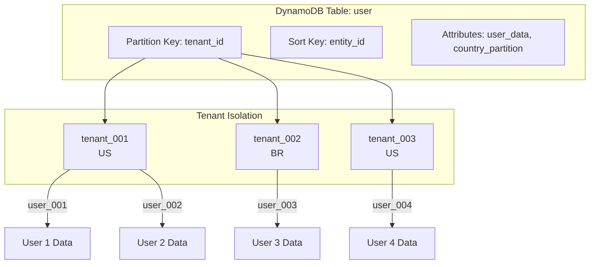
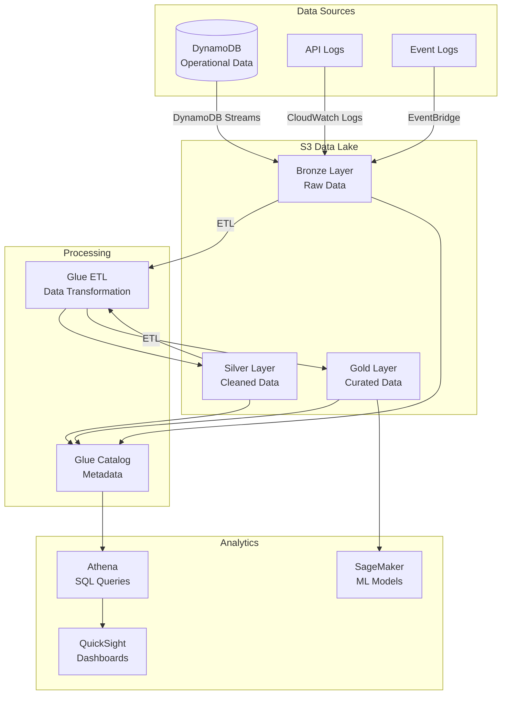
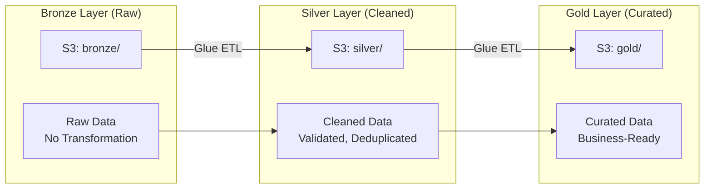
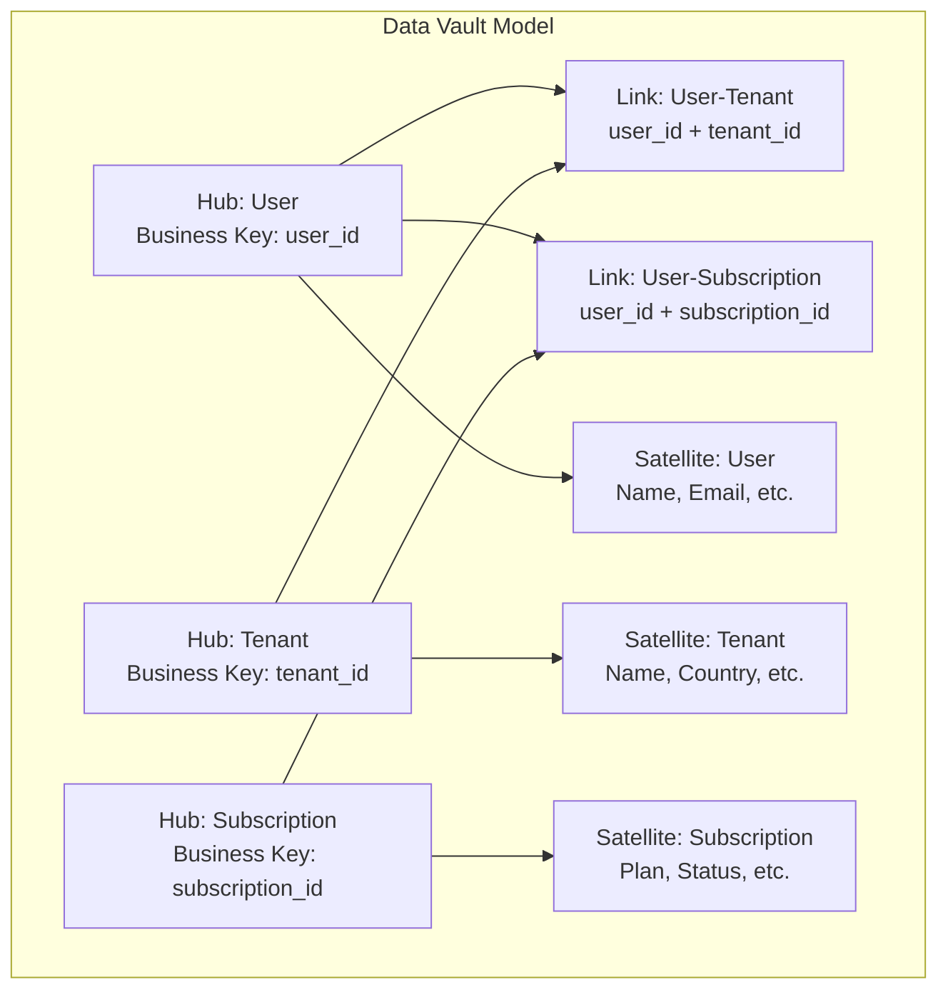
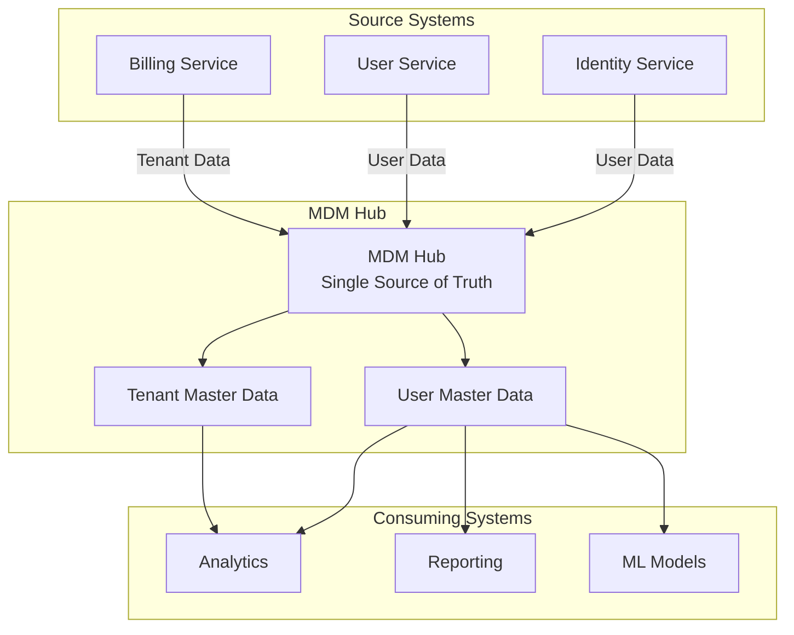
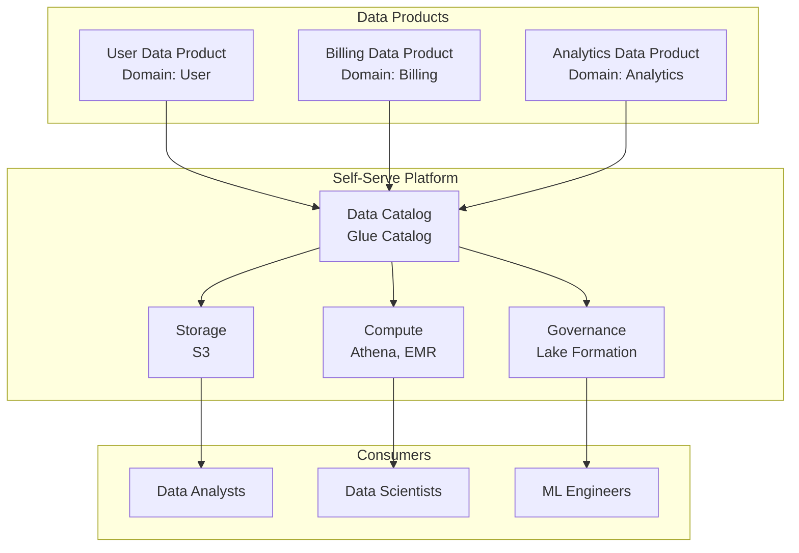
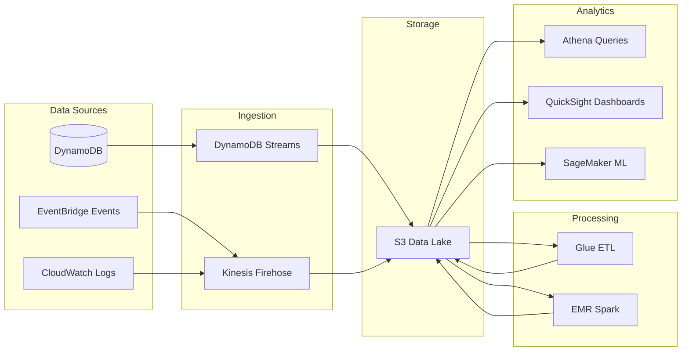
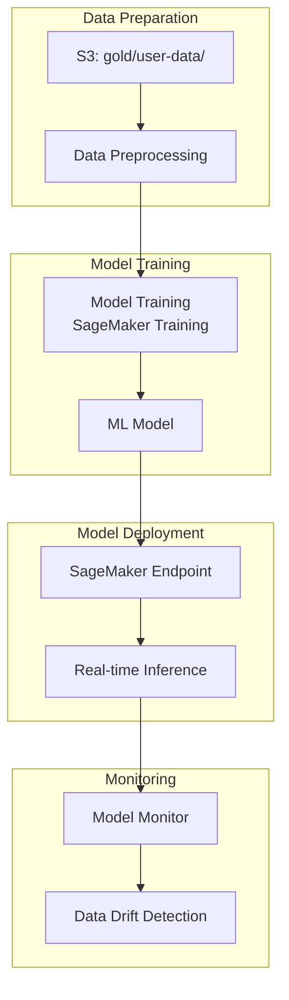

# 💾 Data Platform & Analytics
## 📈 DynamoDB, Data Lake, Medallion, Data Vault, Data Mesh & ML

> **📖 Purpose**: This document describes data patterns for multi-tenant SaaS, including DynamoDB tenant isolation, data lake architecture, Medallion pattern, Data Vault modeling, Master Data Management (MDM), Data Mesh principles, and ML/Analytics pipelines.

---

## 🎯 Scope

- 🗄️ **DynamoDB Multi-Tenancy**: Tenant isolation patterns, partition keys, country residency
- 🏞️ **Data Lake Architecture**: S3, Glue, Athena, Lake Formation
- 🥇 **Medallion Architecture**: Bronze (raw), Silver (cleaned), Gold (curated)
- 🏗️ **Data Vault Modeling**: Hubs, links, satellites for historical data
- 👑 **Master Data Management (MDM)**: Single source of truth for master data
- 🕸️ **Data Mesh**: Domain-oriented data products, self-serve platform
- 🤖 **ML/Analytics Pipelines**: SageMaker, QuickSight, data products

---

## 🗄️ DynamoDB Multi-Tenant Patterns



### ✅ DynamoDB Partition Model

**Table Schema:**
```json
{
  "tenant_id": "tenant_001",        // Partition Key
  "entity_id": "user_123",           // Sort Key
  "country_partition": "US",         // Residency partition
  "user_data": {
    "name": "John Doe",
    "email": "john@example.com"
  },
  "created_at": "2024-01-01T00:00:00Z",
  "updated_at": "2024-01-01T00:00:00Z"
}
```

### 🔐 Data Isolation Strategy

| Strategy | Implementation | Purpose |
|----------|---------------|---------|
| **Partition Key** | `tenant_id` | Ensures tenant isolation at DynamoDB level |
| **Sort Key** | `entity_id` | Unique entity within tenant |
| **Country Partition** | `country_partition` (US/BR) | Data residency compliance |
| **Application Enforcement** | JWT claims validation | Additional application-level isolation |

---

## 🏞️ Data Lake Architecture



### 📊 Data Lake Layers

| Layer | Purpose | Data Format | Retention |
|-------|---------|-------------|-----------|
| **🥇 Bronze** | Raw, unprocessed data | JSON, CSV, Parquet | 7 years |
| **🥈 Silver** | Cleaned, validated data | Parquet | 3 years |
| **🥉 Gold** | Curated, business-ready data | Parquet | 1 year |

---

## 🥇 Medallion Architecture



### 📊 Medallion Processing

**Bronze → Silver:**
- Data validation
- Deduplication
- Schema enforcement
- Data quality checks

**Silver → Gold:**
- Business logic transformation
- Aggregations
- Data enrichment
- Final data products

---

## 🏗️ Data Vault Modeling



### 📊 Data Vault Components

| Component | Purpose | Example |
|-----------|---------|---------|
| **Hub** | Business keys | User (user_id), Tenant (tenant_id) |
| **Link** | Relationships | User-Tenant, User-Subscription |
| **Satellite** | Descriptive attributes | User name, email, tenant name |

### ✅ Data Vault Benefits

- **✅ Historical Tracking**: Full history of changes
- **✅ Scalability**: Add new attributes without schema changes
- **✅ Flexibility**: Easy to add new relationships
- **✅ Audit Trail**: Complete audit trail of data changes

---

## 👑 Master Data Management (MDM)



### 📊 MDM Strategy

| Master Data | Source | Consumers | Purpose |
|-------------|--------|-----------|---------|
| **User** | Identity, User services | Analytics, Reporting, ML | Single source of truth for user data |
| **Tenant** | Identity, Billing services | Analytics, Reporting | Single source of truth for tenant data |

---

## 🕸️ Data Mesh



### 🎯 Data Mesh Principles

1. **✅ Domain Ownership**: Each domain owns its data products
2. **✅ Data as Product**: Data products are first-class citizens
3. **✅ Self-Serve Platform**: Centralized platform for data access
4. **✅ Federated Governance**: Domain-driven governance

### 📊 Data Products

| Data Product | Domain | Format | Consumers |
|--------------|--------|--------|-----------|
| **User Data Product** | User | Parquet (Gold layer) | Analytics, ML |
| **Billing Data Product** | Billing | Parquet (Gold layer) | Analytics, Reporting |
| **Analytics Data Product** | Analytics | Parquet (Gold layer) | Dashboards, ML |

---

## 📊 Analytics Pipeline



### 📊 Analytics Use Cases

| Use Case | Data Source | Processing | Output |
|----------|-------------|------------|--------|
| **User Analytics** | User DynamoDB | Glue ETL | QuickSight dashboard |
| **Revenue Analytics** | Billing DynamoDB | Glue ETL | QuickSight dashboard |
| **Churn Prediction** | User + Billing data | SageMaker ML | ML model predictions |
| **Recommendation Engine** | User behavior data | SageMaker ML | Product recommendations |

---

## 🤖 ML/Analytics Pipelines

### 📊 SageMaker Workflow



### 🎯 ML Use Cases

| Use Case | Model Type | Input | Output |
|----------|-----------|-------|--------|
| **Churn Prediction** | Binary Classification | User behavior, subscription data | Churn probability |
| **Recommendation Engine** | Collaborative Filtering | User interactions | Product recommendations |
| **Fraud Detection** | Anomaly Detection | Transaction data | Fraud score |
| **Revenue Forecasting** | Time Series | Historical billing data | Revenue forecast |

---

## 💡 Key Decisions

1. **✅ DynamoDB Tenant Partitioning**: Single table per domain with tenant_id partition key for isolation
2. **✅ Data Lake Pattern**: S3-based data lake with Medallion architecture (Bronze/Silver/Gold)
3. **✅ Data Vault Modeling**: Historical data tracking with hubs, links, satellites
4. **✅ Data Mesh**: Domain-oriented data products with self-serve platform
5. **✅ MDM Hub**: Single source of truth for master data (users, tenants)
6. **✅ Serverless Analytics**: Athena, Glue, QuickSight for serverless analytics
7. **✅ ML on AWS**: SageMaker for model training, deployment, and monitoring
8. **✅ Lake Formation**: Centralized governance and access control for data lake

---

## 🔗 Related Documentation

- 📄 [README.md](../README.md) - Central index
- ⚙️ [04-backend-ddd-microservices.md](04-backend-ddd-microservices.md) - Domain services and data patterns
- ☁️ [03-cloud-foundation-sre.md](03-cloud-foundation-sre.md) - Infrastructure and S3 setup
- 📊 [08-observability.md](08-observability.md) - Observability and data collection

---

> **💡 Tip**: Medallion architecture (Bronze/Silver/Gold) provides a clear data transformation pipeline. Data Mesh principles enable domain-oriented data products with self-serve analytics capabilities.

