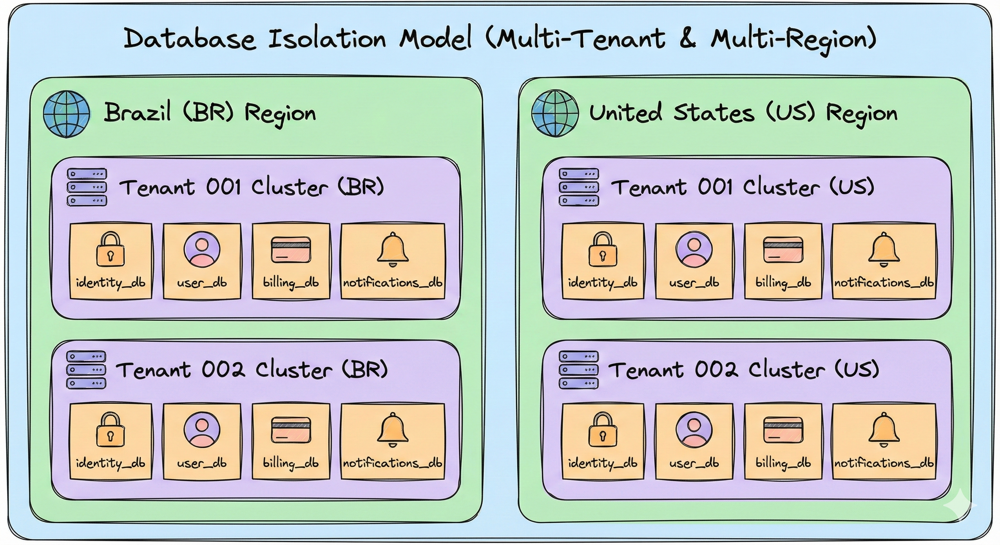
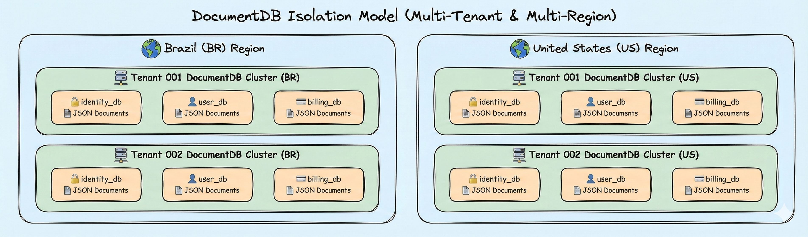
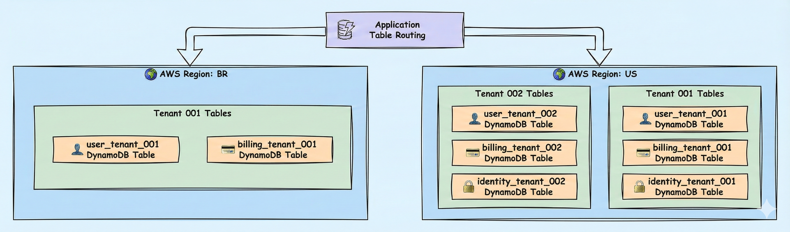
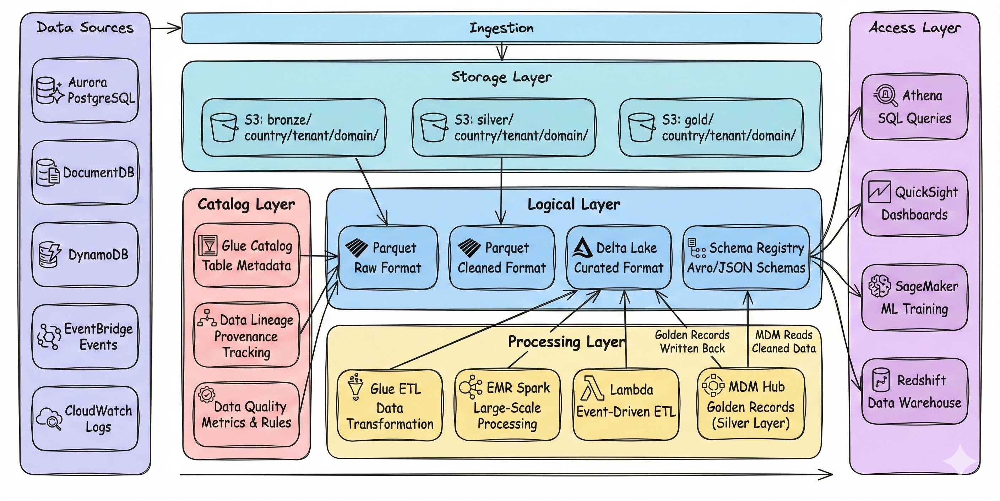
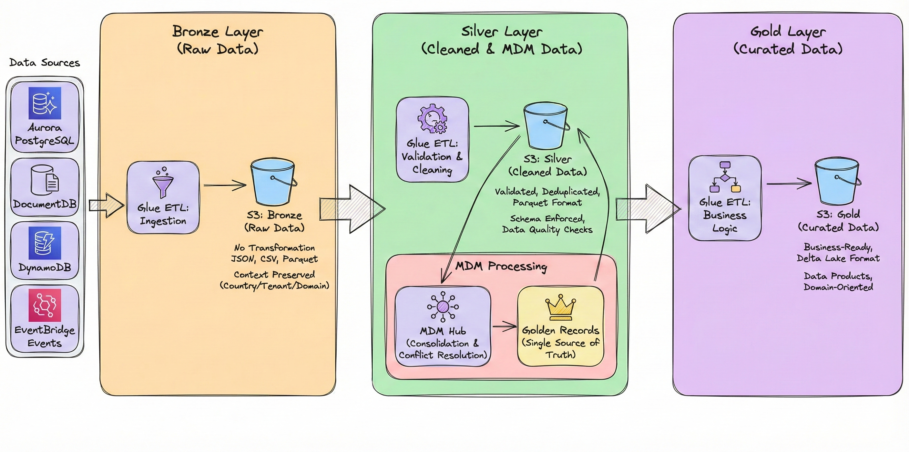
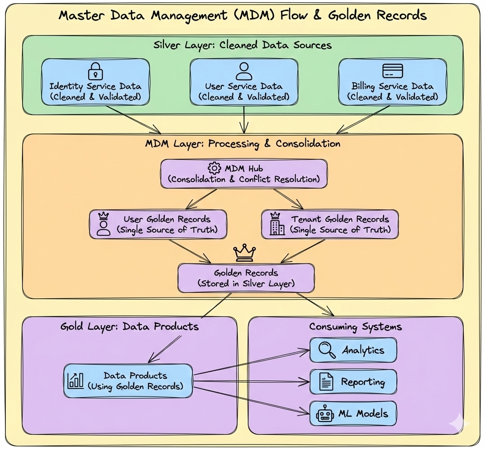
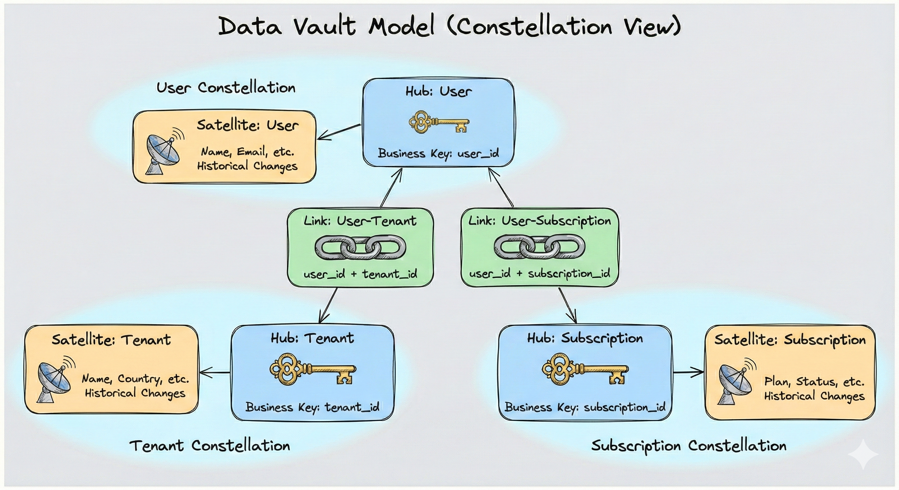
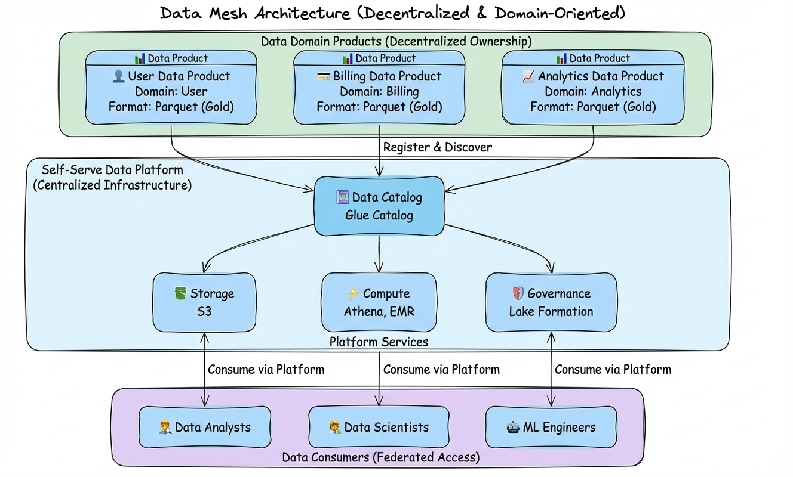
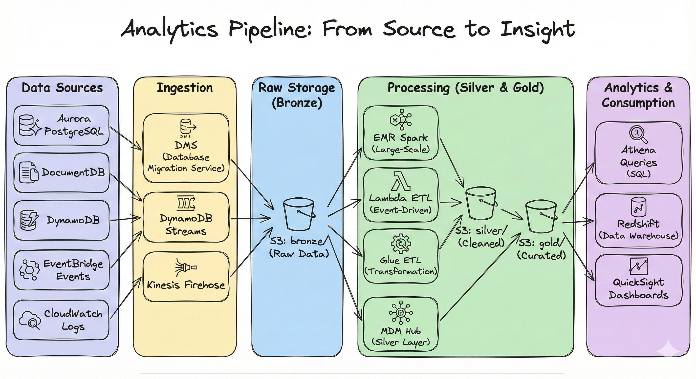
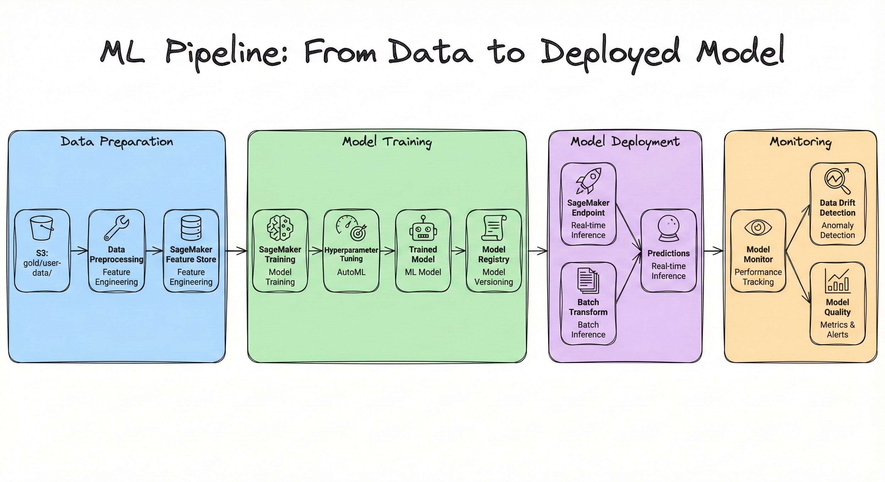

# 💾 Data Platform & Analytics
## 🗄️ Transactional Data Layer & 📊 Analytics Data Layer

> **📖 Purpose**: This document describes data patterns for multi-tenant SaaS, split into two distinct layers: **Transactional Data Layer** (Aurora PostgreSQL, DocumentDB, DynamoDB) for operational data with physical tenant isolation, and **Analytics Data Layer** (Data Lake, Medallion, Data Vault, Data Mesh, ML) for analytical workloads and business intelligence.

---

## 🎯 Scope

### 🗄️ Transactional Data Layer
- 🗄️ **Aurora PostgreSQL**: One cluster per tenant, domains as separate databases, physical isolation
- 📄 **DocumentDB**: One cluster per tenant, domains as separate databases, document storage
- 🗃️ **DynamoDB**: Separate physical tables per tenant, no partition key dependency
- 🔐 **Data Isolation**: Physical separation at cluster/database/table level

### 📊 Analytics Data Layer
- 🏞️ **Data Lake Architecture**: S3, Glue, Athena, Lake Formation with layered views
- 🥇 **Medallion Architecture**: Bronze (raw), Silver (cleaned), Gold (curated)
- 🏗️ **Data Vault Modeling**: Hubs, links, satellites for historical data
- 👑 **Master Data Management (MDM)**: Single source of truth for master data
- 🕸️ **Data Mesh**: Domain-oriented data products, self-serve platform
- 🤖 **ML/Analytics Pipelines**: SageMaker, QuickSight, data products

---

# 🗄️ Part 1: Transactional Data Layer

## 🎯 Transactional Data Architecture Overview

The **Transactional Data Layer** handles all operational, real-time data requirements for the multi-tenant SaaS platform. We implement **physical separation** at every level to ensure **strongest isolation**, **regulatory compliance**, and **data sovereignty**. Unlike logical partitioning strategies, our approach uses **dedicated clusters per tenant** with **domain databases** within each cluster, providing complete physical isolation while maintaining operational efficiency.

### 🏗️ Core Principles

1. **✅ One Cluster Per Tenant**: Each tenant has its own dedicated database cluster per country
2. **✅ Domains as Databases**: Within each tenant cluster, domains (Identity, User, Billing, etc.) are separate databases
3. **✅ Physical Separation**: No shared partitions or logical separation—complete physical isolation
4. **✅ Consistent Pattern**: Same architecture pattern for Aurora PostgreSQL and DocumentDB
5. **✅ DynamoDB Tables**: Separate physical tables per tenant (e.g., `user_tenant_001`, `user_tenant_002`)

---

## 🗄️ Aurora PostgreSQL Architecture

### 🏗️ Cluster Structure

**Aurora PostgreSQL** follows a **one cluster per tenant per country** architecture, where each tenant cluster contains **separate databases for each domain**. This provides **complete physical isolation** while enabling **shared compute resources** within the tenant's cluster.

**Architecture Pattern:**
- **Country Level**: Separate clusters per country (US, BR) for data residency compliance
- **Tenant Level**: One Aurora PostgreSQL cluster per tenant per country (e.g., `tenant_001_cluster_us`, `tenant_002_cluster_us`)
- **Domain Level**: Separate databases within tenant cluster (e.g., `identity_db`, `user_db`, `billing_db`, `notifications_db`)

### 📊 Aurora PostgreSQL Database Isolation Model



### ✅ Data Isolation Strategy

| Isolation Level | Implementation | Purpose |
|----------------|---------------|---------|
| **Country Isolation** | Separate Aurora clusters per country (US, BR) | Data residency compliance, regulatory requirements |
| **Tenant Isolation** | One cluster per tenant per country | Complete physical isolation, data sovereignty |
| **Domain Isolation** | Separate databases per domain within tenant cluster | Clear domain boundaries, independent schema evolution |
| **Connection Routing** | Application routes based on `tenant_id` + `domain` from JWT | Automatic tenant and domain routing |
| **Access Control** | Database-level credentials per tenant, connection pooling | Additional security layer |

### 🔌 Connection Pooling & Routing

The application implements **tenant-aware and domain-aware connection pooling** to route database connections to the correct tenant cluster and domain database based on the `tenant_id` and domain extracted from the JWT token and service context.

**Connection Pool Strategy:**
- **Per-Tenant-Domain Connection Pools**: Each tenant-domain combination has its own dedicated connection pool
- **Lazy Initialization**: Connection pools are created on-demand when first accessed
- **Connection Caching**: Pools are cached in memory to avoid repeated connection establishment
- **Pool Size Configuration**: Configurable pool size per tenant-domain (e.g., min: 2, max: 10 connections)
- **Connection String Pattern**: `postgresql://user:pass@{tenant_id}_cluster_{country}:5432/{domain}_db`

**Connection Routing Flow:**
1. **Extract Context**: Middleware extracts `tenant_id`, `country_partition`, and `domain` from JWT and service context
2. **Get Connection Pool**: Service requests connection from pool manager using `tenant_id` + `domain` + `country_partition`
3. **Route to Cluster**: Pool manager routes to tenant-specific cluster (e.g., `tenant_001_cluster_us`)
4. **Route to Database**: Within cluster, route to domain-specific database (e.g., `user_db`)
5. **Execute Query**: All read/write operations execute against the tenant's isolated domain database
6. **Return Connection**: Connection returned to pool for reuse

**Implementation Pattern** (Pseudo-code):
```typescript
// Connection Pool Manager
class TenantDomainConnectionPoolManager {
  private pools: Map<string, Pool> = new Map();
  
  getConnection(tenantId: string, domain: string, countryPartition: string): Pool {
    const clusterEndpoint = `${tenantId}_cluster_${countryPartition.toLowerCase()}`;
    const dbName = `${domain}_db`;
    const poolKey = `${countryPartition}_${tenantId}_${domain}`;
    
    if (!this.pools.has(poolKey)) {
      const connectionString = 
        `postgresql://user:pass@${clusterEndpoint}:5432/${dbName}`;
      this.pools.set(poolKey, new Pool({
        connectionString,
        min: 2,
        max: 10,
        idleTimeoutMillis: 30000
      }));
    }
    
    return this.pools.get(poolKey);
  }
}

// Service Usage
async function getUser(tenantId: string, userId: string, countryPartition: string) {
  const pool = connectionPoolManager.getConnection(tenantId, 'user', countryPartition);
  const result = await pool.query(
    'SELECT * FROM users WHERE id = $1', 
    [userId]
  );
  return result.rows[0];
}
```

**Benefits:**
- **✅ Complete Physical Isolation**: Tenants have dedicated clusters, no shared infrastructure
- **✅ Domain Separation**: Clear boundaries between domains within tenant cluster
- **✅ Regulatory Compliance**: Country-level isolation ensures data residency
- **✅ Resource Efficiency**: Shared compute within tenant cluster while maintaining data isolation
- **✅ Security**: No risk of cross-tenant or cross-domain data access

---

## 📄 DocumentDB Architecture

### 🏗️ Cluster Structure

**DocumentDB** follows the **same architecture pattern as Aurora PostgreSQL**: one cluster per tenant per country, with domains as separate databases within each tenant cluster. DocumentDB is used for **document storage**, **JSON data**, and **flexible schemas** where relational structure is not required.

**Architecture Pattern:**
- **Country Level**: Separate clusters per country (US, BR) for data residency compliance
- **Tenant Level**: One DocumentDB cluster per tenant per country (e.g., `tenant_001_docdb_us`, `tenant_002_docdb_us`)
- **Domain Level**: Separate databases within tenant cluster (e.g., `identity_db`, `user_db`, `billing_db`)

### 📊 DocumentDB Database Isolation Model



### ✅ DocumentDB Use Cases

| Use Case | Domain | Rationale |
|----------|--------|-----------|
| **Flexible Schema Data** | User profiles, preferences | JSON documents with varying structures |
| **Document Storage** | Notifications, audit logs | Document-based storage for unstructured data |
| **Rapid Schema Evolution** | Feature flags, configurations | No schema migrations required |
| **JSON Queries** | Analytics metadata, user settings | Native JSON query support |

### 🔌 DocumentDB Connection Routing

DocumentDB uses the same connection pooling and routing strategy as Aurora PostgreSQL:

**Connection String Pattern**: `mongodb://user:pass@{tenant_id}_docdb_{country}:27017/{domain}_db`

**Benefits:**
- **✅ Same Isolation Model**: Consistent architecture with Aurora PostgreSQL
- **✅ Flexible Schemas**: No rigid schema requirements, rapid evolution
- **✅ JSON Native**: Native JSON document storage and querying
- **✅ Physical Isolation**: Complete tenant and domain separation

---

## 🗃️ DynamoDB Architecture

### 🏗️ Table Structure

**DynamoDB** implements **physical separation** by creating **separate tables per tenant** instead of using partition keys. Each tenant has dedicated tables for each domain, ensuring complete physical isolation without relying on application-level partition key enforcement.

**Architecture Pattern:**
- **Table Naming**: `{domain}_{tenant_id}` (e.g., `user_tenant_001`, `billing_tenant_001`)
- **Application Routing**: Service routes to correct table based on `tenant_id` from JWT
- **Country Isolation**: Tables are created in country-specific AWS regions (US, BR)

### 📊 DynamoDB Table Isolation Model



### ✅ DynamoDB Table Schema

**Table Naming Convention:**
- Pattern: `{domain}_{tenant_id}`
- Examples: `user_tenant_001`, `billing_tenant_001`, `identity_tenant_001`

**Table Schema (No Partition Key Dependency):**
```json
{
  "entity_id": "user_123",           // Primary Key (Hash Key)
  "sort_key": "profile",             // Sort Key (optional)
  "user_data": {
    "name": "John Doe",
    "email": "john@example.com"
  },
  "created_at": "2024-01-01T00:00:00Z",
  "updated_at": "2024-01-01T00:00:00Z"
}
```

### 🔐 Data Isolation Strategy

| Strategy | Implementation | Purpose |
|----------|---------------|---------|
| **Physical Table Separation** | Separate table per tenant per domain | Complete physical isolation, no partition key dependency |
| **Application Routing** | Service routes to `{domain}_{tenant_id}` table | Automatic tenant isolation |
| **Country Isolation** | Tables in country-specific AWS regions | Data residency compliance |
| **IAM Policies** | Table-level access control per tenant | Additional security layer |

### 🔌 DynamoDB Table Routing

**Application-Level Routing:**
```typescript
// DynamoDB Client Wrapper
class TenantAwareDynamoDBClient {
  private client: DynamoDBClient;
  
  getTableName(domain: string, tenantId: string): string {
    return `${domain}_${tenantId}`;
  }
  
  async getItem(domain: string, tenantId: string, key: Record<string, any>) {
    const tableName = this.getTableName(domain, tenantId);
    return this.client.getItem({
      TableName: tableName,
      Key: key
    });
  }
}

// Service Usage
async function getUser(tenantId: string, userId: string) {
  const tableName = dynamoClient.getTableName('user', tenantId);
  return dynamoClient.getItem('user', tenantId, { entity_id: userId });
}
```

**Benefits:**
- **✅ Physical Separation**: Each tenant has dedicated tables, no shared infrastructure
- **✅ No Partition Key Dependency**: Isolation enforced at table level, not application logic
- **✅ Simplified Queries**: No need to include `tenant_id` in every query
- **✅ Independent Scaling**: Each tenant table scales independently
- **✅ Security**: IAM policies can enforce table-level access control

---

## 💡 Transactional Data Layer Key Decisions

1. **✅ One Cluster Per Tenant**: Aurora PostgreSQL and DocumentDB use one cluster per tenant per country
2. **✅ Domains as Databases**: Within tenant cluster, domains are separate databases (not partitions)
3. **✅ Physical Separation**: Complete physical isolation at cluster/database/table level
4. **✅ DynamoDB Separate Tables**: Separate physical tables per tenant (e.g., `user_tenant_001`)
5. **✅ Consistent Pattern**: Same architecture pattern for Aurora PostgreSQL and DocumentDB
6. **✅ Country-Level Isolation**: Separate clusters/tables per country for data residency
7. **✅ Connection Routing**: Application-level routing based on `tenant_id` + `domain` + `country_partition`

---

# 📊 Part 2: Analytics Data Layer

## 🎯 Analytics Data Architecture Overview

The **Analytics Data Layer** handles all analytical, reporting, and machine learning workloads. Data flows from the **Transactional Data Layer** through **ingestion pipelines** into a **layered data lake architecture** (Medallion: Bronze/Silver/Gold), where it is transformed, curated, and made available for analytics, reporting, and ML workloads. The architecture follows **Data Mesh principles** with **domain-oriented data products** and a **self-serve analytics platform**.

---

## 🏞️ Data Lake Architecture

### 🏗️ Layered Architecture

The data lake is organized into **five distinct layers**, each serving a specific purpose in the data transformation and consumption pipeline:

1. **📦 Storage Layer**: S3 buckets, prefixes, partitions for raw data storage
2. **📋 Logical Layer**: Data formats (Parquet, Delta Lake, Iceberg) and schema definitions
3. **🔄 Processing Layer**: ETL/ELT engines (Glue, EMR, Lambda) for data transformation
4. **📚 Catalog Layer**: Metadata management (Glue Catalog, schema registry) for data discovery
5. **🔍 Access Layer**: Query engines and analytics tools (Athena, QuickSight, SageMaker) for data consumption

### 📊 Comprehensive Data Lake Layered View



### 📊 Data Lake Layers Detail

| Layer | Components | Purpose | Data Format |
|-------|-----------|---------|-------------|
| **📦 Storage Layer** | S3 buckets, prefixes, partitions | Raw data storage, organized by country/tenant/domain | Raw files (JSON, CSV, Parquet) |
| **📋 Logical Layer** | Parquet, Delta Lake, Iceberg, schemas | Data format standardization, schema enforcement | Parquet, Delta Lake, Iceberg |
| **🔄 Processing Layer** | Glue, EMR, Lambda | Data transformation, cleaning, enrichment | ETL/ELT jobs |
| **📚 Catalog Layer** | Glue Catalog, schema registry, lineage | Metadata management, data discovery, governance | Table definitions, schemas |
| **🔍 Access Layer** | Athena, QuickSight, SageMaker, Redshift | Data consumption, analytics, ML | SQL queries, dashboards, models |

### 🗺️ Context Within Data Lake

The data lake preserves **context** from the transactional layer:

- **Country Context**: Data partitioned by country (US, BR) for data residency
- **Tenant Context**: Data partitioned by tenant for multi-tenant analytics
- **Domain Context**: Data organized by domain (Identity, User, Billing) for domain-oriented analytics
- **Temporal Context**: Time-based partitioning for historical analysis

**S3 Path Structure:**
```
s3://data-lake/
  bronze/
    {country}/
      {tenant_id}/
        {domain}/
          {year}/{month}/{day}/
            data.parquet
  silver/
    {country}/
      {tenant_id}/
        {domain}/
          {year}/{month}/{day}/
            data.parquet
  gold/
    {country}/
      {tenant_id}/
        {domain}/
          {year}/{month}/{day}/
            data.parquet
```

---

## 🥇 Medallion Architecture

The **Medallion Architecture** organizes data into three quality layers: **Bronze (raw)**, **Silver (cleaned)**, and **Gold (curated)**. Data flows through these layers with increasing quality and business readiness.

### 📊 Medallion Data Flow



### 📊 Medallion Processing

**Bronze → Silver:**
- Data validation and schema enforcement
- Deduplication and data quality checks
- Error handling and bad data quarantine
- Context preservation (country, tenant, domain)
- **MDM consolidation**: Master Data Management processes cleaned data from multiple sources (Identity, User, Billing services)
- **Golden record creation**: MDM Hub consolidates records, resolves conflicts, and creates golden records (single source of truth)
- **Golden records storage**: Golden records are stored back in Silver layer for consumption by Gold layer

**Silver → Gold:**
- Business logic transformation using golden records from Silver
- Aggregations and enrichments based on master data
- Data product creation (domain-oriented) using consolidated golden records
- Final data products ready for consumption (analytics, reporting, ML)

### 📊 Medallion Layers

| Layer | Purpose | Data Format | Retention | Processing |
|-------|---------|-------------|-----------|------------|
| **🥇 Bronze** | Raw, unprocessed data | JSON, CSV, Parquet | 7 years | Minimal (ingestion only) |
| **🥈 Silver** | Cleaned, validated data + Golden records | Parquet | 3 years | Validation, deduplication, **MDM consolidation**, golden record creation |
| **🥉 Gold** | Curated, business-ready data (using golden records) | Delta Lake | 1 year | Business logic, aggregations, data products |

---

## 👑 Master Data Management (MDM) - Integrated with Silver Layer

**Master Data Management (MDM)** is a **core component of the Silver layer** in the Medallion architecture. MDM processes **cleaned data from multiple sources** that have been validated and deduplicated in Silver, consolidates records, resolves conflicts, and creates **golden records** (single source of truth) that are stored back in the Silver layer. These golden records then feed into the Gold layer for business-ready data products.

### 🎯 MDM in Silver Layer Context

MDM operates **within the Silver layer** processing pipeline:

1. **📥 Input**: Cleaned Silver data from multiple source systems (Identity, User, Billing services)
2. **🔄 Processing**: MDM Hub consolidates records, resolves conflicts, matches entities
3. **👑 Output**: Golden records written back to Silver layer
4. **📊 Consumption**: Gold layer consumes golden records from Silver for business transformations

### 📊 MDM Architecture (Integrated with Silver Layer)



### 📊 MDM Strategy

| Master Data | Source (Silver Layer) | Location | Consumers | Purpose |
|-------------|----------------------|----------|-----------|---------|
| **👤 User** | Identity, User services (cleaned Silver data) | Silver layer (golden records) | Gold layer → Analytics, Reporting, ML | Single source of truth for user data |
| **🏢 Tenant** | Identity, Billing services (cleaned Silver data) | Silver layer (golden records) | Gold layer → Analytics, Reporting | Single source of truth for tenant data |

### ✅ MDM Benefits in Silver Layer

- **✅ Single Source of Truth**: Golden records provide consolidated, conflict-free master data
- **✅ Data Quality**: MDM operates on cleaned Silver data, ensuring high-quality golden records
- **✅ Silver Layer Storage**: Golden records stored in Silver layer for efficient access
- **✅ Gold Layer Consumption**: Business-ready data products in Gold use golden records from Silver
- **✅ Multi-Source Consolidation**: Resolves conflicts from multiple transactional sources
- **✅ Audit Trail**: Complete history of consolidation and conflict resolution

---

## 🏗️ Data Vault Modeling

**Data Vault Modeling** provides a **scalable, flexible data modeling approach** for historical data tracking. It organizes data into **Hubs** (business keys), **Links** (relationships), and **Satellites** (descriptive attributes), enabling **audit trails** and **historical tracking** without schema changes.

### 📊 Data Vault Model Structure



### 📊 Data Vault Components

| Component | Purpose | Example |
|-----------|---------|---------|
| **🔑 Hub** | Business keys, unique identifiers | User (user_id), Tenant (tenant_id), Subscription (subscription_id) |
| **🔗 Link** | Relationships between hubs | User-Tenant, User-Subscription, Tenant-Subscription |
| **📡 Satellite** | Descriptive attributes with history | User name, email, tenant name, subscription plan, status |

### ✅ Data Vault Benefits

- **✅ Historical Tracking**: Full history of changes with timestamps
- **✅ Scalability**: Add new attributes without schema changes
- **✅ Flexibility**: Easy to add new relationships and attributes
- **✅ Audit Trail**: Complete audit trail of data changes
- **✅ No Data Loss**: All historical states preserved

---

## 🕸️ Data Mesh

**Data Mesh** implements **domain-oriented data products** with a **self-serve analytics platform**. Each domain (Identity, User, Billing) owns and publishes its data products, enabling **federated governance** and **domain autonomy** while maintaining **centralized platform capabilities**.

### 📊 Data Mesh Architecture



### 🎯 Data Mesh Principles

1. **✅ Domain Ownership**: Each domain owns its data products end-to-end
2. **✅ Data as Product**: Data products are first-class citizens with SLAs
3. **✅ Self-Serve Platform**: Centralized platform for data access and processing
4. **✅ Federated Governance**: Domain-driven governance with centralized standards

### 📊 Data Products

| Data Product | Domain | Format | Consumers | SLA |
|--------------|--------|--------|-----------|-----|
| **👤 User Data Product** | User | Parquet (Gold layer) | Analytics, ML | 99.9% availability |
| **💳 Billing Data Product** | Billing | Parquet (Gold layer) | Analytics, Reporting | 99.9% availability |
| **📈 Analytics Data Product** | Analytics | Parquet (Gold layer) | Dashboards, ML | 99.5% availability |

---

## 📊 Analytics & Big Data Pipelines

### 🎯 Analytics Pipeline Overview

**Analytics & Big Data Pipelines** handle **batch processing**, **ETL/ELT workflows**, **reporting**, and **business intelligence** use cases. These pipelines process large volumes of data from transactional sources, transform it through the Medallion architecture (Bronze → Silver → Gold), and make it available for **SQL queries**, **dashboards**, and **ad-hoc analytics**. The focus is on **aggregation**, **reporting**, **data quality**, and **business metrics** rather than predictive modeling.

The pipeline orchestrates data flow from transactional sources through ingestion, storage, processing, and consumption layers for **batch analytics**, **reporting**, and **business intelligence**. For **machine learning workflows**, see the [ML & Data Science Pipelines](#-ml--data-science-pipelines) section below.

### 📊 Analytics Pipeline Architecture



> **💡 Note**: This pipeline focuses on **analytics and reporting**. For **machine learning workflows** including model training, deployment, and inference, see the [ML & Data Science Pipelines](#-ml--data-science-pipelines) section.

### 📊 Analytics Use Cases

| Use Case | Data Source | Processing | Output | Purpose |
|----------|-------------|------------|--------|---------|
| **👤 User Analytics** | User Aurora/DynamoDB | Glue ETL | QuickSight dashboard | User behavior analysis, engagement metrics |
| **💳 Revenue Analytics** | Billing Aurora/DynamoDB | Glue ETL | QuickSight dashboard | Revenue trends, subscription analytics |
| **📈 Business Intelligence** | All domains | Glue ETL + Athena | QuickSight reports | Executive dashboards, KPI tracking |
| **📊 Operational Analytics** | EventBridge, CloudWatch | Kinesis Firehose | Athena queries | System performance, operational metrics |
| **🔍 Ad-Hoc Analytics** | Gold layer data | Athena SQL | Custom reports | Data exploration, custom queries |
| **📋 Compliance Reporting** | All domains | Glue ETL | QuickSight reports | Regulatory reporting, audit trails |

### 🔄 Batch Processing Workflow

**ETL/ELT Pipeline Stages:**

1. **📥 Ingestion**: Data extracted from transactional sources (Aurora, DocumentDB, DynamoDB) via DMS, Streams, or Firehose
2. **🥇 Bronze Layer**: Raw data stored in S3 with full fidelity, no transformation
3. **🔧 Silver Processing**: Glue ETL jobs validate, clean, deduplicate, and enforce schemas
4. **🥈 Silver Layer**: Cleaned data stored in Parquet format for efficient querying
5. **🔧 Gold Processing**: Business logic transformations, aggregations, enrichments
6. **🥉 Gold Layer**: Curated data products ready for consumption
7. **📊 Analytics**: Athena queries, QuickSight dashboards, Redshift data warehouse

### 📊 Analytics Tools & Services

| Service | Purpose | Use Case |
|---------|---------|----------|
| **🔍 Athena** | Serverless SQL queries on S3 | Ad-hoc analytics, data exploration |
| **📊 QuickSight** | Business intelligence dashboards | Executive reporting, KPI tracking |
| **🔴 Redshift** | Data warehouse for complex analytics | Large-scale analytics, data warehousing |
| **🔧 Glue ETL** | Data transformation jobs | ETL/ELT workflows, data quality |
| **⚡ EMR Spark** | Large-scale data processing | Big data processing, complex transformations |
| **🔥 Kinesis Firehose** | Streaming data ingestion | Real-time data ingestion to S3 |

---

## 🤖 ML & Data Science Pipelines

### 🎯 ML Pipeline Overview

**ML & Data Science Pipelines** handle **machine learning workflows**, **model training**, **feature engineering**, **model deployment**, and **inference**. These pipelines focus on **predictive modeling**, **ML model lifecycle management**, and **real-time/batch inference**. The ML workflows consume curated data from the Gold layer and produce **trained models**, **predictions**, and **ML insights**.

### 📊 SageMaker ML Workflow



### 🎯 ML Use Cases

| Use Case | Model Type | Input | Output | Purpose |
|----------|-----------|-------|--------|---------|
| **📉 Churn Prediction** | Binary Classification | User behavior, subscription data | Churn probability | Identify at-risk customers |
| **🎯 Recommendation Engine** | Collaborative Filtering | User interactions | Product recommendations | Personalized recommendations |
| **🚨 Fraud Detection** | Anomaly Detection | Transaction data | Fraud score | Detect fraudulent transactions |
| **📈 Revenue Forecasting** | Time Series | Historical billing data | Revenue forecast | Predict future revenue |
| **👤 Customer Segmentation** | Clustering | User behavior data | Customer segments | Group customers by behavior |
| **💬 Sentiment Analysis** | NLP | Text data, reviews | Sentiment score | Analyze customer sentiment |

### 🔄 ML Pipeline Stages

**ML Workflow Stages:**

1. **📊 Data Preparation**: Curated data from Gold layer, feature engineering, feature store
2. **🎓 Model Training**: SageMaker training jobs, hyperparameter tuning, model selection
3. **📦 Model Registry**: Model versioning, model artifacts storage
4. **🚀 Model Deployment**: Real-time endpoints, batch transform jobs
5. **🔮 Inference**: Real-time predictions, batch predictions
6. **📊 Monitoring**: Model performance, data drift detection, model quality metrics

### 📊 ML Tools & Services

| Service | Purpose | Use Case |
|---------|---------|----------|
| **🤖 SageMaker Training** | Model training infrastructure | Train ML models at scale |
| **🎯 SageMaker Hyperparameter Tuning** | Automated hyperparameter optimization | Optimize model performance |
| **📚 SageMaker Feature Store** | Feature engineering and storage | Centralized feature management |
| **🌐 SageMaker Endpoints** | Real-time inference | Low-latency predictions |
| **📊 SageMaker Batch Transform** | Batch inference | Large-scale batch predictions |
| **👁️ SageMaker Model Monitor** | Model performance monitoring | Detect model drift, performance degradation |
| **📦 SageMaker Model Registry** | Model versioning and management | Model lifecycle management |

---

## 💡 Analytics Data Layer Key Decisions

1. **✅ Layered Data Lake**: Five-layer architecture (Storage, Logical, Processing, Catalog, Access)
2. **✅ Medallion Architecture**: Bronze (raw), Silver (cleaned + MDM), Gold (curated) data quality layers
3. **✅ MDM Integrated with Silver Layer**: MDM processes cleaned Silver data from multiple sources, creates golden records, and stores them in Silver layer for Gold layer consumption
4. **✅ Data Vault Modeling**: Historical data tracking with hubs, links, satellites
5. **✅ Data Mesh**: Domain-oriented data products with self-serve platform
6. **✅ Serverless Analytics**: Athena, Glue, QuickSight for serverless analytics
7. **✅ ML on AWS**: SageMaker for model training, deployment, and monitoring
8. **✅ Lake Formation**: Centralized governance and access control for data lake
9. **✅ Context Preservation**: Country, tenant, and domain context preserved throughout pipeline

---

## 🔗 Related Documentation

- 📄 [README.md](../README.md) - Central index
- ⚙️ [04-backend-ddd-microservices.md](04-backend-ddd-microservices.md) - Domain services and transactional data patterns
- ☁️ [03-cloud-foundation-sre.md](03-cloud-foundation-sre.md) - Infrastructure and S3 setup
- 📊 [08-observability.md](08-observability.md) - Observability and data collection

---

> **💡 Tip**: The transactional data layer provides physical isolation for operational data, while the analytics data layer enables business intelligence and ML workloads. Medallion architecture (Bronze/Silver/Gold) provides a clear data transformation pipeline. Data Mesh principles enable domain-oriented data products with self-serve analytics capabilities.
