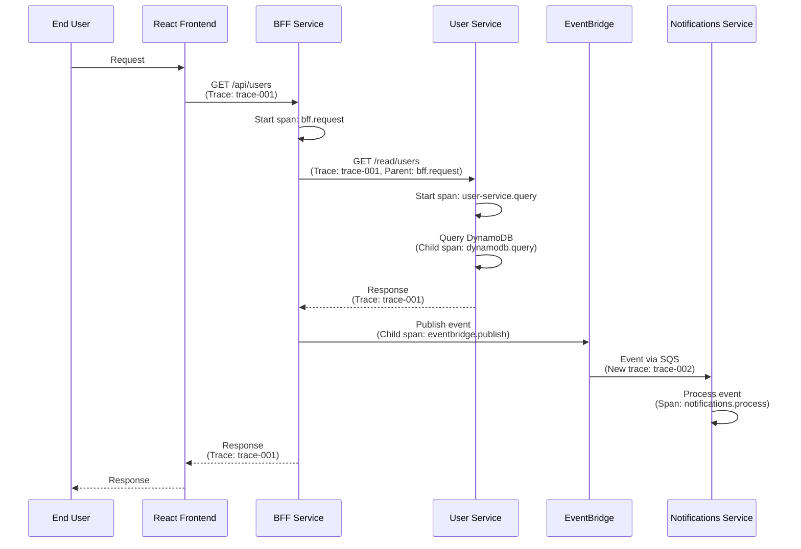
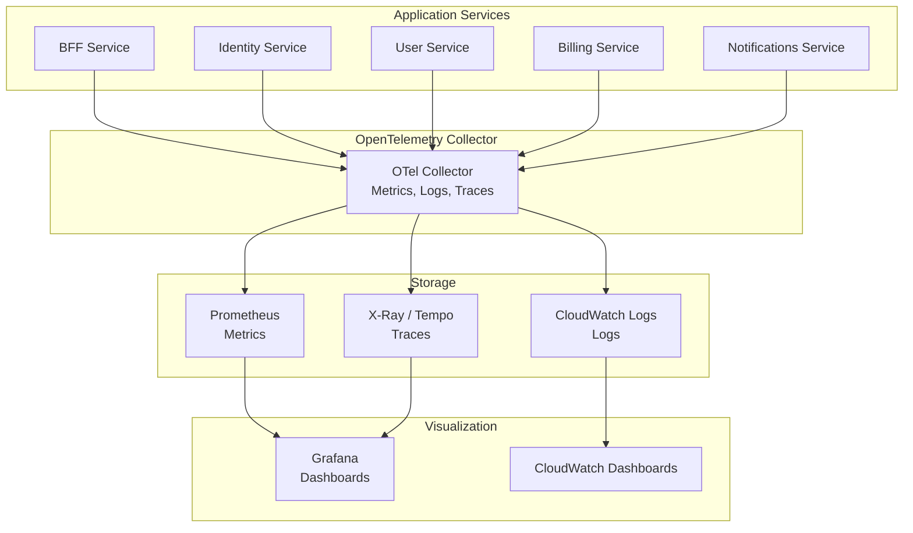

# 📊 Observability
## 🔍 OpenTelemetry, Metrics, Logs, Traces & SLOs

> **📖 Purpose**: This document describes the observability architecture using OpenTelemetry, distributed tracing, metrics collection, structured logging, dashboards, and SLO definitions for operational excellence.

---

## 🎯 Scope

- 🔍 **OpenTelemetry Architecture**: Instrumentation, trace propagation, context
- 📈 **Metrics**: Prometheus, CloudWatch, SLIs (Service Level Indicators)
- 📝 **Logs**: Structured JSON logging, aggregation, CloudWatch Logs
- 🔄 **Distributed Tracing**: Trace propagation across services and events
- 📊 **Dashboards**: Grafana, CloudWatch dashboards, key metrics
- 🎯 **SLOs**: Service Level Objectives, error budgets, alerting

---

## 🔄 OpenTelemetry Trace Flow



### 🔍 Trace Context Propagation

**Headers:**
- `traceparent`: W3C Trace Context
- `tracestate`: Additional trace state

**Span Hierarchy:**
```
trace-001
  ├── bff.request
  │   ├── user-service.query
  │   │   └── dynamodb.query
  │   └── eventbridge.publish
```

---

## 📊 Metrics/Logs/Traces Pipeline



### 📊 Observability Data Types

| Type | Collection | Storage | Visualization |
|------|-----------|---------|--------------|
| **Metrics** | OpenTelemetry | Prometheus, CloudWatch | Grafana, CloudWatch |
| **Logs** | Structured JSON | CloudWatch Logs | CloudWatch, Grafana |
| **Traces** | OpenTelemetry | X-Ray, Tempo | Grafana, X-Ray Console |

---

## 📈 Dashboard Layout

```mermaid
graph TB
    subgraph "Service Dashboard"
        Availability[Availability<br/>99.9% SLO]
        Latency[Latency<br/>p50, p95, p99]
        ErrorRate[Error Rate<br/>5xx / Total]
        Throughput[Throughput<br/>RPS]
    end
    
    subgraph "Infrastructure Dashboard"
        CPULoad[CPU Load<br/>Per Node]
        MemoryUsage[Memory Usage<br/>Per Pod]
        NetworkIO[Network I/O<br/>Bytes/sec]
        PodCount[Pod Count<br/>Per Service]
    end
    
    subgraph "Business Dashboard"
        ActiveUsers[Active Users<br/>Per Tenant]
        Revenue[Revenue<br/>Per Day]
        Subscriptions[Subscriptions<br/>Active/Churned]
    end
    
    Availability --> ServiceDashboard[Service Dashboard]
    Latency --> ServiceDashboard
    ErrorRate --> ServiceDashboard
    Throughput --> ServiceDashboard
    
    CPULoad --> InfrastructureDashboard[Infrastructure Dashboard]
    MemoryUsage --> InfrastructureDashboard
    NetworkIO --> InfrastructureDashboard
    PodCount --> InfrastructureDashboard
    
    ActiveUsers --> BusinessDashboard[Business Dashboard]
    Revenue --> BusinessDashboard
    Subscriptions --> BusinessDashboard
```



### 📊 Key Metrics

| Metric | Type | Purpose | Alert Threshold |
|--------|------|---------|-----------------|
| **Availability** | SLI | Uptime percentage | < 99.9% |
| **Latency (p50)** | Performance | Median response time | > 200ms |
| **Latency (p99)** | Performance | 99th percentile | > 1000ms |
| **Error Rate** | Reliability | 5xx errors / total | > 0.1% |
| **Throughput** | Capacity | Requests per second | > 1000 RPS |

---

## 🎯 SLO Definition

```mermaid
graph TB
    subgraph "SLO: 99.9% Availability"
        SLI[SLI: Uptime Percentage]
        SLO[SLO: 99.9%]
        ErrorBudget[Error Budget: 43.2 min/month]
    end
    
    subgraph "SLO: p99 Latency < 1000ms"
        LatencySLI[SLI: p99 Latency]
        LatencySLO[SLO: < 1000ms]
        LatencyBudget[Error Budget: 1% of requests]
    end
    
    subgraph "SLO: Error Rate < 0.1%"
        ErrorSLI[SLI: 5xx / Total]
        ErrorSLO[SLO: < 0.1%]
        ErrorBudget2[Error Budget: 0.1% of requests]
    end
    
    SLI --> SLO
    SLO --> ErrorBudget
    
    LatencySLI --> LatencySLO
    LatencySLO --> LatencyBudget
    
    ErrorSLI --> ErrorSLO
    ErrorSLO --> ErrorBudget2
```



### 📊 SLO Examples

| Service | SLO | Error Budget | Measurement |
|---------|-----|-------------|-------------|
| **BFF** | 99.9% availability | 43.2 min/month | Uptime percentage |
| **Identity** | 99.95% availability | 21.6 min/month | Uptime percentage |
| **User** | p99 latency < 1000ms | 1% of requests | Response time |
| **Billing** | Error rate < 0.1% | 0.1% of requests | 5xx / total |

---

## 📝 Structured Logging

### 📊 Log Format

```json
{
  "timestamp": "2024-01-01T00:00:00Z",
  "level": "info",
  "service": "user-service",
  "trace_id": "trace-001",
  "span_id": "span-002",
  "tenant_id": "tenant_001",
  "message": "User created successfully",
  "user_id": "user_123",
  "duration_ms": 45,
  "status_code": 200
}
```

### ✅ Log Levels

| Level | Usage | Example |
|-------|-------|---------|
| **ERROR** | Errors requiring attention | Failed database query |
| **WARN** | Warnings, recoverable errors | Retry after failure |
| **INFO** | Important business events | User created, invoice issued |
| **DEBUG** | Debug information | Request/response details |

---

## 🔍 Distributed Tracing Example

### 📊 Trace Visualization

```
Trace: trace-001 (Duration: 250ms)
├── bff.request (Duration: 250ms)
│   ├── user-service.query (Duration: 45ms)
│   │   └── dynamodb.query (Duration: 30ms)
│   ├── eventbridge.publish (Duration: 10ms)
│   └── response.send (Duration: 5ms)
```

### ✅ Trace Attributes

- **trace_id**: Unique trace identifier
- **span_id**: Unique span identifier
- **parent_span_id**: Parent span (for hierarchy)
- **service.name**: Service name
- **operation.name**: Operation name
- **duration**: Span duration in milliseconds
- **status**: OK, ERROR

---

## 📊 Observability Best Practices

### ✅ Instrumentation

1. **✅ Automatic Instrumentation**: Use OpenTelemetry auto-instrumentation when possible
2. **✅ Manual Instrumentation**: Add custom spans for business logic
3. **✅ Context Propagation**: Propagate trace context across service boundaries
4. **✅ Structured Logging**: Use structured JSON logs with consistent fields
5. **✅ Metrics Collection**: Collect SLIs (availability, latency, error rate, throughput)

### ✅ Dashboards

1. **✅ Service Dashboards**: Per-service metrics (availability, latency, errors)
2. **✅ Infrastructure Dashboards**: CPU, memory, network, pod counts
3. **✅ Business Dashboards**: Business metrics (users, revenue, subscriptions)
4. **✅ SLO Dashboards**: SLO compliance, error budget burn rate

### ✅ Alerting

1. **✅ SLO Violations**: Alert when SLO is violated
2. **✅ Error Budget Burn**: Alert when error budget is consumed too quickly
3. **✅ High Latency**: Alert when p99 latency exceeds threshold
4. **✅ High Error Rate**: Alert when error rate exceeds threshold

---

## 💡 Key Decisions

1. **✅ OpenTelemetry**: Vendor-neutral observability standard
2. **✅ Distributed Tracing**: Full request tracing across services and events
3. **✅ Structured Logging**: JSON logs with consistent schema
4. **✅ SLO-Based Operations**: SLIs, SLOs, error budgets for reliability
5. **✅ Prometheus + Grafana**: Open-source metrics and visualization
6. **✅ CloudWatch Integration**: AWS-native logging and metrics
7. **✅ Trace Context Propagation**: W3C Trace Context standard
8. **✅ Automatic Instrumentation**: Minimize manual instrumentation effort

---

## 🔗 Related Documentation

- 📄 [README.md](../README.md) - Central index
- ☁️ [04-cloud-foundation-sre.md](04-cloud-foundation-sre.md) - SRE practices and SLIs
- ⚙️ [02-backend-ddd-microservices.md](02-backend-ddd-microservices.md) - Service architecture
- 🔄 [07-devsecops.md](07-devsecops.md) - CI/CD and deployment

---

> **💡 Tip**: OpenTelemetry provides vendor-neutral observability. Distributed tracing across services and events gives complete visibility into request flows. SLO-based operations ensure reliability targets are met.

