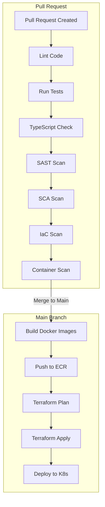
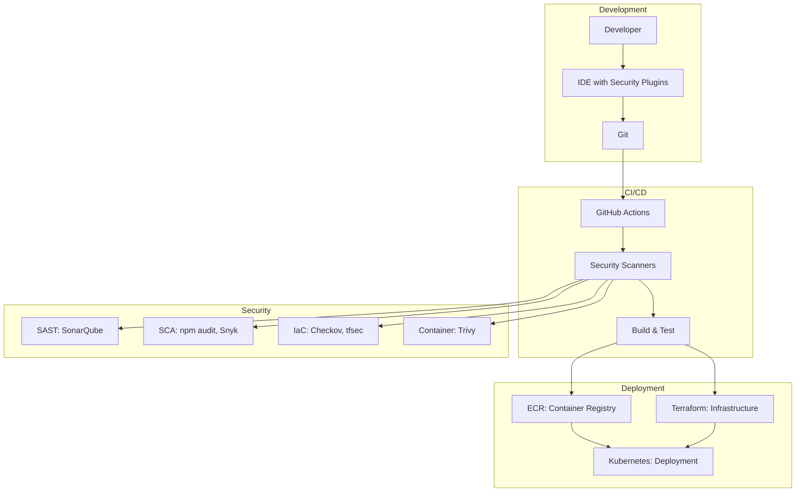

# 🔄 DevSecOps
## 🚀 CI/CD Pipelines, Shift-Left Security & Automation

> **📖 Purpose**: This document describes the CI/CD pipeline architecture, shift-left security model, automated scanning (SAST, SCA, IaC, container), GitHub Actions workflows, and DevSecOps best practices.

---

## 🎯 Scope

- 🚀 **CI/CD Pipeline Architecture**: GitHub Actions workflows, build, test, deploy
- ⬅️ **Shift-Left Security**: Security checks early in development lifecycle
- 🔍 **Security Scanning**: SAST, SCA, IaC scanning, container scanning
- 🤖 **Automation**: Automated testing, building, deployment
- 📦 **Supply Chain Security**: SBOM generation, signing, vulnerability scanning

---

## 🚀 CI/CD Pipeline (PR → Main)



### 📊 Pipeline Stages

| Stage | Purpose | Tools | Trigger |
|-------|---------|-------|---------|
| **Lint** | Code quality | ESLint, Prettier | PR |
| **Test** | Unit tests | Jest, Mocha | PR |
| **TypeCheck** | TypeScript validation | `tsc --noEmit` | PR |
| **SAST** | Static application security testing | SonarQube, Snyk | PR |
| **SCA** | Software composition analysis | `npm audit`, Snyk | PR |
| **IaC Scan** | Infrastructure as code scanning | Checkov, tfsec | PR |
| **Container Scan** | Container image scanning | Trivy, Snyk | PR |
| **Build** | Docker image build | Docker | Main |
| **Push ECR** | Push to AWS ECR | AWS CLI | Main |
| **Terraform** | Infrastructure deployment | Terraform | Main |
| **Deploy K8s** | Kubernetes deployment | kubectl, Helm | Main |

---

## ⬅️ Shift-Left Security

```mermaid
graph LR
    subgraph "Development"
        Code[Write Code]
        LocalScan[Local Security Scan]
        Commit[Commit Code]
    end
    
    subgraph "Pull Request"
        PRScan[PR Security Checks]
        Review[Code Review]
    end
    
    subgraph "Main Branch"
        BuildScan[Build-time Security Scan]
        DeployScan[Deploy-time Security Scan]
    end
    
    subgraph "Production"
        RuntimeScan[Runtime Security Scan]
        Monitor[Security Monitoring]
    end
    
    Code --> LocalScan
    LocalScan --> Commit
    Commit --> PRScan
    PRScan --> Review
    Review --> BuildScan
    BuildScan --> DeployScan
    DeployScan --> RuntimeScan
    RuntimeScan --> Monitor
```



### ✅ Shift-Left Benefits

| Stage | Security Check | Benefit |
|-------|---------------|---------|
| **Development** | Local SAST, SCA | Catch issues before commit |
| **Pull Request** | SAST, SCA, IaC, Container | Block PR if issues found |
| **Build** | Container scanning | Catch vulnerabilities in images |
| **Deploy** | Policy validation | Ensure compliance before deploy |
| **Runtime** | Security monitoring | Detect runtime threats |

---

## 🔄 DevSecOps Workflow



---

## 🔍 Security Scanning

### 📊 SAST (Static Application Security Testing)

**Purpose**: Analyze source code for security vulnerabilities

**Tools**: SonarQube, Snyk, Semgrep

**Checks**:
- SQL injection vulnerabilities
- XSS (Cross-Site Scripting) vulnerabilities
- Insecure dependencies
- Hardcoded secrets
- Weak cryptography

### 📊 SCA (Software Composition Analysis)

**Purpose**: Scan dependencies for known vulnerabilities

**Tools**: `npm audit`, Snyk, OWASP Dependency-Check

**Checks**:
- Known CVEs in dependencies
- Outdated packages
- License compliance
- Supply chain vulnerabilities

### 📊 IaC Scanning

**Purpose**: Scan infrastructure as code for misconfigurations

**Tools**: Checkov, tfsec, Terrascan

**Checks**:
- Security misconfigurations
- Compliance violations
- Best practice violations
- Resource exposure

### 📊 Container Scanning

**Purpose**: Scan container images for vulnerabilities

**Tools**: Trivy, Snyk, AWS ECR scanning

**Checks**:
- OS package vulnerabilities
- Application dependency vulnerabilities
- Configuration issues
- Secrets in images

---

## 📦 GitHub Actions Workflows

### 🔄 PR Checks Workflow

```yaml
name: PR Checks

on:
  pull_request:
    branches: [main]

jobs:
  lint:
    runs-on: ubuntu-latest
    steps:
      - uses: actions/checkout@v3
      - name: Setup Node.js
        uses: actions/setup-node@v3
      - name: Install dependencies
        run: npm ci
      - name: Lint
        run: npm run lint

  test:
    runs-on: ubuntu-latest
    steps:
      - uses: actions/checkout@v3
      - name: Setup Node.js
        uses: actions/setup-node@v3
      - name: Install dependencies
        run: npm ci
      - name: Test
        run: npm test

  typecheck:
    runs-on: ubuntu-latest
    steps:
      - uses: actions/checkout@v3
      - name: Setup Node.js
        uses: actions/setup-node@v3
      - name: Install dependencies
        run: npm ci
      - name: TypeCheck
        run: npm run typecheck

  sast:
    runs-on: ubuntu-latest
    steps:
      - uses: actions/checkout@v3
      - name: SAST Scan
        uses: snyk/actions/node@master

  sca:
    runs-on: ubuntu-latest
    steps:
      - uses: actions/checkout@v3
      - name: SCA Scan
        run: npm audit

  iac-scan:
    runs-on: ubuntu-latest
    steps:
      - uses: actions/checkout@v3
      - name: IaC Scan
        uses: bridgecrewio/checkov-action@master

  container-scan:
    runs-on: ubuntu-latest
    steps:
      - uses: actions/checkout@v3
      - name: Build image
        run: docker build -t app:latest .
      - name: Container Scan
        uses: aquasecurity/trivy-action@master
```

### 🚀 Deploy Workflow

```yaml
name: Deploy

on:
  push:
    branches: [main]

jobs:
  build:
    runs-on: ubuntu-latest
    steps:
      - uses: actions/checkout@v3
      - name: Build Docker image
        run: docker build -t app:latest .
      - name: Push to ECR
        run: |
          aws ecr get-login-password | docker login --username AWS --password-stdin $ECR_REGISTRY
          docker push $ECR_REGISTRY/app:latest

  terraform:
    runs-on: ubuntu-latest
    steps:
      - uses: actions/checkout@v3
      - name: Terraform Plan
        run: terraform plan
      - name: Terraform Apply
        run: terraform apply -auto-approve

  deploy:
    runs-on: ubuntu-latest
    steps:
      - uses: actions/checkout@v3
      - name: Deploy to K8s
        run: kubectl apply -f k8s/
```

---

## 📦 Supply Chain Security

### 🔐 SBOM (Software Bill of Materials)

**Purpose**: Document all software components and dependencies

**Format**: SPDX, CycloneDX

**Generation**: Automated during build process

**Storage**: Attached to container images, stored in artifact repository

### ✍️ Signing

**Purpose**: Sign artifacts to ensure integrity

**Tools**: Cosign, Notary

**Process**:
1. Sign container images during build
2. Verify signatures during deployment
3. Store signatures in artifact registry

---

## 💡 Key Decisions

1. **✅ Shift-Left Security**: Security checks early in development lifecycle
2. **✅ Automated Scanning**: SAST, SCA, IaC, container scanning in CI/CD
3. **✅ GitHub Actions**: CI/CD automation with security gates
4. **✅ Security Gates**: Block PR/merge if security issues found
5. **✅ SBOM Generation**: Automated SBOM generation for supply chain transparency
6. **✅ Artifact Signing**: Sign container images for integrity verification
7. **✅ Multi-Stage Scanning**: Security checks at multiple pipeline stages
8. **✅ Policy as Code**: Infrastructure policies enforced via IaC scanning

---

## 🔗 Related Documentation

- 📄 [README.md](../README.md) - Central index
- 🔒 [08-security-zero-trust.md](08-security-zero-trust.md) - Security model and practices
- ☁️ [04-cloud-foundation-sre.md](04-cloud-foundation-sre.md) - Infrastructure and deployment
- 📊 [06-observability.md](06-observability.md) - Monitoring and alerting

---

> **💡 Tip**: Shift-left security catches vulnerabilities early, reducing cost and risk. Automated scanning in CI/CD ensures security is built into the development process, not bolted on later.

