# 🔒 Security: Zero Trust
## 🛡️ Defense in Depth, IAM, Secrets & Network Security

> **📖 Purpose**: This document describes the Zero Trust security model, defense-in-depth layers, IAM/IRSA patterns, secrets management, network security (Istio mTLS, NetworkPolicies), encryption and key management, data residency compliance, security monitoring, and comprehensive security decision framework.

---

## 🎯 Scope

- 🛡️ **Zero Trust Model**: Never trust, always verify
- 🏰 **Defense in Depth**: Multiple security layers
- 🔐 **Authentication & Authorization**: Frontend and backend security controls
- 🔐 **IAM & IRSA**: Identity and access management, IAM Roles for Service Accounts
- 🔑 **Secrets Management**: AWS Secrets Manager, SSM Parameter Store
- 🌐 **Network Security**: Istio mTLS, NetworkPolicies, default deny
- 🔐 **Encryption & Key Management**: SSL/TLS termination, certificate management, KMS
- 🌍 **Data Residency & Compliance**: GDPR, data localization, audit logging
- 📊 **Security Monitoring & Incident Response**: Threat detection, incident management
- 🔒 **Pod Security**: Pod Security Standards, security contexts

---

## 🏗️ Security Architecture Overview

Our security architecture implements a **comprehensive Zero Trust model** with **defense-in-depth** across all layers of the multi-tenant SaaS platform. The architecture ensures **complete security coverage** from edge to data, with multiple security layers protecting against different attack vectors. This section provides an overview of our security architecture, showing how each layer contributes to the overall security posture.

### 📊 Security Layers Architecture

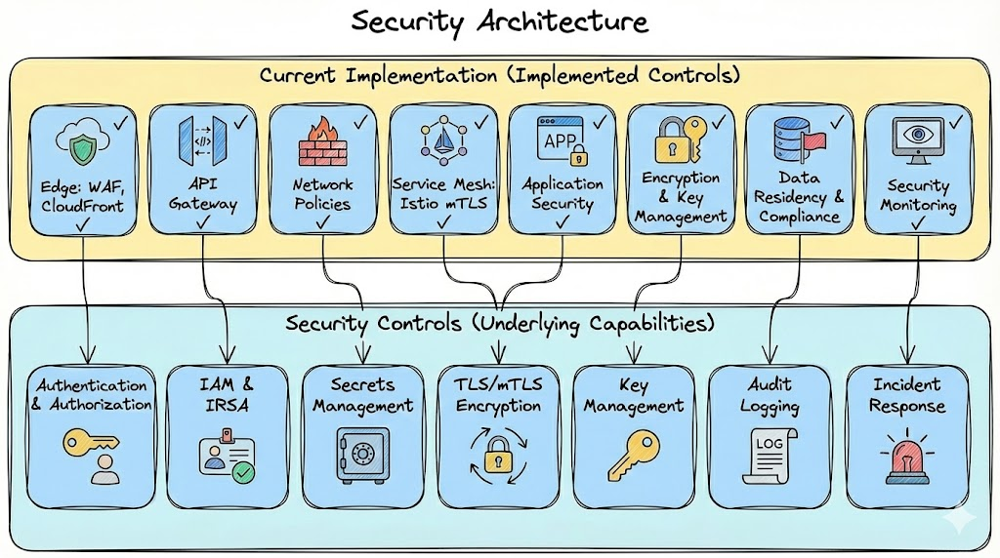

### 🛡️ Defense in Depth Layers

| Layer | Component | Security Controls | Purpose |
|-------|-----------|------------------|---------|
| **Edge** | WAF, CloudFront | OWASP rules, DDoS protection, bot protection, geo-blocking | First line of defense, block malicious traffic |
| **API Gateway** | API Gateway | Authentication, rate limiting, API keys, TLS termination | API security boundary, request validation |
| **Service Mesh** | Istio mTLS | Automatic encryption, service authentication, authorization policies | Service-to-service security, zero-trust networking |
| **Network** | NetworkPolicies | Network segmentation, default deny, explicit allows | Network-level isolation and access control |
| **Application** | Pod Security, Auth | Container security, JWT validation, RBAC, CSRF protection | Application-level security controls |
| **Storage** | Database Encryption, KMS | Encryption at rest (Aurora, DocumentDB, DynamoDB, S3), encryption in transit (TLS/mTLS), KMS key management, tenant-specific keys | Data protection at storage layer, prevent unauthorized access to stored data |
| **Data** | Data Encryption, Key Management | End-to-end encryption, data encryption in transit (TLS 1.2+), data encryption at rest (KMS CMK), key rotation, encryption key hierarchy | Complete data protection throughout lifecycle, compliance with encryption requirements |
| **Compliance** | Audit Logging, Data Residency | Comprehensive audit trails, data localization, GDPR compliance, cross-border controls | Regulatory compliance, data sovereignty |
| **Monitoring** | Security Events, IR | Threat detection, incident response, security dashboards | Proactive security operations |

### 🔐 Zero Trust Implementation

Our Zero Trust implementation ensures **every request is verified** at multiple layers:

- **Identity Verification**: JWT tokens, mTLS certificates, service principals
- **Authorization**: RBAC, permission matrices, service-to-service policies
- **Encryption**: End-to-end TLS, mTLS for service communication
- **Monitoring**: Continuous security event detection and analysis
- **Compliance**: Data residency enforcement, audit logging, regulatory compliance

---

## 🏰 Defense in Depth

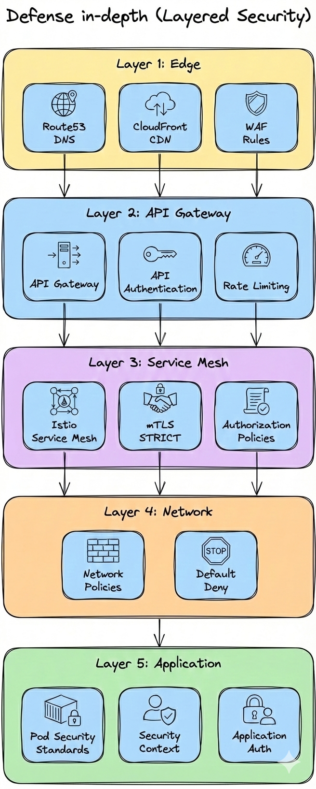

### 🛡️ Security Layers

| Layer | Component | Purpose |
|-------|-----------|---------|
| **Edge** | WAF | OWASP rules, DDoS protection, bot protection |
| **API Gateway** | API Gateway | Authentication, rate limiting, API keys |
| **Service Mesh** | Istio mTLS | Automatic encryption, service authentication |
| **Network** | NetworkPolicies | Network segmentation, default deny |
| **Application** | Pod Security | Container security, least privilege |

---

## 🛡️ Zero Trust Network

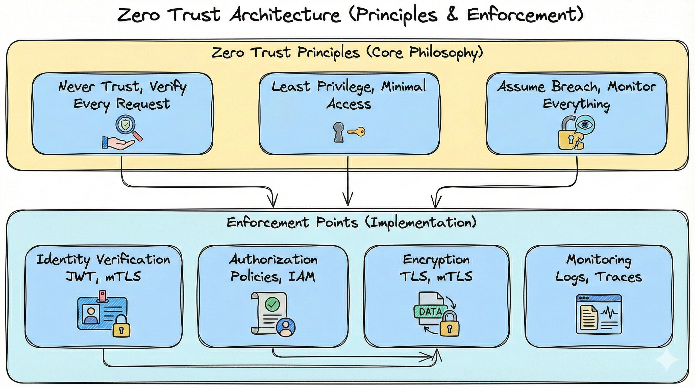

### ✅ Zero Trust Principles

1. **✅ Never Trust**: Every request is verified, no implicit trust
2. **✅ Least Privilege**: Minimal access required for functionality
3. **✅ Assume Breach**: Monitor and detect threats continuously
4. **✅ Verify Explicitly**: Identity, device, and network verification
5. **✅ Use Least Privilege Access**: Grant only necessary permissions

---

## 🔐 Authentication & Authorization

Our **comprehensive authentication and authorization strategy** ensures secure access control across all layers of the platform, from frontend user interactions to backend service-to-service communication. This multi-layered approach implements industry best practices for identity verification, session management, and access control.

### 🎨 Frontend Security Architecture

#### JWT Token Management

We implement a **robust JWT token management system** with automatic refresh mechanisms to ensure seamless user experience while maintaining security.

**Token Refresh Flow**:

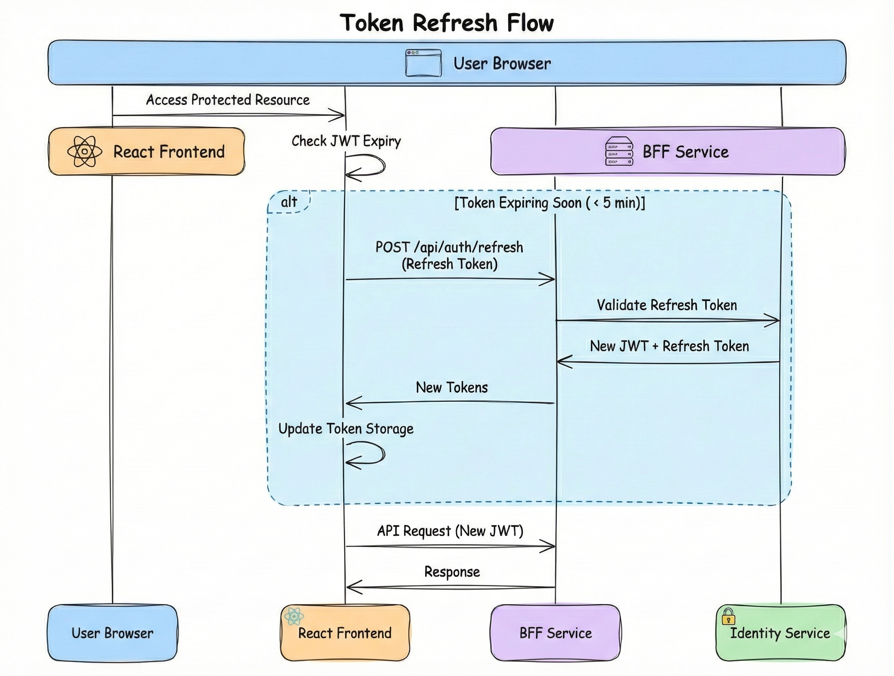

**Implementation Details**:
- **Refresh Token Endpoint**: `POST /api/auth/refresh`
- **Token Storage**: Refresh tokens stored in httpOnly cookies (not localStorage)
- **Automatic Refresh**: Tokens refreshed automatically when < 5 minutes remaining
- **Token Rotation**: New refresh token issued on each refresh
- **Revocation**: Refresh tokens revoked on logout

#### CSRF Protection

We implement **comprehensive CSRF protection** using multiple defense mechanisms:

**CSRF Protection Strategy**:
1. **CSRF Tokens**: State-changing operations require CSRF tokens
2. **SameSite Cookies**: Cookies configured with `SameSite=Strict`
3. **Origin Validation**: Origin header validated on API requests
4. **Double-Submit Cookie Pattern**: Additional layer of CSRF protection

**Implementation Example**:
```typescript
// BFF CSRF Middleware
import csrf from 'csurf';

const csrfProtection = csrf({ 
  cookie: {
    httpOnly: true,
    secure: true,
    sameSite: 'strict'
  }
});

app.use('/api/*', csrfProtection);
```

#### XSS Prevention

We implement **multiple layers of XSS prevention** to protect against cross-site scripting attacks:

**XSS Prevention Strategy**:
1. **Content Security Policy (CSP)**: Restrict resource loading to trusted sources
2. **Input Sanitization**: All user inputs sanitized using DOMPurify
3. **Output Encoding**: All outputs encoded (HTML, JavaScript, URL encoding)
4. **React XSS Protection**: Leverage React's built-in JSX escaping
5. **Security Headers**: X-XSS-Protection, X-Content-Type-Options headers

**CSP Configuration**:
```typescript
// BFF Security Headers
app.use((req, res, next) => {
  res.setHeader('Content-Security-Policy', 
    "default-src 'self'; " +
    "script-src 'self' 'unsafe-inline' 'unsafe-eval'; " +
    "style-src 'self' 'unsafe-inline'; " +
    "img-src 'self' data: https:; " +
    "font-src 'self' data:; " +
    "connect-src 'self' https://api.example.com; " +
    "frame-ancestors 'none';"
  );
  next();
});
```

#### Secure Cookie Configuration

We implement **secure cookie settings** to protect authentication tokens:

**Cookie Security Configuration**:
```typescript
// Secure Cookie Configuration
res.cookie('refreshToken', token, {
  httpOnly: true,        // Prevent XSS
  secure: true,         // HTTPS only
  sameSite: 'strict',   // Prevent CSRF
  maxAge: 7 * 24 * 60 * 60 * 1000, // 7 days
  path: '/api/auth',
  domain: '.example.com'
});
```

**Cookie Security Features**:
- **httpOnly**: Prevents JavaScript access (XSS protection)
- **secure**: HTTPS only transmission
- **sameSite**: Prevents CSRF attacks
- **Expiration**: Short-lived access tokens, longer refresh tokens
- **Cookie Prefixes**: `__Host-` prefix for domain-locked cookies

#### Session Management

We implement **comprehensive session management** with timeout, limits, and revocation:

**Session Management Features**:
- **Session Timeout**: 30 minutes inactivity timeout
- **Concurrent Session Limits**: Maximum sessions per user
- **Session Revocation**: Endpoint to revoke active sessions
- **Activity Tracking**: Track session activity, invalidate suspicious sessions
- **Storage**: Active sessions stored in Redis with expiration

### 🔧 Backend Security Architecture

#### Service-to-Service Authentication

We implement **robust service-to-service authentication** using IRSA and Istio mTLS:

**Service Principal Architecture**:
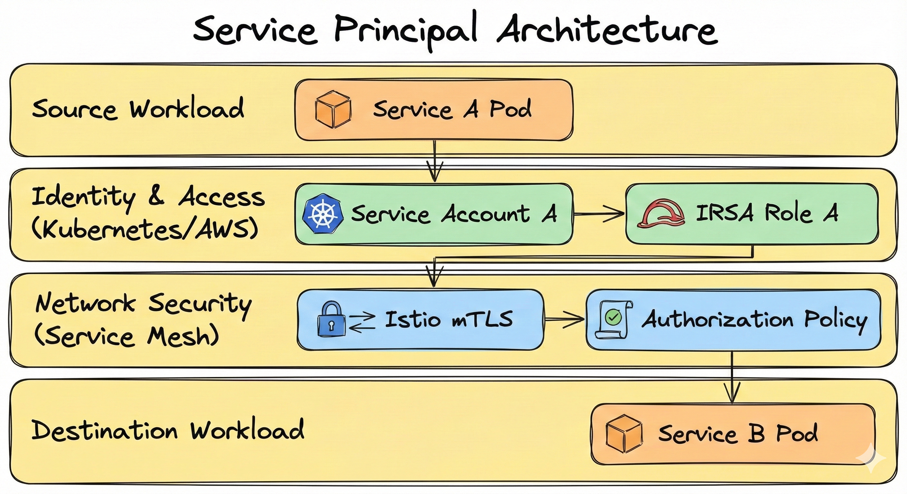

**Service Principal Configuration**:
```yaml
# Service Account with IRSA
apiVersion: v1
kind: ServiceAccount
metadata:
  name: user-service
  namespace: user
  annotations:
    eks.amazonaws.com/role-arn: arn:aws:iam::account:role/user-service-role
---
# Istio Authorization Policy
apiVersion: security.istio.io/v1beta1
kind: AuthorizationPolicy
metadata:
  name: allow-bff-to-user
  namespace: user
spec:
  selector:
    matchLabels:
      app: user-service
  action: ALLOW
  rules:
  - from:
    - source:
        principals: ["cluster.local/ns/bff/sa/bff-service"]
    to:
    - operation:
        methods: ["GET", "POST"]
        paths: ["/read/*", "/commands/*"]
```

**Service Principal Matrix**:
| Service | Service Account | IRSA Role | Allowed Services |
|---------|----------------|-----------|------------------|
| **BFF** | `bff-service` | `bff-service-role` | Identity, User, Billing, Notifications |
| **Identity** | `identity-service` | `identity-service-role` | None (only receives requests) |
| **User** | `user-service` | `user-service-role` | DynamoDB, EventBridge |
| **Billing** | `billing-service` | `billing-service-role` | Aurora PostgreSQL, EventBridge |

#### Role-Based Access Control (RBAC)

We implement **fine-grained RBAC** with comprehensive permission matrices:

**Permission Matrix**:
| Role | Users (Read) | Users (Write) | Billing (Read) | Billing (Write) | Admin |
|------|--------------|---------------|----------------|-----------------|-------|
| **Admin** | ✅ | ✅ | ✅ | ✅ | ✅ |
| **Manager** | ✅ | ✅ | ✅ | ❌ | ❌ |
| **User** | ✅ (own) | ✅ (own) | ✅ (own) | ❌ | ❌ |

**RBAC Implementation Features**:
- **Role Hierarchy**: Admin > Manager > User
- **Fine-Grained Permissions**: Resource:action format (e.g., `users:read`, `billing:write`)
- **Permission Evaluation**: Centralized permission evaluation logic
- **Permission Caching**: Performance optimization through caching
- **Dynamic Permissions**: Permissions evaluated at runtime based on context

---

## 🔐 IAM Roles and IRSA Flow

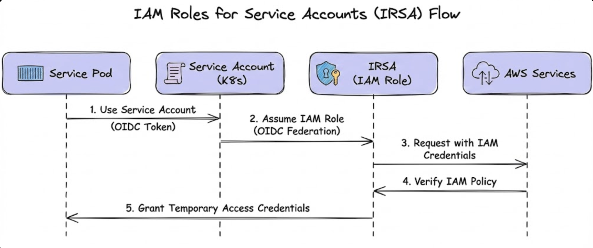

### 📊 IRSA Configuration

| Service | IAM Role | Permissions | Purpose |
|---------|----------|------------|---------|
| **User Service** | `user-service-role` | DynamoDB read/write (user table) | Access user data |
| **Billing Service** | `billing-service-role` | DynamoDB read/write (billing table) | Access billing data |
| **Notifications Service** | `notifications-service-role` | DynamoDB read/write, SES send email | Send notifications |
| **BFF Service** | `bff-service-role` | No AWS service access | No direct AWS access |

### ✅ IAM Best Practices

1. **✅ Least Privilege**: Grant minimum permissions required
2. **✅ IRSA**: Use IAM Roles for Service Accounts (not access keys)
3. **✅ Policy Boundaries**: Use IAM policy boundaries to limit permissions
4. **✅ Regular Review**: Review and audit IAM permissions regularly
5. **✅ No Hardcoded Secrets**: Never hardcode AWS credentials

### 📊 Detailed IAM Policy Examples

**Least Privilege IAM Policy**:
```json
{
  "Version": "2012-10-17",
  "Statement": [
    {
      "Sid": "AllowDynamoDBUserTable",
      "Effect": "Allow",
      "Action": [
        "dynamodb:GetItem",
        "dynamodb:PutItem",
        "dynamodb:UpdateItem",
        "dynamodb:DeleteItem",
        "dynamodb:Query"
      ],
      "Resource": [
        "arn:aws:dynamodb:us-east-1:account:table/user_tenant_*"
      ],
      "Condition": {
        "StringEquals": {
          "dynamodb:LeadingKeys": "${aws:PrincipalTag/tenant_id}"
        }
      }
    },
    {
      "Sid": "DenyAllOtherTables",
      "Effect": "Deny",
      "Action": "dynamodb:*",
      "Resource": [
        "arn:aws:dynamodb:us-east-1:account:table/*"
      ],
      "Condition": {
        "StringNotEquals": {
          "dynamodb:LeadingKeys": "${aws:PrincipalTag/tenant_id}"
        }
      }
    }
  ]
}
```

**Permission Matrix**:
| Service | DynamoDB | Aurora | EventBridge | S3 | Secrets Manager | KMS |
|---------|----------|--------|------------|-----|-----------------|-----|
| **BFF** | ❌ | ❌ | ❌ | ❌ | ❌ | ❌ |
| **User Service** | ✅ (user tables only) | ❌ | ✅ (publish) | ❌ | ✅ (read user secrets) | ✅ (decrypt) |
| **Billing Service** | ❌ | ✅ (billing DB only) | ✅ (publish) | ❌ | ✅ (read billing secrets) | ✅ (decrypt) |
| **Notifications** | ❌ | ✅ (notifications DB) | ✅ (consume) | ❌ | ✅ (read SES secrets) | ✅ (decrypt) |

**Permission Boundary Example**:
```json
{
  "Version": "2012-10-17",
  "Statement": [
    {
      "Sid": "PermissionBoundary",
      "Effect": "Allow",
      "Action": [
        "dynamodb:*",
        "secretsmanager:GetSecretValue"
      ],
      "Resource": "*"
    },
    {
      "Sid": "DenyIAM",
      "Effect": "Deny",
      "Action": [
        "iam:*"
      ],
      "Resource": "*"
    }
  ]
}
```

---

## 🔑 Secrets Management

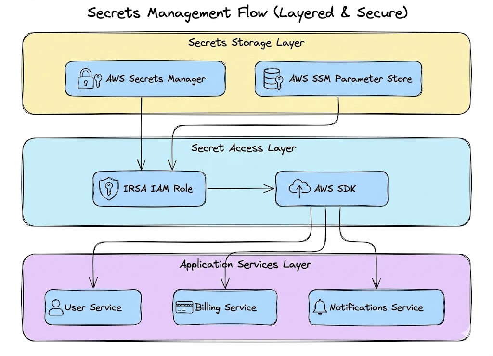

### 📊 Secrets Types

| Secret Type | Storage | Access | Use Case |
|-------------|---------|--------|----------|
| **Database Credentials** | Secrets Manager | IRSA | DynamoDB access |
| **API Keys** | Secrets Manager | IRSA | Third-party API keys |
| **JWT Secrets** | Secrets Manager | IRSA | Token signing keys |
| **Configuration** | SSM Parameter Store | IRSA | App configuration |

### ✅ Secrets Best Practices

1. **✅ AWS Secrets Manager**: Store sensitive secrets (passwords, API keys)
2. **✅ SSM Parameter Store**: Store non-sensitive configuration
3. **✅ Encryption**: All secrets encrypted at rest (KMS)
4. **✅ Rotation**: Enable automatic secret rotation when possible
5. **✅ Least Privilege**: IRSA roles with minimal secrets access
6. **✅ No Hardcoded Secrets**: Never hardcode secrets in code or config

### 🔄 Secrets Rotation

**Secrets Rotation Schedule**:
| Secret Type | Rotation Frequency | Automatic | Failure Handling |
|-------------|-------------------|-----------|-----------------|
| **Database Passwords** | 90 days | ✅ Yes (AWS RDS) | Alert + manual rotation |
| **API Keys** | 180 days | ⚠️ Manual | Alert + manual rotation |
| **JWT Secrets** | 365 days | ⚠️ Manual | Alert + manual rotation |
| **OAuth Client Secrets** | 180 days | ⚠️ Manual | Alert + manual rotation |

**Secrets Access Logging**:
- CloudTrail logging enabled for all Secrets Manager access
- Secrets access audit trail maintained
- Secrets versioning for rollback capability
- Alerts for unusual secrets access patterns
- Regular review of secrets access logs

---

## 🌐 Network Security

### 🔒 Istio mTLS

**Configuration:**
```yaml
apiVersion: security.istio.io/v1beta1
kind: PeerAuthentication
metadata:
  name: default
  namespace: identity
spec:
  mtls:
    mode: STRICT
```

**Benefits:**
- ✅ Automatic encryption for all service-to-service traffic
- ✅ Service identity verification
- ✅ No manual certificate management
- ✅ Transparent to applications

### 🛡️ NetworkPolicies

**Default Deny:**
```yaml
apiVersion: networking.k8s.io/v1
kind: NetworkPolicy
metadata:
  name: default-deny
  namespace: user
spec:
  podSelector: {}
  policyTypes:
  - Ingress
  - Egress
```

**Allow Rules:**
```yaml
apiVersion: networking.k8s.io/v1
kind: NetworkPolicy
metadata:
  name: allow-bff-to-user
  namespace: user
spec:
  podSelector:
    matchLabels:
      app: user-service
  policyTypes:
  - Ingress
  ingress:
  - from:
    - namespaceSelector:
        matchLabels:
          name: bff
      podSelector:
        matchLabels:
          app: bff-service
    ports:
    - protocol: TCP
      port: 8080
```

### 🛡️ WAF Configuration

**WAF Rules Configuration**:
```yaml
# WAF Rules
ManagedRules:
  - AWSManagedRulesCommonRuleSet
  - AWSManagedRulesKnownBadInputsRuleSet
  - AWSManagedRulesLinuxRuleSet
  - AWSManagedRulesSQLiRuleSet
  - AWSManagedRulesUnixRuleSet
  - AWSManagedRulesWindowsRuleSet
  - AWSManagedRulesBotControlRuleSet

CustomRules:
  - Name: GeoBlocking
    Priority: 1
    Action: BLOCK
    Statement:
      GeoMatchStatement:
        CountryCodes: [CN, RU, KP] # Block high-risk countries
    
  - Name: TenantRateLimit
    Priority: 2
    Action: BLOCK
    Statement:
      RateBasedStatement:
        Limit: 2000
        AggregateKeyType: IP
        ScopeDownStatement:
          ByteMatchStatement:
            FieldToMatch: Header
            HeaderName: X-Tenant-ID
```

### 🛡️ DDoS Protection

**DDoS Protection Strategy**:
- AWS Shield Advanced enabled for DDoS protection
- CloudFront configured for DDoS mitigation
- Traffic analysis via CloudWatch and VPC Flow Logs
- DDoS attack response playbook documented
- DDoS attack alerts configured

---

## 🔐 Encryption & Key Management

Our **comprehensive encryption and key management strategy** ensures end-to-end encryption across all layers of the platform, from user browsers to data storage. This section details our SSL/TLS termination architecture, certificate lifecycle management, KMS key hierarchy, and data encryption at rest and in transit.

### 🔒 SSL/TLS Termination Architecture

We implement **end-to-end encryption** with TLS termination at multiple layers to ensure secure communication throughout the platform.

**TLS Termination Points**:

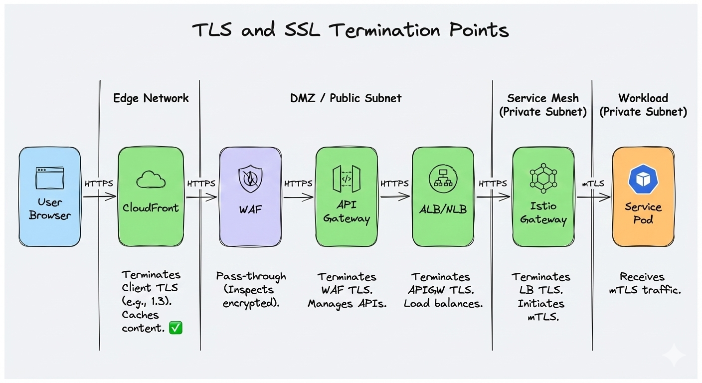

**TLS Configuration Requirements**:
| Layer | TLS Version | Cipher Suites | Certificate Source |
|-------|-------------|---------------|-------------------|
| **CloudFront** | TLS 1.3 | Modern only | ACM |
| **API Gateway** | TLS 1.2+ | Strong ciphers | ACM |
| **ALB** | TLS 1.2+ | Strong ciphers | ACM |
| **Istio** | TLS 1.2+ | Strong ciphers | Istio CA |

### 📜 Certificate Management

We implement **automated certificate lifecycle management** using AWS Certificate Manager (ACM) for seamless certificate provisioning, renewal, and rotation.

**Certificate Lifecycle Flow**:
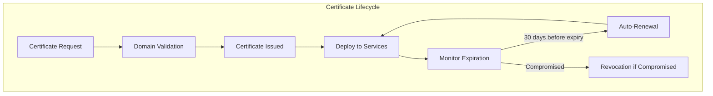

**Certificate Rotation Schedule**:
- **CloudFront**: Auto-renewed by ACM (60 days before expiry)
- **API Gateway**: Auto-renewed by ACM (60 days before expiry)
- **ALB**: Auto-renewed by ACM (60 days before expiry)
- **Istio CA**: Auto-rotated by Istio (90 days default)
- **Monitoring**: CloudWatch alarms at 45, 30, 15 days before expiry

**Certificate Management Features**:
- Automatic certificate rotation via ACM
- Certificate expiration monitoring (CloudWatch alarms)
- Certificate renewal procedures documented
- Certificate validation in CI/CD pipeline
- Emergency certificate runbook

### 🔑 Key Management (KMS)

We implement a **hierarchical key management system** using AWS KMS to ensure secure encryption key management with proper access controls and rotation procedures.

**Key Management Hierarchy**:
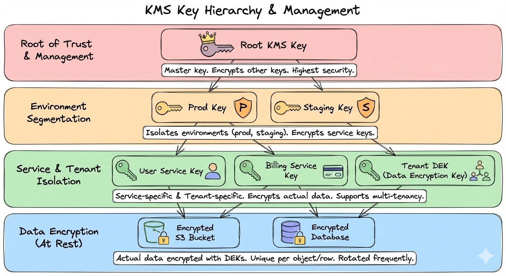

**KMS Key Policy Example**:
```json
{
  "Version": "2012-10-17",
  "Statement": [
    {
      "Sid": "AllowServiceAccess",
      "Effect": "Allow",
      "Principal": {
        "AWS": "arn:aws:iam::account:role/user-service-role"
      },
      "Action": [
        "kms:Decrypt",
        "kms:DescribeKey"
      ],
      "Resource": "*",
      "Condition": {
        "StringEquals": {
          "kms:ViaService": "dynamodb.us-east-1.amazonaws.com"
        }
      }
    }
  ]
}
```

**Key Management Features**:
- **Key Hierarchy**: CMK per service/environment
- **Automatic Rotation**: Annual key rotation
- **Least Privilege**: Key policies with minimal permissions
- **Access Logging**: CloudTrail logging for key access
- **Key Versioning**: Gradual rotation support

### 🔐 Data Encryption at Rest

We implement **comprehensive data encryption at rest** for all databases and storage systems.

**Encryption Configuration**:
| Database | Encryption | Key Source | Rotation |
|----------|------------|-------------|----------|
| **Aurora PostgreSQL** | ✅ Enabled | KMS CMK | Automatic (KMS) |
| **DocumentDB** | ✅ Enabled | KMS CMK | Manual (annual) |
| **DynamoDB** | ✅ Enabled | AWS Managed | Automatic |
| **S3** | ✅ Enabled | KMS CMK | Automatic (KMS) |

**Encryption Features**:
- Encryption enabled for all databases (Aurora, DocumentDB, DynamoDB)
- KMS CMK for database encryption
- Tenant-specific encryption keys (optional, for enhanced isolation)
- Encryption key rotation procedures documented
- Encryption status verified in monitoring

### 🔐 Data Encryption in Transit

We implement **strong encryption in transit** with TLS version enforcement and cipher suite validation.

**Encryption Requirements**:
- Minimum TLS 1.2 enforced (TLS 1.3 preferred)
- Weak cipher suites disabled
- TLS verification in monitoring
- Encryption requirements documented per connection type
- Regular security scans to verify encryption

---

## 🌍 Data Residency & Compliance

Our **compliance-first architecture** ensures data residency requirements are met through comprehensive data localization, cross-border transfer controls, and regulatory compliance measures. This section details our data residency enforcement mechanisms, GDPR compliance measures, and comprehensive audit logging.

### 🗺️ Data Residency Security

We implement **strict data residency enforcement** to ensure data never crosses geographic boundaries, meeting regulatory requirements for GDPR, LGPD, and other data localization laws.

**Data Residency Security Flow**:
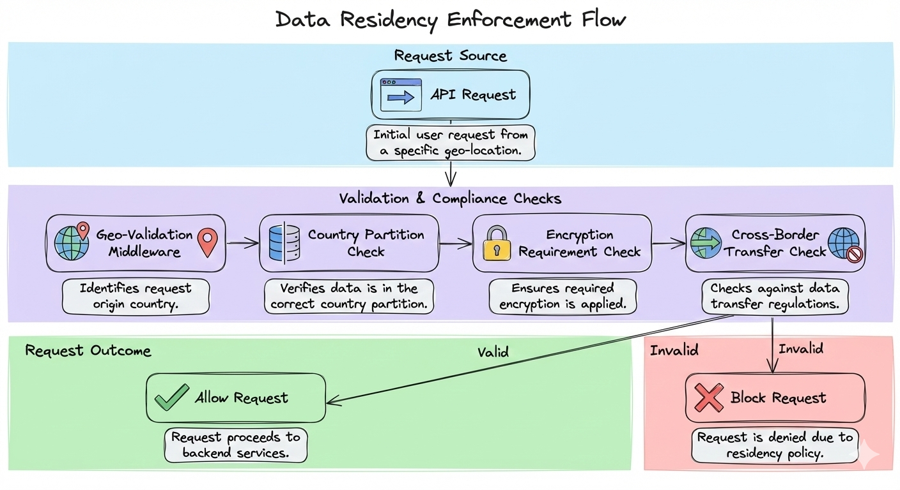

**Country-Specific Requirements**:
| Country | Encryption Required | Data Localization | Cross-Border Transfer |
|---------|---------------------|-------------------|----------------------|
| **EU (GDPR)** | ✅ Yes (encryption at rest + transit) | ✅ Yes (EU only) | ⚠️ Restricted (SCCs required) |
| **US** | ⚠️ Industry-specific | ❌ No | ✅ Allowed |
| **Brazil (LGPD)** | ✅ Yes | ⚠️ Some data types | ⚠️ Restricted |
| **India** | ✅ Yes | ✅ Yes (certain sectors) | ⚠️ Restricted |

**Data Residency Features**:
- Encryption requirements per country documented
- Cross-border data transfer controls implemented
- Data residency validation procedures (automated checks)
- Data localization enforcement (geo-blocking, routing restrictions)
- Data residency compliance per country documented

### 🚫 Cross-Border Data Transfer Controls

We implement **strict cross-border data transfer controls** to prevent unauthorized data transfers and ensure compliance with GDPR and other regulations.

**Cross-Border Transfer Controls**:
- Geo-blocking at network level (WAF rules)
- Data transfers blocked between countries in application logic
- Standard Contractual Clauses (SCCs) documented for required transfers
- Data transfer impact assessments implemented
- Cross-border data access attempts logged

### 📋 GDPR Compliance

We implement **comprehensive GDPR compliance measures** to ensure full compliance with European data protection regulations.

**GDPR Compliance Checklist**:
| Requirement | Status | Implementation |
|-------------|--------|----------------|
| **Data Minimization** | ✅ | Collect only necessary data |
| **Purpose Limitation** | ✅ | Use data only for stated purpose |
| **Storage Limitation** | ✅ | Data retention policies implemented |
| **Right to Access** | ✅ | Automated data export functionality |
| **Right to Deletion** | ✅ | Automated deletion workflows |
| **Data Portability** | ✅ | Export user data in machine-readable format |
| **Breach Notification** | ✅ | 72-hour notification procedures |
| **Privacy by Design** | ✅ | Architecture considers privacy |

**GDPR Compliance Features**:
- Data retention policies (documented retention periods)
- Right to deletion procedures (automated deletion workflows)
- Data breach notification procedures (72-hour notification)
- Data portability (export user data in machine-readable format)
- Consent management system (track and manage user consent)

### 📊 Audit Logging

We implement **comprehensive audit logging** to maintain complete audit trails for compliance and security investigations.

**Audit Log Schema**:
```json
{
  "timestamp": "2024-01-01T00:00:00Z",
  "event_type": "data_access",
  "user_id": "user_123",
  "tenant_id": "tenant_001",
  "country_partition": "US",
  "service": "user-service",
  "action": "read",
  "resource": "users",
  "resource_id": "user_456",
  "ip_address": "192.168.1.1",
  "user_agent": "Mozilla/5.0...",
  "result": "success",
  "metadata": {
    "request_id": "req-123",
    "trace_id": "trace-456"
  }
}
```

**Audit Logging Features**:
- Comprehensive audit log schema (who, what, when, where, why)
- Audit log retention (7 years for compliance)
- Audit log tamper protection (CloudTrail, WORM storage)
- Audit log analysis procedures (SIEM integration)
- Audit log access controls documented

---

## 📊 Security Monitoring & Incident Response

Our **proactive security operations** ensure continuous monitoring, threat detection, and rapid incident response. This section details our security event detection architecture, incident response workflow, and security dashboards.

### 🔍 Security Event Detection

We implement **comprehensive security event detection** using AWS GuardDuty, Security Hub, and custom anomaly detection to identify and respond to security threats.

**Security Monitoring Architecture**:
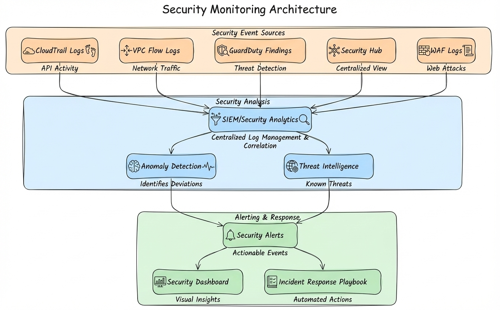

**Security Event Types**:
| Event Type | Detection Method | Alert Threshold |
|-----------|----------------|-----------------|
| **Failed Authentication** | CloudTrail, Application Logs | > 10 failures in 5 minutes |
| **Unauthorized Access** | IAM, GuardDuty | Any unauthorized attempt |
| **Data Exfiltration** | VPC Flow Logs, DLP | > 1GB outbound in 1 hour |
| **Malicious IP** | GuardDuty, Threat Intel | Any known malicious IP |
| **Anomalous Behavior** | ML Anomaly Detection | Deviation from baseline |

**Security Monitoring Features**:
- Security event detection (GuardDuty, Security Hub)
- Threat intelligence integration (AWS GuardDuty, third-party)
- Anomaly detection (CloudWatch Anomaly Detection, ML-based)
- Security dashboards (CloudWatch, Grafana)
- Security alerts (SNS, PagerDuty)

### 🚨 Incident Response

We implement a **comprehensive incident response plan** with defined workflows, playbooks, and communication procedures to ensure rapid and effective response to security incidents.

**Incident Response Workflow**:
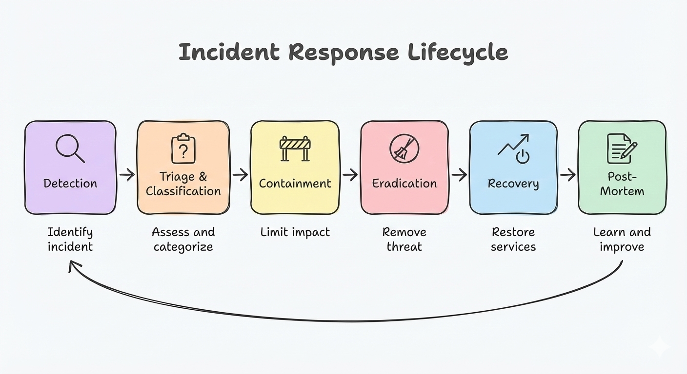

**Incident Response Playbook Template**:
| Phase | Activities | Timeline | Owner |
|-------|-----------|----------|-------|
| **Detection** | Alert received, initial assessment | 0-15 min | SOC |
| **Triage** | Classify severity, assign team | 15-30 min | Security Lead |
| **Containment** | Isolate affected systems | 30-60 min | Platform Team |
| **Eradication** | Remove threat, patch vulnerabilities | 1-4 hours | Security + Dev Teams |
| **Recovery** | Restore services, verify security | 4-24 hours | Platform Team |
| **Post-Mortem** | Root cause analysis, improvements | 1-7 days | All Teams |

**Incident Response Features**:
- Comprehensive incident response plan
- Security playbooks (data breach, DDoS, malware)
- Forensics procedures (evidence collection, preservation)
- Communication procedures (internal, external, regulatory)
- Regular incident response drills

---

## 🔒 Pod Security

### 📊 Pod Security Standards

| Level | Description | Enforcement |
|-------|-------------|-------------|
| **Privileged** | Unrestricted | Not recommended |
| **Baseline** | Minimal restrictions | Default for most workloads |
| **Restricted** | Maximum restrictions | Recommended for production |

### ✅ Security Context

```yaml
apiVersion: v1
kind: Pod
spec:
  securityContext:
    runAsNonRoot: true
    runAsUser: 1000
    fsGroup: 1000
  containers:
  - name: user-service
    securityContext:
      allowPrivilegeEscalation: false
      readOnlyRootFilesystem: true
      capabilities:
        drop:
        - ALL
```

---

## 🔐 Security Layers (Edge to Application)

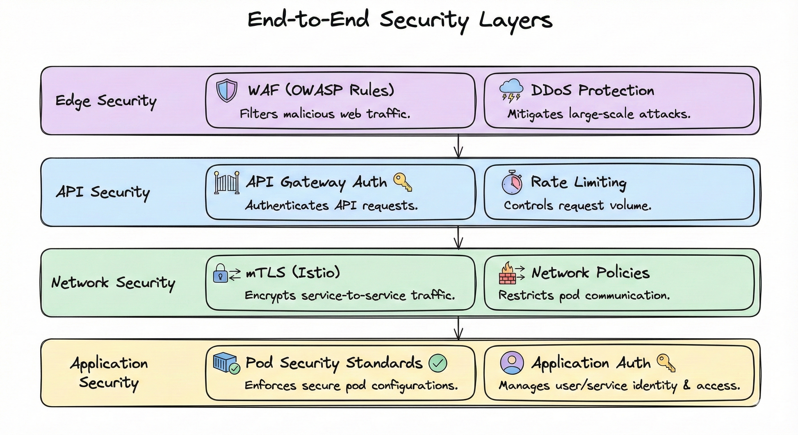

---

## 💡 Key Decisions

1. **✅ Zero Trust Model**: Never trust, always verify every request
2. **✅ Defense in Depth**: Multiple security layers (WAF, API Gateway, Istio, NetworkPolicies, Pod Security)
3. **✅ Comprehensive Authentication & Authorization**: JWT refresh, CSRF protection, XSS prevention, RBAC, service principals
4. **✅ IRSA**: IAM Roles for Service Accounts (no access keys)
5. **✅ Secrets Management**: AWS Secrets Manager and SSM Parameter Store with rotation
6. **✅ Istio mTLS**: Automatic encryption for all service-to-service traffic
7. **✅ NetworkPolicies**: Default deny, explicit allows for network segmentation
8. **✅ Encryption & Key Management**: End-to-end TLS, certificate management, KMS hierarchy
9. **✅ Data Residency & Compliance**: GDPR compliance, data localization, audit logging
10. **✅ Security Monitoring & Incident Response**: Proactive threat detection, comprehensive incident response
11. **✅ Pod Security Standards**: Restricted pod security for production workloads
12. **✅ Least Privilege**: Minimal permissions for all IAM roles and service accounts

---

## 🔗 Related Documentation

- 📄 [README.md](../README.md) - Central index
- ☁️ [03-cloud-foundation-sre.md](03-cloud-foundation-sre.md) - Infrastructure and networking
- 🔄 [09-devsecops.md](09-devsecops.md) - CI/CD and security scanning
- ⚙️ [04-backend-ddd-microservices.md](04-backend-ddd-microservices.md) - Service architecture
- 🎨 [05-frontend-bff.md](05-frontend-bff.md) - Frontend and BFF architecture
- 🔒 [07-security-zero-trust-extended.md](07-security-zero-trust-extended.md) - Comprehensive security gap analysis

---

> **💡 Tip**: Zero Trust means verifying every request, not trusting any network segment or service. Defense in depth ensures multiple security layers protect against different attack vectors. Our comprehensive security architecture covers authentication, authorization, encryption, compliance, and monitoring to provide complete security coverage from edge to data.
