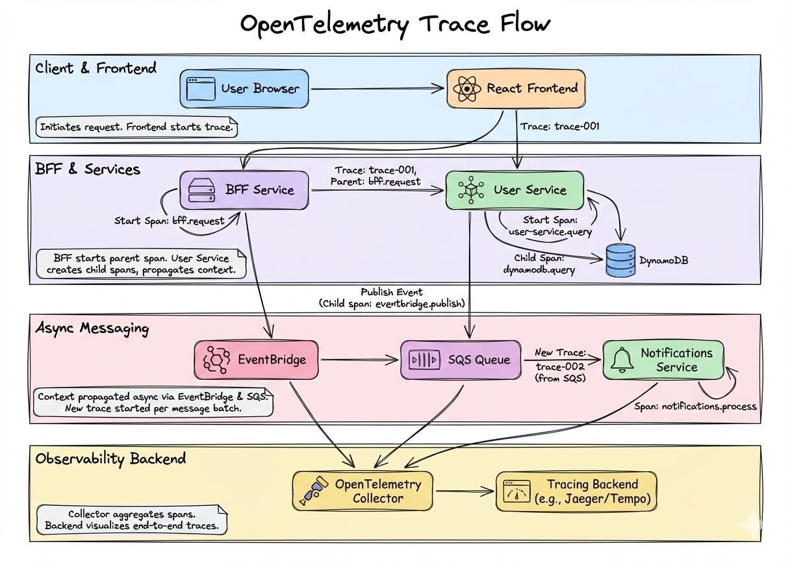
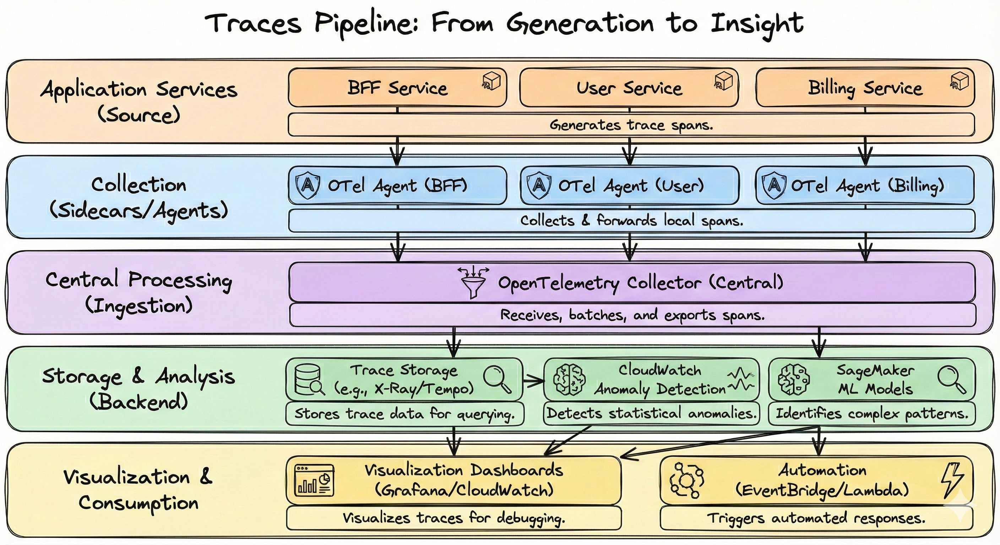
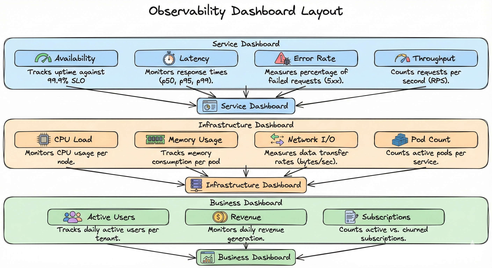
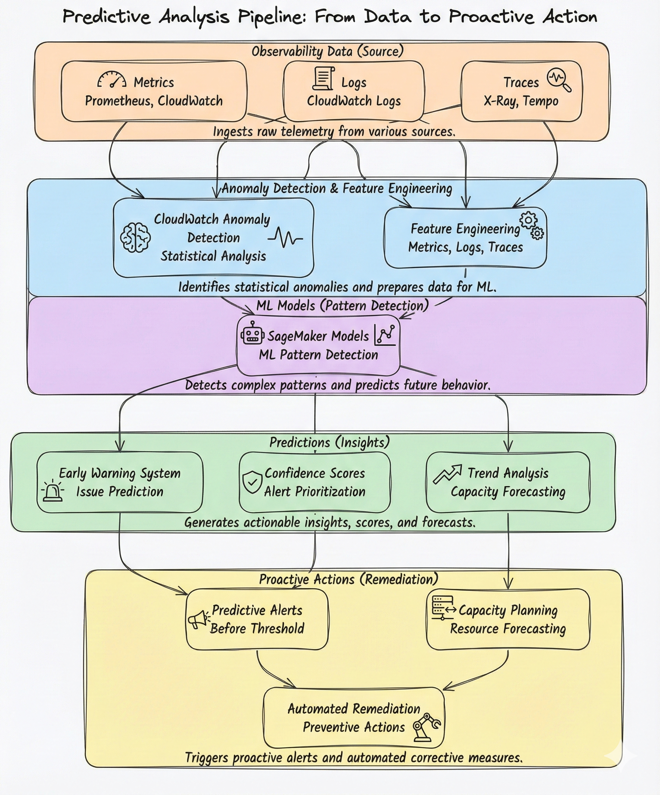
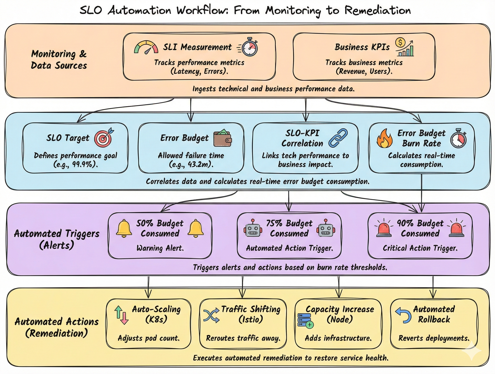
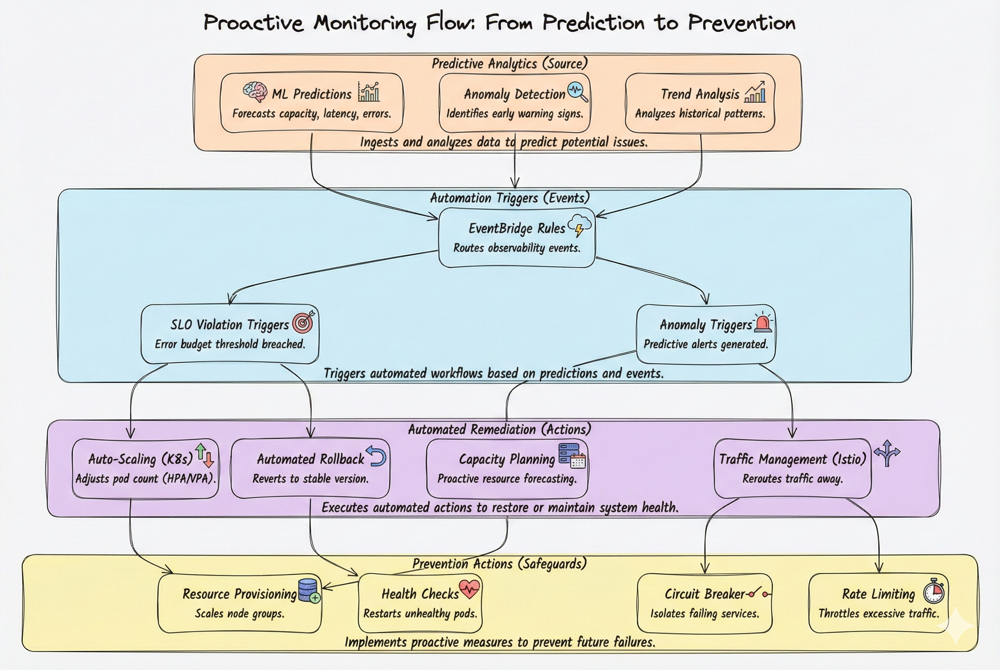

# 📊 Observability
## 🔍 OpenTelemetry, Metrics, Logs, Traces, Predictive Analytics & Proactive Monitoring

> **📖 Purpose**: This document describes the observability architecture using OpenTelemetry, distributed tracing, metrics collection, structured logging, dashboards, SLO definitions with automated triggers, predictive observability with ML-based anomaly detection, and proactive monitoring with automated remediation for operational excellence.

---

## 🎯 Scope

- 🔍 **OpenTelemetry Architecture**: Instrumentation, trace propagation, context
- 📈 **Metrics**: Prometheus, CloudWatch, SLIs (Service Level Indicators)
- 📝 **Logs**: Structured JSON logging, aggregation, CloudWatch Logs
- 🔄 **Distributed Tracing**: Trace propagation across services and events
- 📊 **Dashboards**: Grafana, CloudWatch dashboards, key metrics
- 🎯 **SLOs**: Service Level Objectives, error budgets, automated triggers
- 🔮 **Predictive Observability**: ML-based anomaly detection, trend analysis, early warning systems
- 🚀 **Proactive Monitoring**: Automated remediation, capacity planning, predictive scaling

---

## 🔄 OpenTelemetry Trace Flow



### 🔍 Trace Context Propagation

**Headers:**
- `traceparent`: W3C Trace Context
- `tracestate`: Additional trace state

**Span Hierarchy:**
```
trace-001
  ├── bff.request
  │   ├── user-service.query
  │   │   └── dynamodb.query
  │   └── eventbridge.publish
```

---

## 📊 Metrics/Logs/Traces Pipeline



### 📊 Observability Data Types

| Type | Collection | Storage | Visualization |
|------|-----------|---------|--------------|
| **Metrics** | OpenTelemetry | Prometheus, CloudWatch | Grafana, CloudWatch |
| **Logs** | Structured JSON | CloudWatch Logs | CloudWatch, Grafana |
| **Traces** | OpenTelemetry | X-Ray, Tempo | Grafana, X-Ray Console |

---

## 📈 Dashboard Layout



### 📊 Key Metrics

| Metric | Type | Purpose | Alert Threshold |
|--------|------|---------|-----------------|
| **Availability** | SLI | Uptime percentage | < 99.9% |
| **Latency (p50)** | Performance | Median response time | > 200ms |
| **Latency (p99)** | Performance | 99th percentile | > 1000ms |
| **Error Rate** | Reliability | 5xx errors / total | > 0.1% |
| **Throughput** | Capacity | Requests per second | > 1000 RPS |

---

## 🔮 Predictive Observability

Moving beyond reactive monitoring, **predictive observability** uses machine learning and statistical analysis to **predict issues before they occur**, enabling proactive intervention and preventing incidents. By analyzing historical patterns, trends, and anomalies in metrics, logs, and traces, we can forecast capacity needs, detect early warning signs, and trigger automated remediation before users are impacted.

### 🔮 Predictive Observability Flow



### 🎯 Anomaly Detection Strategies

**CloudWatch Anomaly Detection:**
- Statistical analysis of metric patterns (mean, standard deviation)
- Automatic baseline learning from historical data
- Real-time anomaly detection for key SLIs (latency, error rate, throughput)
- Low-latency alerts for immediate response

**SageMaker ML Models:**
- Complex pattern detection (latency trends, error rate patterns, capacity degradation)
- Multi-metric correlation analysis (combining latency, errors, throughput)
- Seasonal pattern recognition (daily/weekly cycles, traffic patterns)
- Custom models trained on domain-specific observability data

### 📊 Feature Engineering

**Observability Features:**
- **Temporal Features**: Time-of-day, day-of-week, seasonal patterns
- **Metric Features**: Latency percentiles, error rates, throughput trends
- **Correlation Features**: Cross-service dependencies, database query patterns
- **Derived Features**: Error budget burn rate, capacity utilization trends

**Feature Sources:**
- Metrics from Prometheus and CloudWatch
- Log patterns from CloudWatch Logs Insights
- Trace spans from X-Ray and Tempo
- Business KPIs from analytics platform

### ✅ Predictive Capabilities

| Capability | Method | Purpose | Example |
|------------|--------|---------|---------|
| **Capacity Forecasting** | Time series analysis | Predict resource needs | "CPU will exceed 80% in 2 hours" |
| **Latency Degradation** | Trend analysis | Predict latency issues | "p99 latency trending toward threshold" |
| **Error Rate Spikes** | Pattern detection | Predict error increases | "Error rate pattern suggests spike in 30 min" |
| **Anomaly Detection** | ML models | Detect unusual patterns | "Unusual database query pattern detected" |
| **Early Warning** | Multi-metric correlation | Predict incidents | "Combined metrics suggest service degradation" |

---

## 🎯 SLO Definition & Automation

Service Level Objectives (SLOs) define **reliability targets** for our services, with **error budgets** representing the acceptable amount of unreliability. By monitoring **error budget burn rate** and integrating with **automated remediation workflows**, we ensure proactive response to SLO violations and prevent incidents before they impact users.

### 🎯 SLO Automation Workflow



### 📊 SLO Examples with Error Budget Monitoring

| Service | SLO | Error Budget | Burn Rate Thresholds | Automated Actions |
|---------|-----|-------------|----------------------|-------------------|
| **BFF** | 99.9% availability | 43.2 min/month | 50%: Warning<br/>75%: Auto-scale<br/>90%: Rollback | HPA scale-up, traffic shift |
| **Identity** | 99.95% availability | 21.6 min/month | 50%: Warning<br/>75%: Auto-scale<br/>90%: Rollback | HPA scale-up, capacity increase |
| **User** | p99 latency < 1000ms | 1% of requests | 50%: Warning<br/>75%: Auto-scale<br/>90%: Traffic shift | VPA resource increase, read replica |
| **Billing** | Error rate < 0.1% | 0.1% of requests | 50%: Warning<br/>75%: Auto-scale<br/>90%: Rollback | HPA scale-up, circuit breaker |

### 🔄 Error Budget Burn Rate Calculation

**Burn Rate Formula:**
```
Burn Rate = (Error Budget Consumed) / (Time Elapsed) / (Total Error Budget)
```

**Example:**
- Error Budget: 43.2 minutes/month (99.9% availability)
- Consumed: 10 minutes in first week
- Burn Rate: 10 / 7 days / 43.2 = 0.033 (3.3% per day)
- Projected: 3.3% × 30 days = 99% consumed by month end → **Critical Action Triggered**

### ⚡ Automated Trigger Thresholds

| Threshold | Action | Purpose | Implementation |
|-----------|--------|---------|----------------|
| **50% Budget Consumed** | Warning Alert | Early notification | CloudWatch Alarm → SNS → PagerDuty |
| **75% Budget Consumed** | Automated Action | Preventive remediation | EventBridge Rule → Lambda → K8s HPA/VPA |
| **90% Budget Consumed** | Critical Action | Emergency response | EventBridge Rule → Lambda → Rollback Pipeline |

### 🔗 KPI Integration

**Business KPI Correlation:**
- **Revenue Impact**: SLO violations correlate with revenue loss
- **User Engagement**: Availability issues impact active users
- **Subscription Churn**: Error rate spikes correlate with churn

**SLO-KPI Dashboard:**
- Real-time correlation between SLO compliance and business KPIs
- Historical analysis of SLO violations and business impact
- Predictive models linking SLO trends to KPI forecasts

---

## 🚀 Proactive Monitoring & Automated Remediation

**Proactive monitoring** transforms observability from reactive alerting to **automated incident prevention**. By combining predictive analytics, SLO-driven automation, and intelligent remediation workflows, we prevent issues before they impact users, automatically scale resources based on predictions, and maintain service reliability without manual intervention.

### 🚀 Proactive Monitoring Flow



### ⚡ Automated Remediation Workflows

**EventBridge-Driven Automation:**
- **Observability Events**: Metrics, logs, traces trigger EventBridge rules
- **Lambda Functions**: Execute automated remediation actions
- **K8s Controllers**: HPA/VPA for auto-scaling, deployment controllers for rollbacks
- **Istio Policies**: Traffic shifting, circuit breakers, retry policies

**Remediation Actions:**

| Trigger | Action | Implementation | Purpose |
|---------|--------|---------------|---------|
| **High Latency Prediction** | Preemptive Scale-Up | HPA → Increase Pods | Prevent latency degradation |
| **Error Rate Spike** | Circuit Breaker | Istio → Isolate Service | Prevent cascade failures |
| **Capacity Forecast** | Resource Provisioning | EKS → Scale Node Group | Meet predicted demand |
| **SLO Violation** | Automated Rollback | Pipeline → Previous Version | Restore service reliability |
| **Anomaly Detection** | Traffic Shift | Istio → Weighted Routing | Route away from problematic pods |

### 📊 Predictive Capacity Planning

**Capacity Forecasting:**
- **Historical Analysis**: Analyze past capacity trends and growth patterns
- **ML Predictions**: SageMaker models forecast resource needs (CPU, memory, network)
- **Seasonal Patterns**: Account for daily/weekly/seasonal traffic variations
- **Growth Projections**: Business growth forecasts inform capacity planning

**Capacity Planning Workflow:**
1. **Data Collection**: Historical metrics (CPU, memory, network, throughput)
2. **Feature Engineering**: Temporal features, growth trends, seasonal patterns
3. **ML Prediction**: SageMaker models forecast capacity needs (1 hour, 1 day, 1 week ahead)
4. **Automated Provisioning**: Trigger EKS node group scaling before capacity limits
5. **Validation**: Monitor actual vs. predicted capacity usage, refine models

### ✅ Proactive Monitoring Capabilities

| Capability | Method | Trigger | Action |
|------------|--------|--------|--------|
| **Predictive Scaling** | ML capacity forecast | Predicted capacity > 80% | Preemptive HPA scale-up |
| **Anomaly Prevention** | Anomaly detection | Unusual pattern detected | Traffic shift, circuit breaker |
| **SLO Protection** | Error budget burn rate | 75% budget consumed | Auto-scale, capacity increase |
| **Incident Prevention** | Multi-metric correlation | Early warning signs | Automated remediation |
| **Capacity Planning** | Trend analysis | Growth forecast | Node group scaling |

---

## 📝 Structured Logging

### 📊 Log Format

```json
{
  "timestamp": "2024-01-01T00:00:00Z",
  "level": "info",
  "service": "user-service",
  "trace_id": "trace-001",
  "span_id": "span-002",
  "tenant_id": "tenant_001",
  "message": "User created successfully",
  "user_id": "user_123",
  "duration_ms": 45,
  "status_code": 200
}
```

### ✅ Log Levels

| Level | Usage | Example |
|-------|-------|---------|
| **ERROR** | Errors requiring attention | Failed database query |
| **WARN** | Warnings, recoverable errors | Retry after failure |
| **INFO** | Important business events | User created, invoice issued |
| **DEBUG** | Debug information | Request/response details |

---

## 🔍 Distributed Tracing Example

### 📊 Trace Visualization

```
Trace: trace-001 (Duration: 250ms)
├── bff.request (Duration: 250ms)
│   ├── user-service.query (Duration: 45ms)
│   │   └── dynamodb.query (Duration: 30ms)
│   ├── eventbridge.publish (Duration: 10ms)
│   └── response.send (Duration: 5ms)
```

### ✅ Trace Attributes

- **trace_id**: Unique trace identifier
- **span_id**: Unique span identifier
- **parent_span_id**: Parent span (for hierarchy)
- **service.name**: Service name
- **operation.name**: Operation name
- **duration**: Span duration in milliseconds
- **status**: OK, ERROR

---

## 📊 Observability Best Practices

### ✅ Instrumentation

1. **✅ Automatic Instrumentation**: Use OpenTelemetry auto-instrumentation when possible
2. **✅ Manual Instrumentation**: Add custom spans for business logic
3. **✅ Context Propagation**: Propagate trace context across service boundaries
4. **✅ Structured Logging**: Use structured JSON logs with consistent fields
5. **✅ Metrics Collection**: Collect SLIs (availability, latency, error rate, throughput)

### ✅ Dashboards

1. **✅ Service Dashboards**: Per-service metrics (availability, latency, errors)
2. **✅ Infrastructure Dashboards**: CPU, memory, network, pod counts
3. **✅ Business Dashboards**: Business metrics (users, revenue, subscriptions)
4. **✅ SLO Dashboards**: SLO compliance, error budget burn rate
5. **✅ Predictive Dashboards**: Anomaly detection, capacity forecasts, trend analysis

### ✅ Alerting & Automation

1. **✅ SLO Violations**: Alert when SLO is violated, trigger automated remediation
2. **✅ Error Budget Burn**: Alert at 50% (warning), 75% (action), 90% (critical)
3. **✅ High Latency**: Alert when p99 latency exceeds threshold, trigger auto-scaling
4. **✅ High Error Rate**: Alert when error rate exceeds threshold, trigger circuit breaker
5. **✅ Predictive Alerts**: Alert on predicted issues before thresholds are breached

### ✅ Predictive Observability

1. **✅ Anomaly Detection**: Enable CloudWatch Anomaly Detection for key SLIs
2. **✅ ML Models**: Train SageMaker models on historical observability data
3. **✅ Feature Engineering**: Extract temporal, metric, and correlation features
4. **✅ Early Warning**: Set up predictive alerts based on ML confidence scores
5. **✅ Model Tuning**: Continuously refine models based on prediction accuracy

### ✅ Proactive Monitoring

1. **✅ Automated Remediation**: Configure EventBridge rules for observability-driven automation
2. **✅ Predictive Scaling**: Use ML capacity forecasts to trigger preemptive scaling
3. **✅ Capacity Planning**: Analyze historical trends and growth patterns for resource planning
4. **✅ SLO-Driven Automation**: Integrate error budget burn rate with automated actions
5. **✅ Incident Prevention**: Use multi-metric correlation to prevent incidents before they occur

### ✅ SLO Management

1. **✅ Error Budget Monitoring**: Track error budget burn rate in real-time
2. **✅ Automated Triggers**: Configure thresholds (50%, 75%, 90%) for automated actions
3. **✅ KPI Integration**: Correlate SLO compliance with business KPIs
4. **✅ SLO Reviews**: Regular review of SLO targets and error budgets
5. **✅ Remediation Workflows**: Document and automate remediation actions for SLO violations

---

## 💡 Key Decisions

1. **✅ OpenTelemetry**: Vendor-neutral observability standard
2. **✅ Distributed Tracing**: Full request tracing across services and events
3. **✅ Structured Logging**: JSON logs with consistent schema
4. **✅ SLO-Based Operations**: SLIs, SLOs, error budgets with automated triggers
5. **✅ Prometheus + Grafana**: Open-source metrics and visualization
6. **✅ CloudWatch Integration**: AWS-native logging and metrics
7. **✅ Trace Context Propagation**: W3C Trace Context standard
8. **✅ Automatic Instrumentation**: Minimize manual instrumentation effort
9. **✅ Predictive Observability**: ML-based anomaly detection and early warning systems using SageMaker
10. **✅ Proactive Monitoring**: Automated remediation via EventBridge and K8s controllers
11. **✅ Error Budget Automation**: Automated actions triggered by error budget burn rate thresholds
12. **✅ Capacity Planning**: ML-driven capacity forecasting for proactive resource provisioning

---

## 🔗 Related Documentation

- 📄 [README.md](../README.md) - Central index
- ☁️ [03-cloud-foundation-sre.md](03-cloud-foundation-sre.md) - SRE practices and SLIs
- ⚙️ [04-backend-ddd-microservices.md](04-backend-ddd-microservices.md) - Service architecture and EventBridge
- 💾 [06-data-platform-analytics-ml.md](06-data-platform-analytics-ml.md) - SageMaker ML capabilities
- 🔄 [09-devsecops.md](09-devsecops.md) - CI/CD and deployment

---

> **💡 Tip**: OpenTelemetry provides vendor-neutral observability. Distributed tracing across services and events gives complete visibility into request flows. Predictive observability with ML-based anomaly detection enables early warning systems, while proactive monitoring with automated remediation prevents incidents before they impact users. SLO-driven automation ensures reliability targets are met through error budget monitoring and automated triggers.

