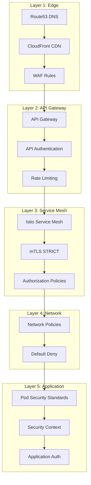
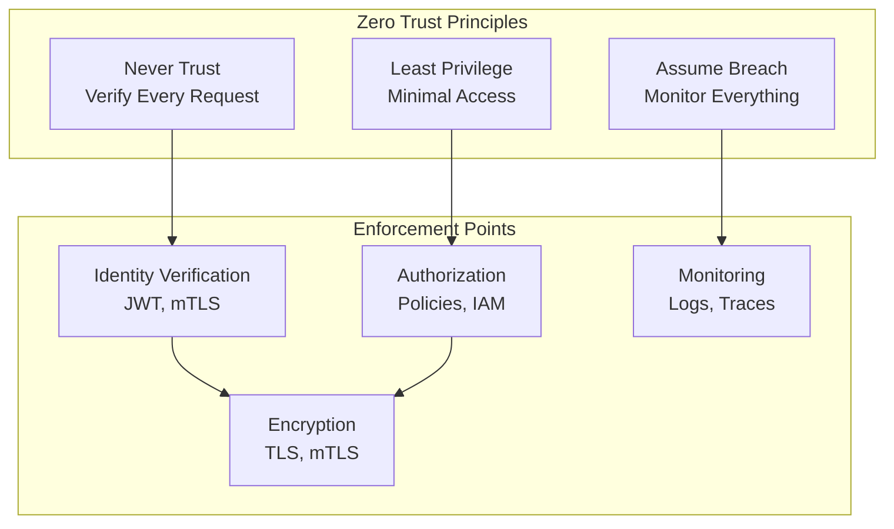
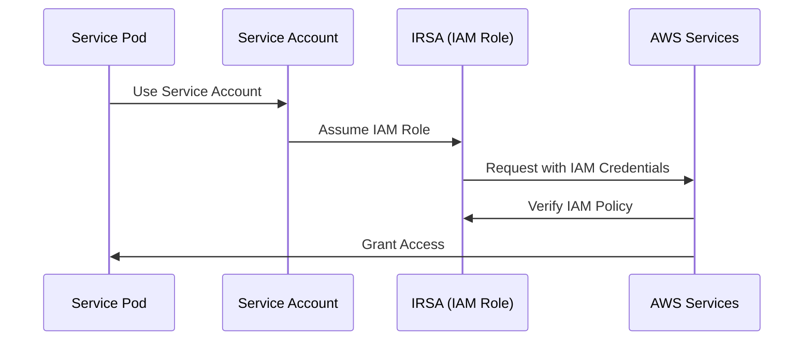
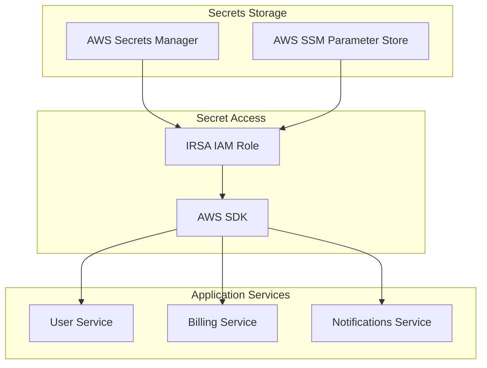
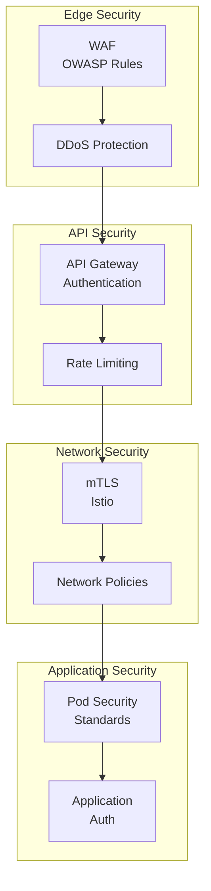

# 🔒 Security: Zero Trust
## 🛡️ Defense in Depth, IAM, Secrets & Network Security

> **📖 Purpose**: This document describes the Zero Trust security model, defense-in-depth layers, IAM/IRSA patterns, secrets management, network security (Istio mTLS, NetworkPolicies), and security decision framework.

---

## 🎯 Scope

- 🛡️ **Zero Trust Model**: Never trust, always verify
- 🏰 **Defense in Depth**: Multiple security layers
- 🔐 **IAM & IRSA**: Identity and access management, IAM Roles for Service Accounts
- 🔑 **Secrets Management**: AWS Secrets Manager, SSM Parameter Store
- 🌐 **Network Security**: Istio mTLS, NetworkPolicies, default deny
- 🔒 **Pod Security**: Pod Security Standards, security contexts

---

## 🏰 Defense in Depth



### 🛡️ Security Layers

| Layer | Component | Purpose |
|-------|-----------|---------|
| **Edge** | WAF | OWASP rules, DDoS protection, bot protection |
| **API Gateway** | API Gateway | Authentication, rate limiting, API keys |
| **Service Mesh** | Istio mTLS | Automatic encryption, service authentication |
| **Network** | NetworkPolicies | Network segmentation, default deny |
| **Application** | Pod Security | Container security, least privilege |

---

## 🛡️ Zero Trust Network



### ✅ Zero Trust Principles

1. **✅ Never Trust**: Every request is verified, no implicit trust
2. **✅ Least Privilege**: Minimal access required for functionality
3. **✅ Assume Breach**: Monitor and detect threats continuously
4. **✅ Verify Explicitly**: Identity, device, and network verification
5. **✅ Use Least Privilege Access**: Grant only necessary permissions

---

## 🔐 IAM Roles and IRSA Flow



### 📊 IRSA Configuration

| Service | IAM Role | Permissions | Purpose |
|---------|----------|------------|---------|
| **User Service** | `user-service-role` | DynamoDB read/write (user table) | Access user data |
| **Billing Service** | `billing-service-role` | DynamoDB read/write (billing table) | Access billing data |
| **Notifications Service** | `notifications-service-role` | DynamoDB read/write, SES send email | Send notifications |
| **BFF Service** | `bff-service-role` | No AWS service access | No direct AWS access |

### ✅ IAM Best Practices

1. **✅ Least Privilege**: Grant minimum permissions required
2. **✅ IRSA**: Use IAM Roles for Service Accounts (not access keys)
3. **✅ Policy Boundaries**: Use IAM policy boundaries to limit permissions
4. **✅ Regular Review**: Review and audit IAM permissions regularly
5. **✅ No Hardcoded Secrets**: Never hardcode AWS credentials

---

## 🔑 Secrets Management



### 📊 Secrets Types

| Secret Type | Storage | Access | Use Case |
|-------------|---------|--------|----------|
| **Database Credentials** | Secrets Manager | IRSA | DynamoDB access |
| **API Keys** | Secrets Manager | IRSA | Third-party API keys |
| **JWT Secrets** | Secrets Manager | IRSA | Token signing keys |
| **Configuration** | SSM Parameter Store | IRSA | App configuration |

### ✅ Secrets Best Practices

1. **✅ AWS Secrets Manager**: Store sensitive secrets (passwords, API keys)
2. **✅ SSM Parameter Store**: Store non-sensitive configuration
3. **✅ Encryption**: All secrets encrypted at rest (KMS)
4. **✅ Rotation**: Enable automatic secret rotation when possible
5. **✅ Least Privilege**: IRSA roles with minimal secrets access
6. **✅ No Hardcoded Secrets**: Never hardcode secrets in code or config

---

## 🌐 Network Security

### 🔒 Istio mTLS

**Configuration:**
```yaml
apiVersion: security.istio.io/v1beta1
kind: PeerAuthentication
metadata:
  name: default
  namespace: identity
spec:
  mtls:
    mode: STRICT
```

**Benefits:**
- ✅ Automatic encryption for all service-to-service traffic
- ✅ Service identity verification
- ✅ No manual certificate management
- ✅ Transparent to applications

### 🛡️ NetworkPolicies

**Default Deny:**
```yaml
apiVersion: networking.k8s.io/v1
kind: NetworkPolicy
metadata:
  name: default-deny
  namespace: user
spec:
  podSelector: {}
  policyTypes:
  - Ingress
  - Egress
```

**Allow Rules:**
```yaml
apiVersion: networking.k8s.io/v1
kind: NetworkPolicy
metadata:
  name: allow-bff-to-user
  namespace: user
spec:
  podSelector:
    matchLabels:
      app: user-service
  policyTypes:
  - Ingress
  ingress:
  - from:
    - namespaceSelector:
        matchLabels:
          name: bff
      podSelector:
        matchLabels:
          app: bff-service
    ports:
    - protocol: TCP
      port: 8080
```

---

## 🔒 Pod Security

### 📊 Pod Security Standards

| Level | Description | Enforcement |
|-------|-------------|-------------|
| **Privileged** | Unrestricted | Not recommended |
| **Baseline** | Minimal restrictions | Default for most workloads |
| **Restricted** | Maximum restrictions | Recommended for production |

### ✅ Security Context

```yaml
apiVersion: v1
kind: Pod
spec:
  securityContext:
    runAsNonRoot: true
    runAsUser: 1000
    fsGroup: 1000
  containers:
  - name: user-service
    securityContext:
      allowPrivilegeEscalation: false
      readOnlyRootFilesystem: true
      capabilities:
        drop:
        - ALL
```

---

## 🔐 Security Layers (Edge to Application)



---

## 💡 Key Decisions

1. **✅ Zero Trust Model**: Never trust, always verify every request
2. **✅ Defense in Depth**: Multiple security layers (WAF, API Gateway, Istio, NetworkPolicies, Pod Security)
3. **✅ IRSA**: IAM Roles for Service Accounts (no access keys)
4. **✅ Secrets Management**: AWS Secrets Manager and SSM Parameter Store
5. **✅ Istio mTLS**: Automatic encryption for all service-to-service traffic
6. **✅ NetworkPolicies**: Default deny, explicit allows for network segmentation
7. **✅ Pod Security Standards**: Restricted pod security for production workloads
8. **✅ Least Privilege**: Minimal permissions for all IAM roles and service accounts

---

## 🔗 Related Documentation

- 📄 [README.md](../README.md) - Central index
- ☁️ [04-cloud-foundation-sre.md](04-cloud-foundation-sre.md) - Infrastructure and networking
- 🔄 [07-devsecops.md](07-devsecops.md) - CI/CD and security scanning
- ⚙️ [02-backend-ddd-microservices.md](02-backend-ddd-microservices.md) - Service architecture

---

> **💡 Tip**: Zero Trust means verifying every request, not trusting any network segment or service. Defense in depth ensures multiple security layers protect against different attack vectors. Istio mTLS provides automatic encryption without manual certificate management.

