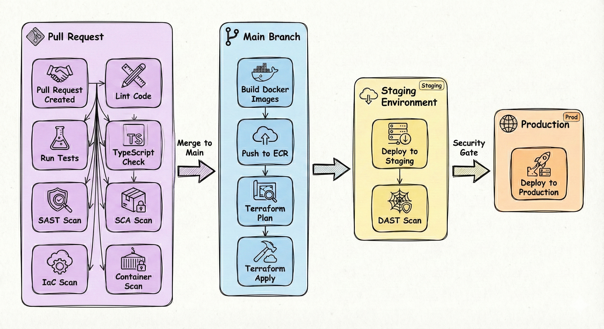
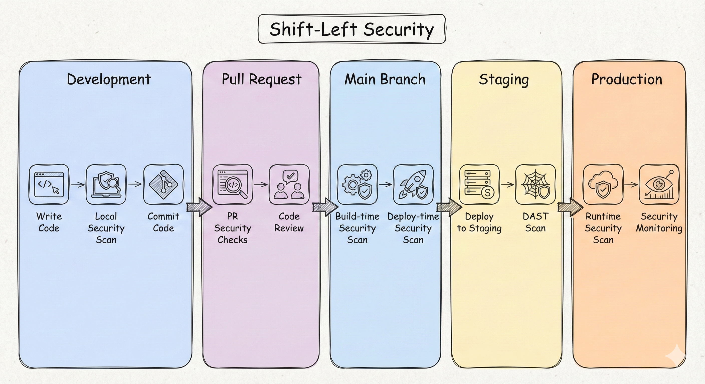
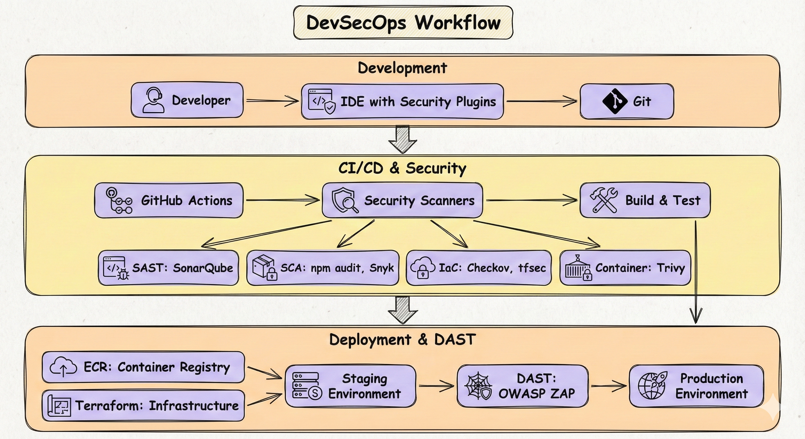

# 🔄 DevSecOps
## 🚀 CI/CD Pipelines, Shift-Left Security & Automation

> **📖 Purpose**: This document describes the CI/CD pipeline architecture, shift-left security model, automated scanning (SAST, DAST SCA, IaC, container, DAST), GitHub Actions workflows, and DevSecOps best practices.

---

## 🎯 Scope

- 🚀 **CI/CD Pipeline Architecture**: GitHub Actions workflows, build, test, deploy
- ⬅️ **Shift-Left Security**: Security checks early in development lifecycle
- 🔍 **Security Scanning**: SAST, SCA, IaC scanning, container scanning, DAST
- 🤖 **Automation**: Automated testing, building, deployment
- 📦 **Supply Chain Security**: SBOM generation, signing, vulnerability scanning

---

## 🚀 CI/CD Pipeline (PR → Main)



### 📊 Pipeline Stages

| Stage | Purpose | Tools | Trigger |
|-------|---------|-------|---------|
| **Lint** | Code quality | ESLint, Prettier | PR |
| **Test** | Unit tests | Jest, Mocha | PR |
| **TypeCheck** | TypeScript validation | `tsc --noEmit` | PR |
| **SAST** | Static application security testing | SonarQube, Snyk | PR |
| **SCA** | Software composition analysis | `npm audit`, Snyk | PR |
| **IaC Scan** | Infrastructure as code scanning | Checkov, tfsec | PR |
| **Container Scan** | Container image scanning | Trivy, Snyk | PR |
| **Build** | Docker image build | Docker | Main |
| **Push ECR** | Push to AWS ECR | AWS CLI | Main |
| **Terraform** | Infrastructure deployment | Terraform | Main |
| **Deploy Staging** | Deploy to staging environment | kubectl, Helm | Main |
| **DAST** | Dynamic application security testing | OWASP ZAP, Burp Suite | After staging deployment |
| **Deploy Production** | Deploy to production | kubectl, Helm | After DAST passes |

---

## ⬅️ Shift-Left Security



### ✅ Shift-Left Benefits

| Stage | Security Check | Benefit |
|-------|---------------|---------|
| **Development** | Local SAST, SCA | Catch issues before commit |
| **Pull Request** | SAST, SCA, IaC, Container | Block PR if issues found |
| **Build** | Container scanning | Catch vulnerabilities in images |
| **Deploy** | Policy validation | Ensure compliance before deploy |
| **Staging** | DAST (Dynamic testing) | Test running application for runtime vulnerabilities before production |
| **Runtime** | Security monitoring | Detect runtime threats |

---

## 🔄 DevSecOps Workflow



---

## 🔍 Security Scanning

### 📊 SAST (Static Application Security Testing)

**Purpose**: Analyze source code for security vulnerabilities without executing the application

**Tools**: SonarQube, Snyk, Semgrep

**When**: During development and in PR checks (before code execution)

**Checks**:
- SQL injection vulnerabilities
- XSS (Cross-Site Scripting) vulnerabilities
- Insecure dependencies
- Hardcoded secrets
- Weak cryptography

**Note**: SAST analyzes source code statically, while DAST tests the running application. Both are complementary and should be used together for comprehensive security coverage.

### 📊 SCA (Software Composition Analysis)

**Purpose**: Scan dependencies for known vulnerabilities

**Tools**: `npm audit`, Snyk, OWASP Dependency-Check

**Checks**:
- Known CVEs in dependencies
- Outdated packages
- License compliance
- Supply chain vulnerabilities

### 📊 IaC Scanning

**Purpose**: Scan infrastructure as code for misconfigurations

**Tools**: Checkov, tfsec, Terrascan

**Checks**:
- Security misconfigurations
- Compliance violations
- Best practice violations
- Resource exposure

### 📊 Container Scanning

**Purpose**: Scan container images for vulnerabilities

**Tools**: Trivy, Snyk, AWS ECR scanning

**Checks**:
- OS package vulnerabilities
- Application dependency vulnerabilities
- Configuration issues
- Secrets in images

### 📊 DAST (Dynamic Application Security Testing)

**Purpose**: Test running application for runtime security vulnerabilities in a controlled staging environment

**Tools**: OWASP ZAP, Burp Suite, Nessus, AWS Inspector

**When**: After deployment to staging environment, before production deployment

**Checks**:
- OWASP Top 10 vulnerabilities (SQL injection, XSS, CSRF, etc.)
- API security vulnerabilities
- Authentication and authorization flaws
- Business logic vulnerabilities
- Session management issues
- Configuration security issues
- Runtime error handling

**Note**: DAST complements SAST by testing the running application rather than source code. It is performed in a controlled staging environment that mirrors production, allowing for safe security testing before production deployment as part of the Shift-Left security model.

---

## 📦 GitHub Actions Workflows

### 🔄 PR Checks Workflow

```yaml
name: PR Checks

on:
  pull_request:
    branches: [main]

jobs:
  lint:
    runs-on: ubuntu-latest
    steps:
      - uses: actions/checkout@v3
      - name: Setup Node.js
        uses: actions/setup-node@v3
      - name: Install dependencies
        run: npm ci
      - name: Lint
        run: npm run lint

  test:
    runs-on: ubuntu-latest
    steps:
      - uses: actions/checkout@v3
      - name: Setup Node.js
        uses: actions/setup-node@v3
      - name: Install dependencies
        run: npm ci
      - name: Test
        run: npm test

  typecheck:
    runs-on: ubuntu-latest
    steps:
      - uses: actions/checkout@v3
      - name: Setup Node.js
        uses: actions/setup-node@v3
      - name: Install dependencies
        run: npm ci
      - name: TypeCheck
        run: npm run typecheck

  sast:
    runs-on: ubuntu-latest
    steps:
      - uses: actions/checkout@v3
      - name: SAST Scan
        uses: snyk/actions/node@master

  sca:
    runs-on: ubuntu-latest
    steps:
      - uses: actions/checkout@v3
      - name: SCA Scan
        run: npm audit

  iac-scan:
    runs-on: ubuntu-latest
    steps:
      - uses: actions/checkout@v3
      - name: IaC Scan
        uses: bridgecrewio/checkov-action@master

  container-scan:
    runs-on: ubuntu-latest
    steps:
      - uses: actions/checkout@v3
      - name: Build image
        run: docker build -t app:latest .
      - name: Container Scan
        uses: aquasecurity/trivy-action@master
```

### 🚀 Deploy Workflow

```yaml
name: Deploy

on:
  push:
    branches: [main]

jobs:
  build:
    runs-on: ubuntu-latest
    steps:
      - uses: actions/checkout@v3
      - name: Build Docker image
        run: docker build -t app:latest .
      - name: Push to ECR
        run: |
          aws ecr get-login-password | docker login --username AWS --password-stdin $ECR_REGISTRY
          docker push $ECR_REGISTRY/app:latest

  terraform:
    runs-on: ubuntu-latest
    steps:
      - uses: actions/checkout@v3
      - name: Terraform Plan
        run: terraform plan
      - name: Terraform Apply
        run: terraform apply -auto-approve

  deploy-staging:
    runs-on: ubuntu-latest
    needs: [build, terraform]
    steps:
      - uses: actions/checkout@v3
      - name: Configure AWS credentials
        uses: aws-actions/configure-aws-credentials@v2
        with:
          aws-access-key-id: ${{ secrets.AWS_ACCESS_KEY_ID }}
          aws-secret-access-key: ${{ secrets.AWS_SECRET_ACCESS_KEY }}
          aws-region: us-east-1
      - name: Deploy to Staging
        run: |
          kubectl config use-context staging
          kubectl apply -f k8s/staging/
          kubectl rollout status deployment/app -n staging

  dast:
    runs-on: ubuntu-latest
    needs: [deploy-staging]
    steps:
      - uses: actions/checkout@v3
      - name: Wait for staging deployment
        run: sleep 60
      - name: Run OWASP ZAP Baseline Scan
        uses: zaproxy/action-baseline@v0.10.0
        with:
          target: 'https://staging.example.com'
          rules_file_name: '.zap/rules.tsv'
          cmd_options: '-a'
      - name: Generate DAST Report
        if: always()
        uses: actions/upload-artifact@v3
        with:
          name: dast-report
          path: report_html.html

  deploy-production:
    runs-on: ubuntu-latest
    needs: [dast]
    if: success()
    steps:
      - uses: actions/checkout@v3
      - name: Configure AWS credentials
        uses: aws-actions/configure-aws-credentials@v2
        with:
          aws-access-key-id: ${{ secrets.AWS_ACCESS_KEY_ID }}
          aws-secret-access-key: ${{ secrets.AWS_SECRET_ACCESS_KEY }}
          aws-region: us-east-1
      - name: Deploy to Production
        run: |
          kubectl config use-context production
          kubectl apply -f k8s/production/
          kubectl rollout status deployment/app -n production
```

---

## 📦 Supply Chain Security

### 🔐 SBOM (Software Bill of Materials)

**Purpose**: Document all software components and dependencies

**Format**: SPDX, CycloneDX

**Generation**: Automated during build process

**Storage**: Attached to container images, stored in artifact repository

### ✍️ Signing

**Purpose**: Sign artifacts to ensure integrity

**Tools**: Cosign, Notary

**Process**:
1. Sign container images during build
2. Verify signatures during deployment
3. Store signatures in artifact registry

---

## 💡 Key Decisions

1. **✅ Shift-Left Security**: Security checks early in development lifecycle
2. **✅ Automated Scanning**: SAST, SCA, IaC, container, DAST scanning in CI/CD
3. **✅ GitHub Actions**: CI/CD automation with security gates
4. **✅ Security Gates**: Block PR/merge if security issues found
5. **✅ SBOM Generation**: Automated SBOM generation for supply chain transparency
6. **✅ Artifact Signing**: Sign container images for integrity verification
7. **✅ Multi-Stage Scanning**: Security checks at multiple pipeline stages
8. **✅ Policy as Code**: Infrastructure policies enforced via IaC scanning
9. **✅ DAST in Staging**: Dynamic application security testing performed in controlled staging environment before production deployment, ensuring runtime vulnerabilities are caught as part of Shift-Left security model

---

## 🔗 Related Documentation

- 📄 [README.md](../README.md) - Central index
- 🔒 [07-security-zero-trust.md](07-security-zero-trust.md) - Security model and practices
- ☁️ [03-cloud-foundation-sre.md](03-cloud-foundation-sre.md) - Infrastructure and deployment
- 📊 [08-observability.md](08-observability.md) - Monitoring and alerting

---

> **💡 Tip**: Shift-left security catches vulnerabilities early, reducing cost and risk. Automated scanning in CI/CD ensures security is built into the development process, not bolted on later. SAST analyzes source code statically, while DAST tests the running application in a controlled staging environment, providing complementary security coverage before production deployment.

